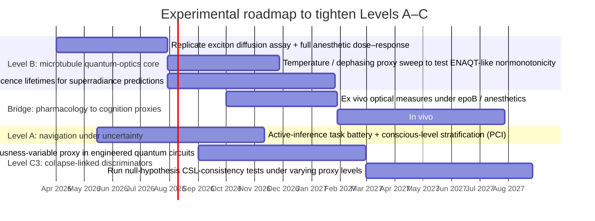

# Defending Nested Claims About Consciousness, Quantum Mechanism, and Ontology

**Executive summary.** Your three-level structure (A functional → B mechanistic → C ontological) is logically well-posed because it allows you to (i) defend a conservative functional thesis using mainstream cognitive/neuroscience formalisms, (ii) treat the quantum-mechanism thesis as a *conditional computational hypothesis* rather than a metaphysical leap, and (iii) firewall the most controversial ontological commitments so that Levels A and B can stand without them. citeturn35search0turn11search12turn35search7turn39search0  
Level A is defensible if stated minimally as: **conscious processing implements policy selection over counterfactual futures in a way that reduces epistemic uncertainty**, e.g., the “epistemic value” term in expected free energy and related planning-as-inference formalisms. citeturn11search12turn35search7turn35search2  
Level B is defensible only as a *testable* claim if trimmed to: **some subpersonal component of the “navigation” computation uses coherent (or partially coherent) dynamics that enable interference-mediated search/transport advantages over purely classical diffusive dynamics**, and if you explicitly tether the claim to concrete quantum-walk / quantum-stochastic-walk (QSW) formalisms and to reproducible microtubule-scale observables (e.g., diffusion lengths, fluorescence lifetimes, superradiant/subradiant signatures) that are demonstrably perturbable by anesthetics. citeturn18view0turn18view2turn37search2turn30view0turn31view0  
Level C is where you must be most careful: **C₁ is interpretive and empirically equivalent to standard quantum mechanics** (hence “metaphysical decoration” risk), **C₂ is a psychophysical-law postulate that is underdetermined unless you specify law-forms and measurement-like criteria**, and **C₃ is the most testable but inherits hard constraints from Born-rule recovery, no-signaling, decoherence realism, and the very strong existing bounds on collapse parameters** from interferometry, non-interferometric heating/noise tests, and gravitational-wave-detector-class constraints. citeturn14view0turn39search1turn39search16turn9view0turn13search2turn13search0  
For making the paper more compelling scientifically, the highest-yield “expansions” are: (1) explicitly connect Level A to *epistemic value / expected free energy* and current falsification-oriented consciousness science; (2) explicitly connect Level B to *robustness-to-decoherence* results (ENAQT, QSW interpolation, decoherence-useful regimes); (3) expand Level C with a rigorous constraints-and-bounds table anchored in modern collapse-model reviews and experiments (including LIGO/LISA Pathfinder–derived bounds); (4) add a discriminative experimental roadmap that crosses scales (spectroscopy → pharmacology → cognition metrics → quantum-foundations tests). citeturn11search12turn34search7turn37search2turn10view0turn12view3  

## Framing

**Minimal logical architecture.** The cleanest way to defend the nesting is to treat each level as adding a *new kind of commitment*:  
Level A adds a **functional commitment** about what consciousness *does* in an agent’s control loop (policy selection under uncertainty), without assuming any exotic physics. citeturn11search12turn35search7  
Level B adds a **mechanistic commitment** about how some part of that function is physically realized: not “quantum everywhere,” but “coherence/interference is exploited where it yields a measurable computational/transport advantage.” citeturn37search8turn37search17turn34search7turn18view2  
Level C adds an **ontological commitment** about what possibility space *is* and how definite outcomes are *made real*, with C₁–C₃ corresponding to increasing empirical risk (and increasing contact with experimental constraints). citeturn14view0turn39search0turn9view0  

**A key discipline that will make the argument feel “scientific” rather than “mystical.”** For B and C (especially C₃), you want to systematically separate:  
1) *The mathematical formalism* (e.g., Lindblad/QSW, CSL master equations),  
2) *The empirical observables* (e.g., diffusion lengths, spectral signatures, collapse-induced heating/noise), and  
3) *The interpretive gloss* (consciousness talk). citeturn18view0turn39search16turn9view0  

**Where your draft can expand without changing its core story.** In your uploaded draft, the microtubule/exciton and superradiance lines are present (e.g., Kalra and Babcock), but the “robust-to-decoherence” quantum-walk literature (ENAQT-style results), the no-signaling theorems relevant to consciousness-linked nonlinearity, and the modern collapse-bounds landscape are not yet doing the heavy lifting they can do. Adding those makes the paper look like it is engineered against the strongest known constraints. citeturn30view0turn31view0turn37search2turn10view0turn39search3  

## Level A evidence

**Minimal claim (A).** *In agents capable of flexible, reportable experience, consciousness functions as a navigational faculty that selects policies over counterfactual futures to reduce uncertainty over trajectory distributions (i.e., it has an epistemic control role), while not denying that many subroutines run unconsciously.* citeturn11search12turn35search7turn11search3  

**Primary theoretical support (peer-reviewed).**  
A particularly defensible scientific backbone for “navigation as uncertainty reduction” is the active-inference family: a formal treatment in which agents select policies that minimize **expected free energy**, which decomposes into instrumental (preference-fulfillment) and epistemic (uncertainty-reduction) terms. citeturn11search12turn11search0  
Planning and navigation have been explicitly formulated in this framework, including simulations showing how uncertainty-minimizing action dissolves exploration/exploitation, producing subgoals and context-sensitive planning—directly aligned with your Level A wording (“navigational faculty”). citeturn35search7turn11search5  
The “possible futures” component has deep empirical and theoretical roots in cognitive neuroscience: the “prospective brain” view emphasizes overlap between remembering and simulating futures (episodic/constructive processes used to imagine alternative trajectories). citeturn35search2  

**Primary empirical support (peer-reviewed).**  
If Level A is phrased functionally (and not metaphysically), the strongest evidence comes from *state-dependent changes in the brain’s capacity for integrated, flexible model-based control*. Measures like the perturbational complexity index (PCI) operationalize level-of-consciousness by combining perturbation and algorithmic complexity of distributed cortical responses, and they reliably track conscious level across conditions without requiring behavioral report. citeturn35search5turn35search1  
Large-scale theory-testing work in consciousness science increasingly emphasizes preregistered, adversarial protocols comparing competing functional/architectural predictions; the Cogitate program’s adversarial testing framework in *Nature* illustrates the field’s current standard for making consciousness theories empirically bite. (This helps you position Level A as “the least ontologically loaded, most testable.”) citeturn36search0turn36search2  
A practical “navigation” read of major workspace-style models is that conscious access corresponds to global availability of information for flexible control and planning (including the capacity to be “temporarily detached” from immediate stimuli), which coheres with your trajectory-selection phrasing. citeturn36search15turn36search7  

**Strongest objections and the most robust rebuttals.**  
Objection: “Unconscious processing already handles decision and action; consciousness is not needed for ‘navigation.’” A fair reading of blindsight and unconscious vision is that substantial perception and even discrimination can occur without awareness, weakening any strong claim that consciousness is required for all selection. citeturn11search3  
Rebuttal: your Level A can survive by being *non-exclusivist*: consciousness is not claimed to be the only selector, but a **late-stage integrative selector** that (i) expands temporal horizon, (ii) integrates across modalities/goals, and (iii) shifts control from habitual to model-based regimes—exactly the kind of role formalized in policy selection under expected free energy. citeturn11search12turn35search7turn35search0  

Objection: “Stating A in information-theoretic/control terms risks being a relabeling of cognition.”  
Rebuttal: the way out is to tie A to measurable dissociations: PCI-like state changes, loss of long-horizon planning under anesthesia/sleep, and predictable changes in exploration/exploitation and counterfactual evaluation under carefully controlled manipulations. citeturn35search5turn35search7  

**Falsifiable predictions and tests for Level A.**  
A strong A-level experimental program looks like: (i) quantify *policy horizon* and *epistemic foraging* as behavioral observables; (ii) independently quantify conscious level (PCI, or state markers used in clinical consciousness science); (iii) test whether reductions in conscious level selectively degrade epistemic components of planning more than stimulus-response competence. The key measurable is a selective falloff of uncertainty-driven exploration and counterfactual planning depth as PCI drops, even when basic perception/action remains intact. citeturn35search5turn35search7turn11search12  

## Level B evidence & tests

**Minimal claim (B).** *Some part of navigational selection (trajectory distribution pruning/search) depends on coupling to a quantum-capable substrate because coherent amplitude interference can implement search/transport scaling not achievable (or not achievable as efficiently) by purely classical stochastic diffusion under comparable resource constraints.* citeturn37search8turn37search17turn34search7turn18view0  

### Computational-efficiency claim: what is solid, and what must be conditional

**What is solid.** Coherent interference can provably change scaling on well-specified tasks. Unstructured search yields a quadratic query advantage (∼O(√N) versus ∼O(N)) in Grover-style amplitude amplification. citeturn37search8turn37search0  
Quantum walks supply additional algorithmic leverage. For example, the hypercube analysis shows an **O(n)**-step instantaneous mixing time compared with classical **Θ(n log n)** mixing, with the speedup arising from phase interference; the same formalism shows sharply structured amplitudes over Hamming weight driven by (cos(t/n)) and (sin(t/n)) factors. citeturn25view0turn17view0turn26view1  
Most importantly for your “polynomial-vs-exponential” language: there exist oracle/black-box problems where continuous-time quantum walk achieves an exponential separation from classical algorithms, as shown in the classic “exponential algorithmic speedup by a quantum walk” line of work. citeturn37search17turn37search1  

**What must be conditional (and you should say so explicitly).** Quantum-walk speedups are not uniform across all graphs/definitions; foundational quantum-walk theory explicitly analyzes mixing/filling/dispersion measures and discusses limits on general speedups. This matters because overclaiming (“quantum always exponential”) is an easy target for critics. citeturn20search3turn25view0  

### Classical vs quantum scaling table (with robustness-to-decoherence hooks)

| Problem/setting (representative) | Classical scaling (baseline) | Quantum scaling (baseline) | What provides the advantage | Robustness to decoherence / noise |
|---|---:|---:|---|---|
| Unstructured search over N items | Θ(N) queries to reach constant success probability | Θ(√N) queries | Amplitude amplification via phase-sensitive interference | Advantage degrades with noise; requires coherence across ∼√N iterations citeturn37search8 |
| Hypercube walk mixing (n-dimensional) | Θ(n log n) mixing time | Instantaneous mixing at (π/4)n (i.e., O(n)) | Global phase structure and interference on highly symmetric graphs | Small decoherence can sometimes “regularize” distributions; too much yields classical diffusion citeturn25view0turn34search2turn34search22 |
| Hypercube targeted transfer (Hamming-weight dynamics) | Typical hitting/return times scale exponentially in number of vertices (∝2^n) for specific-state recurrence arguments | Structured amplitude evolution with explicit (cos(t/n))^(n−x)(sin(t/n))^x dependence enables sharply peaked probabilities at chosen t | Coherent evolution on product structure | Noise washes out sharp-time peaks; partial decoherence can improve reliability of hitting-time–like behavior in some regimes citeturn26view1turn29view0turn34search6 |
| Oracle graph traversal (“exponential speedup by quantum walk”) | Exponential (oracle lower bounds) | Polynomial (quantum walk traversal) | Coherent propagation across a graph that defeats classical local exploration | Requires coherence long enough to traverse; task is oracle-structured, not generic planning citeturn37search17turn37search1 |
| Open-system interpolation (QSW: between QW and CRW) | Classical random walk limit | Quantum walk limit; continuous interpolation via Lindblad/QSW | Formal mechanism for mixing coherence + stochasticity | Built to model partial decoherence; directly supports your “warm, noisy substrate” stance citeturn18view0turn34search7 |
| ENAQT-style transport (noise-assisted regimes) | Noise typically degrades transport | Intermediate dephasing can enhance transfer efficiency (non-monotonic) | Suppression of destructive interference / unlocking pathways | Core point: *some* noise helps; too much restores classical diffusion citeturn18view2turn37search2turn34search22 |

### QSW and ENAQT: why this matters for a warm brain

Your draft’s strongest “physics hygiene move” is to lean on QSW/ENAQT results to rebut the naïve objection “warm brains can’t be quantum.” QSW explicitly generalizes classical random walks and quantum walks into a single open-system framework (a quantum stochastic equation / Lindblad-style evolution on graphs), giving you a mathematically clean bridge between fully coherent and fully classical diffusion. citeturn18view0turn34search7  
ENAQT results show that *some* dephasing can increase transport efficiency in quantum networks, countering the simplistic “any decoherence kills the effect” intuition and offering a concrete prediction: performance should often be **non-monotonic** in noise strength (too little → trapping via interference; intermediate → best transfer; too much → classical diffusion). citeturn18view2turn37search2turn34search22  

### Microtubules: what the empirical record supports

Your microtubule case is strongest when presented as a chain of *measured mesoscopic optical/transport phenomena* plus *pharmacological perturbations*, while remaining agnostic about whether these phenomena scale into cognition.

**Exciton/energy migration (direct measurements).** The Kalra et al. microtubule study uses tryptophan autofluorescence lifetimes and quenching to estimate electronic energy diffusion lengths. It reports diffusion over ≈6.6 nm in microtubules, shows dependence on polymerization state, and reports that etomidate and isoflurane reduce diffusion lengths (e.g., ≈6.6 nm down to ≈5.6–5.8 nm at the stated conditions), while protofilament number (13 vs 14) has negligible effect on diffusion length. citeturn30view0  
Crucially, the paper argues that conventional Förster theory (even incorporating Tyr–Trp interactions) does not fully explain the observed diffusion lengths, motivating stronger coupling mechanisms (e.g., short-range orbital overlap contributions). citeturn30view0  

**Collective radiative effects (superradiance/subradiance).** The Babcock et al. work in *J. Phys. Chem. B* predicts strongly superradiant states in very large tryptophan networks (including microtubule architectures) and reports experiments consistent with fluorescence quantum-yield enhancement, including increases on the order of tens of percent and reporting “up to almost 70%” increases from tubulin dimers to microtubules under their measurement conditions, with persistence under disorder. citeturn31view0  

**Anesthetic interaction (molecular + phenomenology).** The Kalra microtubule study directly reports anesthetic-associated reductions in exciton diffusion and interprets this as damping of energy transfer via dielectric screening changes. citeturn30view0  
Craddock et al. (Scientific Reports) model anesthetic binding on tubulin and report theory suggesting anesthetic-associated alterations of collective terahertz oscillatory modes correlated with clinical potency (this is supportive as a mechanistic “hypothesis generator,” though it remains modeling-heavy relative to lifetime spectroscopy). citeturn38search2turn38search5  

**In vivo pharmacology (bridging to consciousness proxies).** The epothilone B rat study reports that a brain-penetrant microtubule stabilizer increased latency to loss of righting reflex under 4% isoflurane by ~69 seconds with a large standardized effect size (Cohen’s d ≈ 1.9), and argues this is not explained by tolerance from repeated exposures. citeturn32view0  
Scientifically, the most conservative inference is: *microtubule stability/availability is a functionally relevant variable in anesthetic-induced loss of responsiveness*, which is consistent with (but not uniquely diagnostic of) microtubule-centric consciousness mechanisms. citeturn32view0  

### Level B’s strongest objections and how to answer them without overclaiming

**Objection: Tegmark-style decoherence arguments make “brain quantum computation” impossible.** Tegmark’s calculations argue neural degrees of freedom decohere extremely fast (∼10^−13–10^−20 s) relative to neural timescales, motivating the conclusion that cognitive processing is effectively classical. citeturn37search7turn37search3  
**Rebuttal (best form):** you do not need to claim long-lived macroscopic brain-wide coherence. Instead, you can claim **mesoscopic, short-range, partially coherent transport/control** (QSW/ENAQT style), and you can point to rebuttals that contest Tegmark’s assumptions for specific microtubule-associated superpositions and decoherence models. citeturn38search0turn34search7turn18view2  
A scientifically “clean” way to phrase this is: Tegmark-type arguments constrain *which degrees of freedom* could matter and at *what coherence times*, but they do not preclude short-lived coherence that is repeatedly refreshed, spatially localized, and operationally harnessed in noise-assisted regimes. citeturn18view2turn34search22turn30view0  

**Objection: observed optical/transport effects in proteins do not imply a cognitive computational role.**  
**Rebuttal:** agree, and treat this as a demand for *bridging experiments* that connect (i) quantified microtubule quantum-optical observables (lifetimes, diffusion lengths, superradiant decay rates) to (ii) neural-level markers (spiking reliability, dendritic integration, network oscillations) and (iii) consciousness-level markers (PCI-like complexity or controlled-report tasks). citeturn30view0turn31view0turn35search5  

### Concrete, falsifiable Level B predictions and tests

**Prediction class B1: non-monotonic noise dependence (ENAQT signature) in microtubule energy migration.** If microtubule transport sits in a noise-assisted regime, varying dephasing (temperature, solvent viscosity, ionic strength, isotopic substitution that shifts vibrational spectra) should produce a *peak* in effective diffusion length or transfer efficiency, rather than monotonic decline. citeturn18view2turn37search2turn30view0  
**Observable:** diffusion length extracted from lifetime quenching protocols; fluorescence lifetime distributions; temperature/noise dependence curve shape. citeturn30view0  

**Prediction class B2: anesthetic dose–response on quantum-optical observables with matched classical controls.** Kalra already reports reduced diffusion lengths with etomidate/isoflurane; the falsifiable extension is to map a full dose–response, include non-immobilizers or structurally similar controls, and test whether effect size scales with anesthetic potency in a Meyer–Overton–like manner at the level of the microtubule optical observable. citeturn30view0turn38search2  
**Observable:** percent change in diffusion coefficient/length; effect sizes across anesthetics; replication across tubulin sources and polymerization conditions. citeturn30view0  

**Prediction class B3: geometry scaling and superradiant lifetimes.** The superradiance account predicts specific geometry-dependent radiative-rate enhancements and saturation around relevant optical wavelengths (e.g., the reported ∼280 nm scale for UV excitation considerations), implying measurable changes in lifetime (not just quantum yield) over controlled microtubule lengths and bundling regimes. citeturn31view0  
**Observable:** time-resolved fluorescence lifetimes spanning ultrafast to slow components; scaling vs microtubule length/bundle size; persistence under controlled disorder. citeturn31view0  

**Prediction class B4: “bridging” to pharmacology and behavior.** If microtubule quantum-optical variables are mechanistically upstream of anesthetic-induced loss of responsiveness, then microtubule stabilizers (epoB, taxanes) should shift anesthetic sensitivity curves, and the shift magnitude should correlate with changes in the microtubule optical observable under the same pharmacological manipulations. citeturn32view0turn30view0  

image_group{"layout":"carousel","aspect_ratio":"16:9","query":["n-dimensional hypercube quantum walk diagram","continuous-time quantum walk hypercube probability distribution figure","quantum walk mixing time hypercube plot"],"num_per_query":1}

image_group{"layout":"carousel","aspect_ratio":"16:9","query":["quantum stochastic walk lindblad equation schematic","open quantum walk graph lindblad schematic","quantum stochastic walk classical to quantum transition diagram"],"num_per_query":1}

image_group{"layout":"carousel","aspect_ratio":"16:9","query":["microtubule tubulin lattice tryptophan residues visualization","microtubule structure diagram protofilaments tubulin dimer","tryptophan network microtubule superradiance diagram"],"num_per_query":1}

## Level C analysis & constraints

**Minimal claim (C).** *Possibility space is physically real (not just a calculational device), and consciousness participates—interpretively or dynamically—in the emergence of definite outcomes.* citeturn7search8turn14view0turn39search0  

### C₁ interpretive (empirically equivalent)

**Minimal C₁ claim.** Definite facts are only defined relative to or for experiential subjects (a consciousness-indexed “actualization relation”), while all empirical predictions remain those of standard quantum mechanics. citeturn6search3turn7search9  
**Support.** This is defensible in the narrow sense of not conflicting with any quantum experiment because it adds no new dynamics; it is an interpretive move aligned with relational/agent-centered readings. citeturn6search3turn7search9  
**Objection (explanatory idleness).** Because it is empirically equivalent, critics can reject it as metaphysics-without-work. citeturn14view0  
**Rebuttal strategy.** Explicitly concede that C₁ is not where empirical leverage lies; treat it as a conceptual “interface layer” that motivates why C₂/C₃ are worth formulating, without pretending it predicts new data. citeturn14view0  
**Tests.** None beyond standard QM unless you add auxiliary postulates; C₁ is mainly constrained by internal coherence and compatibility with the rest of your framework. citeturn14view0  

### C₂ psychophysical-law (substantive but underspecified)

**Minimal C₂ claim.** There exist fundamental psychophysical laws linking certain physical structures to conscious experience, and those laws also constrain when/where “measurement-like” actualization occurs, without invoking consciousness as an *external* cause. citeturn14view0turn35search5  
**Support.** Collapse-model programs already provide templates for adding lawful structure that yields definite outcomes while aiming to recover the Born rule; C₂ can be cast as adding lawful constraints on *collapse-trigger conditions* tied to consciousness correlates instead of (or in addition to) purely mass/size/environmental structure. citeturn39search0turn39search16turn9view0  
**Objection (testability gap).** Without specifying the law-form (variables, scaling, coupling, invariances), C₂ risks being unfalsifiable. citeturn14view0  
**Rebuttal strategy.** You can “make C₂ scientific” by explicitly proposing candidate lawful variables (Φ-like, PCI-like operational proxies, or specific microtubule observables) and showing how they would enter a dynamical criterion. citeturn14view0turn35search5turn30view0  
**Tests.** Any viable C₂ should yield at least one discriminative prediction about when collapse-like effects occur that differs from standard CSL/GRW triggers. The easiest entry point is: specify a thresholded variable measurable in engineered systems (e.g., a quantum integrated-information proxy in small quantum circuits) and predict deviations in decoherence/collapse statistics relative to baseline CSL. citeturn14view0turn39search0turn39search16  

### C₃ consciousness-weighted collapse (most testable)

**Minimal C₃ claim.** Collapse is objective and dynamical (GRW/CSL family), but collapse parameters depend partly on a quantifiable consciousness-relevant variable (Φ, PCI proxy, or another operationally defined correlate). citeturn39search1turn39search16turn14view0  

**Why this is testable (and why the Zeno constraint bites).** Chalmers & McQueen explicitly develop consciousness-collapse models by combining IIT-style constructs with CSL-like dynamics, and argue that simple “super-resistance” versions face a quantum Zeno problem (continuous measurement/superselection freezes dynamics), while more complex versions can remain empirically viable and are in-principle testable with quantum-computational experiments. citeturn14view0turn19view2  

### The four engineering constraints for any C-sharpening, made explicit

**Born-rule recovery.** Collapse dynamics must reproduce Born statistics (not optional). Collapse-model reviews emphasize that collapse frameworks are designed to yield definite outcomes distributed according to Born probabilities, and C₃ variants must preserve this. citeturn9view0turn39search0turn14view0  

**No superluminal signaling.** Deterministic nonlinear modifications of quantum theory notoriously enable superluminal communication (Gisin/Polchinski-style constraints). Therefore any consciousness-linked modification must be formulated so that ensemble dynamics remain signal-local (typically via stochastic, linear-on-density-matrix evolution). citeturn39search3turn6search2  

**Decoherence compatibility.** Your model must not require long-lived macroscopic neural coherence; instead it should be compatible with open-system decoherence and (if needed) exploit partial coherence/noise-assisted regimes rather than deny warm, wet noise. citeturn37search7turn18view2turn34search7  

**Consistency with collapse bounds.** Any objective-collapse parameter choices (or effective parameter ranges in relevant regimes) are heavily constrained by modern experiments and reanalyses, including interferometry, non-interferometric heating/noise tests, and gravitational-wave-detector constraints (LIGO/LISA Pathfinder class). citeturn9view0turn12view3turn13search2turn13search1turn13search0  

### Collapse bounds and viability table for consciousness-weighted variants

Below is a *defense-ready* way to present C₃: start from standard CSL/GRW parameterization, then show what experiments already exclude, and only then discuss what a consciousness-weighted modification would have to look like to remain viable.

| Item | What it is | Representative values / results | Key empirical constraints | Implication for C₃ variants |
|---|---|---|---|---|
| GRW baseline | Objective collapse with collapse rate λ and correlation length r_C | Review material reports GRW-proposed λ ≈ 10^−16 s^−1 and r_C ≈ 10^−7 m; Adler proposed much larger λ values at similar r_C scales citeturn12view0 | Many experiments bound λ at given r_C | A C₃ model that simply “sets λ high” in ordinary matter is usually excluded; consciousness-dependence must be carefully structured citeturn12view3turn13search0 |
| Best modern synthesis of bounds | Consolidated review of interferometric and non-interferometric tests | Collapse review summarizes broad exclusion plots and gives concrete bounds at r_C = 10^−7 m (e.g., interferometry λ < 10^−7 s^−1; CUORE-style heating λ < 3.3×10^−11 s^−1; LIGO λ < 10^−5 s^−1; LISA Pathfinder λ < 3.8×10^−9 s^−1; layered sensors tightening further) citeturn12view3turn9view0 | Interferometry, cryogenic force sensors, heating/noise, X-ray emission, GW detectors | Any C₃ theory must allow baseline collapse parameters in *non-conscious* experiments to fall inside allowed region; otherwise already falsified citeturn12view3turn13search0 |
| Layered force sensors | Non-interferometric CSL-noise amplification strategy | PRL result “narrowing parameter space” tightly constrains CSL; review notes bounds that “completely cover” Adler-suggested values at r_C=10^−7 m citeturn13search0turn12view3 | Ultracold layered force sensors | If a consciousness-weighted model requires Adler-scale λ *even when consciousness-variable is low*, it is ruled out; if λ depends on a consciousness variable, you must argue why these sensors have low effective value of that variable citeturn13search0turn14view0 |
| Gravitational-wave-detector constraints | Bounds from classical macroscopic masses monitored with extreme precision | Collapse review explicitly lists bounds from AURIGA/LIGO/LISA Pathfinder and cites dedicated PRD analyses; LISA Pathfinder is highlighted as strong in some regimes citeturn12view3turn13search2turn13search1 | LIGO/LISA Pathfinder/AURIGA analyses | A C₃ variant that increases collapse-induced noise/heating in macroscopic test masses outside bounds is excluded; “consciousness-variable” must not inadvertently turn on in such systems citeturn12view3turn39search0 |
| Recent updates | Continued tightening via new data analyses | Recent work reports improved bounds from LISA Pathfinder rotational noise analysis (peer-reviewed PRA) citeturn8search4 | Updated exclusion plots | You can argue C₃ remains open only in parameter corners not yet excluded; this makes “which corner?” an explicit empirical question citeturn8search4turn9view0 |

### How to evaluate candidate C₃ models against the four constraints

A defense strategy that works in front of skeptical physicists is to present candidate C₃ as *a constrained modification of CSL*, e.g. λ_eff = λ_0 + f(Q) where Q is a consciousness-relevant variable, and then assess:

1) **Born rule:** require that the stochastic dynamics still yields Born statistics (as in CSL) regardless of Q; otherwise you invite immediate experimental refutation (and philosophical complaints about “agentive bias”). citeturn39search0turn14view0  
2) **No-signaling:** require that Q is not a controllable “switch” that lets an agent choose between two different dynamical maps on entangled states in a way that changes distant marginals; this is exactly the failure mode highlighted by no-signaling arguments for nonlinear dynamics. citeturn39search3turn6search2  
3) **Decoherence compatibility:** require that Q-modulation is compatible with open-system decoherence (i.e., it does not sneak in an assumption of long-lived macroscopic coherence in neural tissue). citeturn37search7turn18view2  
4) **Bounds:** require that for all systems with Q≈0 (laboratory test masses, interferometers, cryogenic sensors, GW detectors), λ_eff sits within current bounds; otherwise the model is already dead. citeturn12view3turn13search0turn13search2  

Finally, you can leverage PBR-style ψ-ontology results as **supportive motivation** for “possibility space is physically real,” while explicitly acknowledging the assumptions (e.g., preparation independence) and the fact that ψ-ontology is not automatically “consciousness does collapse.” citeturn7search8turn7search10  

## Objections & rebuttals

**Cross-cutting objection: “Category error—consciousness is not a computational primitive.”**  
The strongest rebuttal is to emphasize that Level A makes no ontological claim; it is a functional claim compatible with multiple mechanisms, phrased in the same optimization/inference language used in mainstream theoretical neuroscience. citeturn35search0turn11search12turn35search7  

**Cross-cutting objection: “Quantum advantage is irrelevant because the brain is noisy and classical.”**  
Your strongest rebuttal is not to deny noise, but to impose *noise-aware quantum biology discipline*: (i) open-system frameworks (QSW) explicitly interpolate quantum↔classical, and (ii) ENAQT results establish that intermediate noise can be functional for transfer. This reframes the dispute from “noise kills everything” to “what regime are microtubule excitations in, empirically?” citeturn34search7turn18view2turn34search22turn30view0  

**Cross-cutting objection: “Microtubule optical effects don’t scale to cognition.”**  
Agree and turn it into a research program: the right standard is *bridging predictions* that link microtubule observables to neural and behavioral observables under interventions (anesthetics, stabilizers), ideally producing correlated changes across scales. The epothilone B rat effect is a starting point, but it does not, by itself, identify a quantum mechanism. citeturn32view0turn30view0turn35search5  

**Cross-cutting objection: “C₁ is idle; C₂ is vague; C₃ violates physics.”**  
This is where your constraints-first presentation matters. C₁ is acknowledged as empirically equivalent; C₂ is acknowledged as underdetermined unless law-forms are specified; C₃ is treated as an objective-collapse variant whose survival hinges on explicit compliance with Born rule, no-signaling, decoherence realism, and the modern exclusion plots. That is what distinguishes “speculative but scientific” from “mystical.” citeturn14view0turn39search0turn12view3turn39search3  

## Recommended experiments & next steps

### High-value, near-term experiments that most directly strengthen your paper

**Microtubule quantum-optics replication and extension (foundation layer for Level B).**  
Replicate the lifetime/quenching diffusion-length assay across: multiple tubulin sources, polymerization conditions, temperature series, ionic strength series, and anesthetic dose–response series; preregister effect-size expectations using the existing ∼15% diffusion-length decrease under anesthetics as an anchor. citeturn30view0  
Key observables: diffusion length, diffusion coefficient, lifetime distributions, and (critically) whether the dependence on dephasing proxies is monotonic or ENAQT-like non-monotonic. citeturn18view2turn30view0turn37search2  

**Time-resolved lifetime tests of superradiance predictions (discriminates classical vs collective quantum-optical models).**  
Babcock et al. explicitly state that QY changes should be complemented by lifetime measurements over wide temporal ranges. Doing exactly that creates an immediate, publishable discriminative result: superradiance predicts radiative-rate changes, not only yield changes. citeturn31view0  

**Pharmacology-to-quantum-optics bridge (connects B evidence to anesthesia).**  
Combine the epothilone B paradigm with ex vivo microtubule optical measures: test whether epoB shifts microtubule optical observables (diffusion length, lifetime) in the *same direction* as it shifts behavioral sensitivity (LORR latency), and whether anesthetic binding produces predictable counter-shifts. This directly targets the “bridging gap.” citeturn32view0turn30view0  

**C₃: quantum-computational discriminators (if you want C₃ to be taken seriously).**  
Follow the Chalmers–McQueen posture: propose experiments with engineered quantum systems where a proposed consciousness-variable proxy can be varied while holding classical environment fixed, and predict deviations from baseline CSL-like decoherence. Even if the first generation is null, it forces C₃ into the same experimental ecosystem that already constrains CSL/GRW. citeturn14view0turn39search0turn9view0  

### Where your draft can expand the science most effectively

1) **Add a “robust-to-decoherence” subsection** that explicitly connects your microtubule evidence to QSW and ENAQT, emphasizing non-monotonic noise signatures as discriminators. citeturn34search7turn37search2turn18view2turn30view0  
2) **Add a “no-signaling and nonlinearity” subsection** that states—without drama—that many consciousness-linked collapse ideas fail if they enable controllable changes to dynamical maps on entangled states, and explicitly cite the canonical constraints literature. citeturn39search3turn6search2  
3) **Add a collapse-bounds table** anchored in modern collapse reviews (including explicit LIGO/LISA Pathfinder references) and highlight which parameter corners remain open; then state what your C₃ would predict in those corners. citeturn12view3turn9view0turn13search2turn13search1turn8search4  
4) **Convert “possibility space is real” from rhetoric to structure** by using ψ-ontology motivation (PBR) plus a careful disclaimer about assumptions; this gives Level C a physics-facing motivation without pretending it proves your consciousness thesis. citeturn7search8  

### Mermaid timeline for a discriminative experimental program

### Short primary-source reference list

- entity["people","Karl Friston","free energy principle"] (2010). *The free-energy principle: a unified brain theory?* citeturn35search0  
- entity["people","Karl Friston","active inference"] (2015). *Active inference and epistemic value.* citeturn11search12  
- entity["people","Rafal Kaplan","active inference navigation"] (2018). *Planning and navigation as active inference.* citeturn35search7  
- entity["people","Daniel Schacter","prospective brain"] et al. (2007). *Remembering the past to imagine the future: the prospective brain.* citeturn35search2  
- entity["people","Andrea Casali","pci consciousness"] et al. (2013). *Perturbational Complexity Index (PCI).* citeturn35search5  
- entity["organization","Cogitate Consortium","consciousness research consortium"] (2025). Adversarial testing of GNWT vs IIT. citeturn36search0  
- entity["people","Lov Grover","quantum search"] (1997; STOC 1996 lineage). *A fast quantum mechanical algorithm for database search.* citeturn37search8  
- entity["people","Andrew Childs","quantum walks"] et al. (2003). *Exponential algorithmic speedup by a quantum walk.* citeturn37search17  
- entity["people","Julia Kempe","quantum random walks"] (2003). *Quantum random walks: an introductory overview.* citeturn34search5  
- entity["people","Cesar Rodriguez-Rosario","quantum stochastic walks"] et al. (2010). *Quantum stochastic walks (QSW).* citeturn34search7  
- entity["people","Martin Plenio","dephasing assisted transport"] & entity["people","Susana Huelga","quantum biology"] (2008). *Dephasing-assisted transport (ENAQT).* citeturn18view2  
- entity["people","Masoud Mohseni","enaqt photosynthesis"] et al. (2008). *Environment-assisted quantum walks in photosynthetic energy transfer.* citeturn37search2  
- entity["people","Max Tegmark","decoherence brain"] (2000). *Importance of quantum decoherence in brain processes.* citeturn37search3  
- entity["people","Scott Hagan","microtubule decoherence"] et al. (2002). Response-style critique of Tegmark assumptions for microtubule models. citeturn38search0  
- entity["people","Kalra (first author)","microtubule exciton transport"] et al. (2023). *Electronic energy migration in microtubules* (diffusion lengths; anesthetic effects). citeturn30view0  
- entity["people","N. S. Babcock","microtubule superradiance"] et al. (2024). *Ultraviolet superradiance from tryptophan mega-networks.* citeturn31view0  
- entity["people","David Chalmers","philosophy of mind"] & entity["people","Kelvin McQueen","consciousness collapse"] (2021). *Consciousness and the collapse of the wave function.* citeturn14view0  
- entity["people","GianCarlo Ghirardi","grw collapse"] et al. (1986). *GRW collapse model.* citeturn39search1  
- entity["people","Angelo Bassi","collapse models"] et al. (2013). *Review of collapse models and tests.* citeturn39search16  
- entity["people","Nicolas Gisin","no signaling nonlinear qm"] (1990). Nonlinear QM enabling superluminal communication (constraint motivation). citeturn39search3  
- entity["people","Matteo Carlesso","collapse bounds"] et al. (2016, 2022 review context). Collapse bounds from gravitational-wave detectors; modern exclusion plots. citeturn13search2turn9view0  
- entity["people","Andrea Vinante","collapse experiments"] et al. (2020). Ultracold layered force sensors tightening CSL parameter space. citeturn13search0  
- entity["organization","LIGO","gravitational wave observatory"] / LISA Pathfinder class constraints summarized in modern reviews. citeturn12view3turn13search2