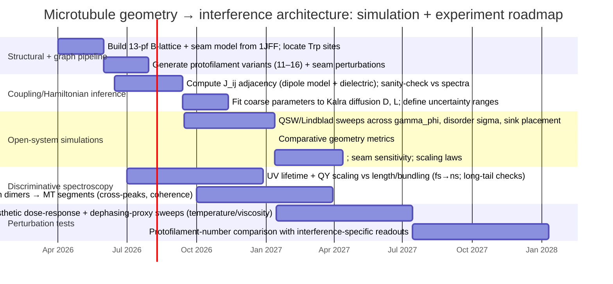

# Can Microtubule Lattice Geometry Generate Interference Patterns That Improve Biological State‑Space Exploration?

**Executive summary.** The strongest peer‑reviewed evidence relevant to “geometry → interference → functional advantage” in microtubules is **indirect but nontrivial**: (i) microtubules have a highly constrained and evolutionarily conserved lattice architecture—typically a **13‑protofilament B‑lattice with a seam**—whose symmetry and symmetry‑breaking features are structurally well characterized. citeturn14view4turn14view5turn17view0turn6view2 (ii) tubulin/microtubules host dense aromatic networks; recent experiments show **electronic excitation can diffuse ~6.6 nm in microtubules** and that anesthetics can reduce this diffusion length by **~10–15%** under reported conditions—an empirical foothold for “transport is real and chemically modulable.” citeturn14view1turn4view1 (iii) independent theory+experiment on **tryptophan mega‑networks** in microtubule architectures reports collective quantum‑optical **superradiant/subradiant eigenmodes**, robustness to disorder, and orders‑of‑magnitude spreads in bright vs dark decay behaviors, consistent with strong geometry‑dependent interference in *radiative* channels. citeturn7view2turn17view4turn17view5turn14view0turn16search21

What is *not* established in the peer‑reviewed record is the final step you want—**that microtubule geometry implements a quantum‑walk‑like interference pattern that improves “search” or “state‑space exploration” in a way that selection could act on.** Today, that remains a *research hypothesis*, but it can be made sharply testable by (a) mapping real microtubule chromophore geometry into an excitonic coupling graph (adjacency), (b) simulating coherent↔incoherent transitions using open‑system formalisms that explicitly interpolate between quantum and classical walks (QSW/Lindblad), and (c) experimentally probing for interference signatures (non‑monotonic noise dependence/ENAQT peaks, coherence beatings in ultrafast spectroscopy, geometry‑dependent lifetime and cross‑peak structure). citeturn12view0turn12view1turn17view6turn12view2turn12view3turn14view1

A key scientific tension is that some measurements already report **little difference in diffusion length between 13‑ and 14‑protofilament microtubules** in the specific Kalra assay, which cautions against overclaiming that “13 is obviously optimal for exciton transport” in all observables. citeturn13search12turn14view1 The most defensible “evolutionary weight” claim is therefore narrower: **microtubule lattice geometry plausibly shapes collective excitonic/radiative eigenmodes and transport statistics under realistic decoherence, and this could provide functional advantages in signaling/control *if* downstream biochemical transduction couples to these modes.** citeturn14view0turn17view4turn12view2turn12view1

## Framing

**Operational question.** “Can microtubule geometry produce interference patterns that improve biological state‑space exploration?” becomes scientific when you specify (i) what “state‑space” is and (ii) what “improve” means. The most conservative re‑framing is at the level of **excitation transport/search on a graph**: microtubule chromophore sites are nodes; couplings define edges; an “improvement” is faster or more reliable transfer to a target subspace (“sink”) or better exploration/mixing over the network under constraints (noise, disorder). citeturn12view0turn12view2turn14view1

**Minimal hypotheses (testable, consciousness‑free).**

**H0 (classical diffusion only).** Microtubule tryptophan excitation transport is well approximated by incoherent hopping (Förster‑like) on a disordered network; lattice geometry changes rates mainly via distances/orientations but does not produce useful phase‑structured interference (no ENAQT peak; no coherent beatings beyond instrument response). citeturn12view2turn14view1

**H1 (geometry‑enabled interference).** Microtubule lattice geometry plus chromophore arrangement produces a coupling graph whose **Hamiltonian eigenstructure** supports interference phenomena (e.g., partial delocalization, dark/bright mode structure, directional biases from symmetry breaking at seams), leading to measurable signatures: (a) **non‑monotonic dependence** of transfer efficiency on dephasing (ENAQT‑like optimum), (b) coherence beatings at frequencies commensurate with coupling scales, and (c) system‑size/geometry‑dependent radiative lifetimes and quantum yields. citeturn14view0turn12view1turn17view4turn17view5turn12view0

**Why quantum walks are relevant (and what they do *not* guarantee).** Quantum walk theory shows that interference can dramatically reshape propagation and mixing statistics—sometimes yielding speedups or qualitatively different hitting/mixing behavior—because amplitudes add/cancel depending on phase relationships. The hypercube analysis emphasizes that exact uniformization at a specific time can arise from “destructive interference between terms of different phase.” citeturn15view0turn12view3 But this does not imply that *any* physical network will realize a useful algorithmic speedup; it implies that **graph topology + Hamiltonian structure + measurement/decay model** jointly determine whether interference produces a functional advantage. citeturn15view0turn12view0turn12view1

**Core objection you must confront up front: decoherence times.** entity["people","Max Tegmark","decoherence critique 2000"] estimated very short decoherence timescales for various brain‑related degrees of freedom (reported in the ~10^−13–10^−20 s range, including ~10^−13 s for microtubule‑scale superpositions in his model), arguing brain dynamics are effectively classical for cognition‑relevant processes. citeturn18view0turn18view3turn18view4 A key rebuttal line from entity["people","Scott Hagan","microtubule decoherence rebuttal"] and colleagues is that specific assumptions in the Tegmark calculation are mismatched to their modeled degrees of freedom and that corrected estimates can shift coherence times upward (they report recalculations yielding ~10^−5–10^−4 s under their assumptions). citeturn19view0turn19view4 Whether either set of timescales is relevant to *tryptophan UV excitons* (rather than tubulin conformational superpositions) is itself an empirical question; the safest stance is to treat decoherence as **a parameter to be inferred from spectroscopy**, not a purely armchair veto. citeturn14view1turn12view1turn12view2

## Structural mapping (lattice & chromophores)

**Assumptions and structural hypotheses.**

**S1 (lattice topology).** Most cytoplasmic microtubules are well approximated as a **B‑lattice tube** composed of protofilaments, with a structural discontinuity (“seam”) where A‑lattice contacts occur; protofilament counts are often 13 (sometimes 14), and the seam is a necessary consequence of closing helical symmetry on a tube. citeturn4view3turn17view0turn14view5turn17view1

**S2 (chromophore map).** Tubulin contains multiple aromatic chromophores (notably tryptophan), and the 3D positions and transition dipole orientations of these chromophores define an effective excitonic network once you specify an electronic transition manifold (e.g., UV‑excited Trp states). citeturn7view2turn6view2turn14view0turn17view4

**Primary structural sources (peer‑reviewed, open).**  
Microtubule lattice seam evidence and B‑lattice predominance were directly visualized in classic electron microscopy: entity["people","Mitsuhiro Kikkawa","microtubule seam 1994"] et al. report direct evidence for a seam and predominantly B‑lattice microtubules. citeturn4view3turn14view4turn17view1  
The relationship between protofilament number, helix starts, and seam necessity is discussed in early structural work by entity["people","Eckhard Mandelkow","microtubule lattice 1986"] et al. (J Cell Biol), explicitly connecting 13/14 protofilament arrangements with a helical discontinuity. citeturn14view5turn13search2  
High‑resolution cryo‑EM reconstructions of 13‑protofilament microtubules stabilized by cellular ligands show B‑lattice contacts and explicitly retain the seam; the doublecortin‑stabilized 13‑pf reconstruction is a particularly useful “in vivo‑like” reference. citeturn4view4turn14view3turn17view0  
For tubulin atomic structure input, the refined αβ‑tubulin dimer structure (PDB 1JFF; J Mol Biol 2001) provides coordinates needed to locate aromatic residues. citeturn6view2

**How to build the geometry (methods).** A complete “lattice→chromophore map” pipeline can be specified without new biology:

1) **Atomic template.** Use the αβ‑tubulin dimer coordinates from entity["organization","RCSB Protein Data Bank","structure database"] entry 1JFF. citeturn6view2  
2) **Lattice assembly.** Build a 13‑pf B‑lattice microtubule (including seam) using published helical parameters, or adopt the explicit assembly protocol described in the tryptophan mega‑network work (which constructs a “virtual MT” from 1JFF using a specified sequence of rotations/translations). citeturn4view0turn7view2  
3) **Chromophore placement.** Extract coordinates (and if available, transition dipole directions) of tryptophan indole moieties; if dipole orientation is not specified, first‑pass modeling can assign dipole vectors using standard indole transition dipole approximations (this step should be marked **unspecified** until you cite a primary Trp transition‑dipole parameter source). citeturn14view0turn7view2  
4) **Seam annotation.** Mark A‑lattice contacts at the seam and treat them as a controlled symmetry‑breaking perturbation in the coupling graph (see below). citeturn4view3turn17view1

**Strong objections and rebuttals.**

Objection: microtubules are polymorphic—protofilament number can vary and even change along length—so “geometry is optimized for interference” sounds fragile. This is empirically true: in vitro, mixtures of protofilament numbers are observed (e.g., 13/14/15 coexistence), and protofilament number distributions depend on assembly conditions. citeturn16search20turn16search13turn13search22  
Rebuttal: the hypothesis does not require perfect uniformity; it requires a measurable **geometry dependence** of interference signatures. Polymorphism becomes part of the experimental program: compare signatures across protofilament counts and seam configurations under controlled conditions. citeturn14view1turn14view5turn17view1

image_group{"layout":"carousel","aspect_ratio":"16:9","query":["microtubule 13 protofilament b lattice seam diagram","tubulin dimer tryptophan residues 1JFF figure","microtubule lattice schematic 13_3 seam"],"num_per_query":1}

## Excitonic coupling → adjacency matrices

**Assumptions and hypotheses.**

**E1 (single‑excitation manifold).** In the relevant UV regime, treat the system in the *single‑excitation manifold* over chromophore sites: \(|i\rangle\) denotes an excitation localized on Trp site \(i\). This is consistent with how collective eigenmodes are modeled in the mega‑network superradiance study. citeturn7view2turn14view0

**E2 (effective Hamiltonian / adjacency).** The excitonic network is captured by an effective Hamiltonian  
\(H = \sum_i \varepsilon_i |i\rangle\langle i| + \sum_{i\neq j} J_{ij} |i\rangle\langle j|\),  
where \(J_{ij}\) derives from dipole‑dipole coupling (or a more refined electronic coupling model) modulated by dielectric screening; the **weighted adjacency matrix** is \(A_{ij}\propto J_{ij}\). citeturn14view2turn12view2

**Primary evidence supporting “nontrivial couplings exist.”**

**Measured migration and diffusion constants in microtubules.** entity["people","Aarat P. Kalra","microtubule energy migration 2023"] et al. estimate diffusion from Stern–Volmer lifetime‑quenching analysis, reporting a **2D diffusion coefficient** \(D \approx 3.15\times10^{-5}\) cm\(^2\)/s and a **diffusion length** \(L \approx 6.64\) nm in microtubules under their assay. citeturn14view1turn4view1 They further report anesthetic effects that reduce the diffusion length from 6.6 nm to 5.6 nm (etomidate) and 5.8 nm (isoflurane) at 50 μM, implying an order‑of‑magnitude **~10–15%** decrease in \(L\) under those conditions. citeturn4view1turn14view1 Importantly, they state that conventional Förster explanations (even accommodating Tyr–Trp) do not fully account for observed diffusion distances, motivating enhanced coupling mechanisms. citeturn13search12turn13search4

**Computed site energies / eigenmodes in tubulin Trp networks.** entity["people","Travis J. A. Craddock","microtubule energy transfer 2014"] and coauthors perform structure‑based simulations of energy transfer in tubulin/microtubules and report excited‑state energies (in cm\(^{-1}\)) and eigenvector structure for Trp networks derived from Hamiltonian diagonalization (evidence that coherent/delocalized eigenmodes are at least computationally plausible in realistic geometries). citeturn4view2turn14view2 They also argue that using an experimentally measured optical dielectric for tubulin improves agreement between simulated and experimental spectra compared to arbitrary dielectric choices, highlighting that **electromagnetic environment parameters matter** for the coupling matrix. citeturn14view2

**Collective quantum‑optical eigenmodes in mega‑networks.** entity["people","Nathan S. Babcock","tryptophan superradiance 2024"] et al. model and measure UV collective behavior in very large Trp networks, predicting superradiant/subradiant eigenmodes and reporting that **bright (hundreds of fs) and dark (tens of seconds) states can coexist** in these lattices. citeturn7view2turn16search21 They report that even though **Trp–Trp dipole coupling is relatively weak (~60 cm\(^{-1}\)) compared to room‑temperature energy (~200 cm\(^{-1}\))**, long‑range couplings can increase robustness, and they discuss “cooperative robustness” where robustness to disorder can increase with system size. citeturn14view0turn17view5

**How to compute the adjacency matrices (methods).**

1) **Nodes.** Each Trp site (or each relevant electronic transition on Trp) is a graph node. Babcock et al. treat tubulin dimers with **eight Trp chromophores** and assemble microtubule segments computationally from 1JFF, giving a concrete node‑count scaling with length and protofilament number. citeturn7view2turn17view4  
2) **Edge weights \(J_{ij}\).** Start with dipole‑dipole coupling: \(J_{ij}\propto \kappa_{ij}|\mu_i||\mu_j|/( \varepsilon_r r_{ij}^3)\) with orientation factor \(\kappa_{ij}\). Use a dielectric parameter calibrated to tubulin optical properties where possible (Craddock et al. emphasize its importance). citeturn14view2  
3) **Site energies \(\varepsilon_i\).** Treat as baseline \(\varepsilon_0\) plus disorder \(\delta\varepsilon_i\). Numerical disorder scales of order **200–1000 cm\(^{-1}\)** appear in the mega‑network robustness discussion; use these as stress‑tests, while marking actual tubulin Trp site‑energy distributions as **partly unspecified** unless you extract them from a primary spectroscopy parameterization. citeturn17view5turn14view0  
4) **Seam modeling.** Encode seam contacts as a controlled change in adjacency (modified \(J_{ij}\) across seam) or as an on‑site perturbation region. Structural work indicates the seam is where A‑lattice contacts occur within otherwise B‑lattice tubes. citeturn4view3turn17view1  
5) **Outputs.** Diagonalize \(H\) to obtain eigenenergies, participation ratios, and (if using a radiative/non‑Hermitian model) decay widths—quantities directly related to interference and super/subradiance. citeturn7view2turn14view2

**Table A: Lattice geometry → graph motifs → expected interference roles**

| Lattice / geometric feature | Graph motif in coupling network | Why it matters for interference | Testable signature |
|---|---|---|---|
| Protofilament cylinder (m protofilaments) | Approximate “ring × line” product graph \(C_m \times P_L\) (before seam) | Product graphs often yield partially separable spectra; interference can create ballistic features vs diffusive spreading depending on coherence | Geometry‑dependent spectral band structure; differing coherence beat frequencies vs m citeturn15view0turn12view2 |
| 13‑protofilament “spiral layer” (Babcock’s modeled layer) | Repeating circumferential layer with fixed Trp count (reported 13 TuD/104 Trp per spiral) | Repetition can produce Bloch‑like modes; interference depends on lattice periodicity | Length‑dependent QY regimes; saturation near few wavelengths (~280 nm) citeturn7view2turn17view4 |
| Seam (A‑lattice contact line) | Symmetry‑breaking “defect line” in otherwise periodic lattice | Defects can break degeneracies and create preferred pathways or localized scattering states | Seam‑dependent splitting of peaks / altered localization; changed transport asymmetry citeturn4view3turn17view1 |
| Helical shift and axial repeat (~8 nm) | Longitudinal periodicity; directional edges along protofilaments | Directional/periodic couplings can yield coherent propagation along preferred axes | Anisotropic diffusion coefficients; direction-dependent coherence signatures citeturn17view1turn17view0 |
| Bundling / super‑architectures | Higher‑order coupled lattices (multiple cylinders in proximity) | Coupled lattices can enhance collective radiative modes and robustness | Increased superradiance enhancement with hierarchy; altered lifetime distributions citeturn7view2turn17view4 |

**Strong objections and rebuttals.**

Objection: the observed phenomena (diffusion length, QY) could be explained without quantum interference (purely incoherent hopping; classical disorder averaging).  
Rebuttal: the most discriminative route is not to argue abstract plausibility but to target **interference‑specific signatures**: coherent beatings in 2D spectroscopy; non‑monotonic performance vs dephasing (ENAQT); and radiative lifetime shifts (superradiant mode rate changes), which cannot be mimicked by simple rate‑equation models without fine‑tuned parameter changes. citeturn12view1turn17view5turn7view2turn14view1

image_group{"layout":"carousel","aspect_ratio":"16:9","query":["exciton coupling graph schematic from protein chromophores","adjacency matrix heatmap schematic quantum walk network","microtubule tryptophan network coupling graph"],"num_per_query":1}

## Quantum‑walk simulations & QSW (methods, decoherence models)

**Assumptions and hypotheses.**

**Q1 (open system is mandatory).** Any realistic microtubule exciton model at room temperature must be treated as an open quantum system with dephasing and dissipation; the relevant question is whether **partial coherence** persists long enough to reshape transport statistics and eigenmode structure. citeturn17view6turn12view2turn18view0

**Q2 (interference is functional only if it survives noise).** A “useful interference architecture” should show *robustness* to disorder and to dephasing in some regime—e.g., ENAQT‑type improvements where intermediate dephasing enhances transfer in detuned/disordered networks. citeturn12view1turn17view5

**Primary theoretical sources and what they contribute.**

**Quantum stochastic walk (QSW).** entity["people","James D. Whitfield","quantum stochastic walk 2010"], entity["people","César A. Rodríguez-Rosario","quantum stochastic walk 2010"], and entity["people","Alán Aspuru-Guzik","quantum transport 2008"] define QSW as a graph‑constrained quantum stochastic process encompassing both classical random walks and quantum walks as limiting cases and enabling interpolation between them. citeturn12view0turn11view0 This is exactly the formal tool needed to avoid the straw‑man of “either long‑lived coherence or nothing.” citeturn12view0

**ENAQT / dephasing‑assisted transport.** entity["people","Martin B. Plenio","dephasing-assisted transport 2008"] and entity["people","Susana F. Huelga","dephasing-assisted transport 2008"] show that dephasing can enhance excitation transport in certain disordered/nonuniform networks, giving an explicit mechanism: dephasing broadens site energies so previously detuned neighbors overlap, improving transfer until excessive dephasing washes out structure (a non‑monotonic optimum). citeturn12view1turn5view5

**Quantum‑walk formalism for energy transfer.** entity["people","Masoud Mohseni","ENAQT 2008"] and colleagues explicitly recast energy transfer in multichromophoric systems as a generalized continuous‑time quantum walk in the single‑excitation manifold within a Lindblad framework, contrasting it with a classical random walk derived from Förster theory. citeturn12view2turn8view0 They also provide a worked example where environmental interplay drives energy transfer efficiency strongly upward in a canonical photosynthetic complex (reported 70%→99% in their abstract), illustrating the magnitude such effects can reach in the right regime. citeturn8view0

**How to simulate the microtubule hypothesis (concrete protocol).**

1) **Graph construction.** Build \(J_{ij}\) and \(\varepsilon_i\) from the structural pipeline above (1JFF + lattice map + dielectric). citeturn6view2turn14view2turn4view0  
2) **Unitary baseline (CTQW).** Set \(d|\psi\rangle/dt = -iH|\psi\rangle\) and compute spreading metrics (variance growth, inverse participation ratio) and target‑hitting probability to a designated sink region. citeturn15view0  
3) **Open‑system model.** Use Lindblad master equation with:  
   - **Dephasing:** \(L_i=\sqrt{\gamma_\phi}|i\rangle\langle i|\) (energy‑conserving dephasing). citeturn17view6turn12view1  
   - **Dissipation/recombination:** model exciton decay with Lindblad dissipators or non‑Hermitian terms. citeturn17view6turn12view2  
   - **Sink/trap:** irreversible transfer from a chosen chromophore subset to a sink state, as in standard ENAQT frameworks. citeturn17view6turn12view1  
4) **QSW interpolation.** Implement a controlled interpolation between coherent and incoherent limits using QSW axioms (graph‑constrained construction) rather than arbitrary noise injection. citeturn12view0turn11view0  
5) **Parameter inference.** Constrain parameters by matching **observed diffusion coefficient/length** (Kalra) and **QY/lifetime behavior** (Babcock). The key point is not perfect realism, but establishing whether there exists a parameter region consistent with measurements that necessarily implies interference signatures. citeturn14view1turn17view5turn7view2

**Table B: Simulation parameter regimes and predicted signatures**

Using Babcock’s indicative coupling scale \(J\sim 60\) cm\(^{-1}\) and thermal scale \(\sim 200\) cm\(^{-1}\) as anchors. citeturn14view0turn17view5

| Regime | Representative parameters (order‑of‑magnitude) | Predicted transport/“search” signature | What would falsify it |
|---|---|---|---|
| Coherent‑dominant (“quantum walk‑like”) | \(\gamma_\phi \ll J\); low disorder \(\sigma \ll J\) | Ballistic/structured spreading; coherent beatings at frequencies \(\sim J\); strong sensitivity to seam/geometry | No coherent oscillations in 2DES; transport metrics match classical diffusion even at low noise citeturn15view0turn12view2 |
| ENAQT peak (intermediate dephasing) | \(\gamma_\phi \sim J\); disorder/detuning present (nonuniform \(\varepsilon_i\)) | **Non‑monotonic** dependence of transfer efficiency on \(\gamma_\phi\); improved sink population vs both coherent and fully classical limits | Monotonic degradation of transfer with increasing dephasing across wide range citeturn12view1turn17view6 |
| Classical‑dominant (diffusive) | \(\gamma_\phi \gg J\) or very large disorder \(\sigma \gg J\) | Rate‑equation behavior; no interference; efficiency decreases or plateaus; geometry dependence becomes mostly local | Strong geometry‑dependent phase features persist even in high dephasing citeturn12view2turn14view1 |
| Cooperative radiative regime (super/subradiance) | Large network size; long‑range couplings included; radiative widths significant | QY increases with system size then saturates; broad lifetime distribution (bright fs, dark seconds); robustness to disorder up to very high \(\sigma\) reported | No measurable lifetime shifts vs size; QY scaling incompatible with collective radiative process citeturn7view2turn17view4turn17view5turn14view0 |

**Strong objections and rebuttals.**

Objection: “All of this is underdetermined by parameters (site energies, dephasing rates).”  
Rebuttal: that is *precisely* why the simulation program must be paired with discriminatory observables. ENAQT predicts **non‑monotonicity** with respect to dephasing; superradiance predicts **radiative‑rate/lifetime** changes with network size; these provide high‑leverage constraints that cannot be fit by arbitrary classical diffusion without ad hoc complexity. citeturn12view1turn7view2turn17view5turn14view1

image_group{"layout":"carousel","aspect_ratio":"16:9","query":["quantum walk hypercube diagram probability distribution","n dimensional hypercube quantum walk schematic","hypercube graph vertices and edges diagram"],"num_per_query":1}

## Comparative results & scaling (protofilament variants)

**Assumptions and hypotheses.**

**C1 (protofilament number as a controlled topology parameter).** Microtubules can be assembled with different protofilament counts (commonly 13–15 in vitro; broader ranges reported), and protofilament number can vary across conditions. citeturn16search20turn16search13turn13search22

**C2 (if geometry is an “interference architecture,” then geometry changes should matter).** If interference is functionally relevant, changing protofilament number \(m\), helix‑start number, or seam configuration should measurably alter at least one of: (i) eigenvalue spectrum / degeneracies, (ii) coherence beat frequencies, (iii) ENAQT peak location/height, (iv) superradiant enhancement scaling with length. citeturn14view0turn12view1turn15view0turn17view4

**What the current literature already says (and how it constrains you).**

**Constraint from Kalra: 13 vs 14 looked similar for their diffusion-length observable.** Kalra et al. explicitly report that diffusion lengths were not significantly altered by average protofilament number in their comparison (13 vs 14) and provide separate quenching rates and diffusion‑length estimates. citeturn13search12turn14view1 This means “13 is uniquely optimized for exciton diffusion length” is not supported by that dataset. Any “13‑special” claim must therefore move to *different observables* (e.g., coherence signatures, lifetime distributions, geometry‑dependent super/subradiant mode structure) or different regimes (e.g., longer‑range propagation, seam‑specific effects). citeturn14view1turn7view2turn17view1

**Support from Babcock: lattice geometry organizes distinct size regimes.** Babcock et al. divide microtubule QY behavior into regimes associated with assembly geometry and length, and they explicitly discuss size‑dependent enhancement and saturation at length scales comparable to a few excitation wavelengths (~280 nm), and they emphasize robustness to disorder and thermal environments in their modeling. citeturn7view2turn17view4turn17view5 While this is not a protofilament‑number comparison, it is evidence that *geometry and size* can strongly modulate collective radiative behavior. citeturn17view4turn17view5

**How to do the comparative scaling study (simulation methods).**

Define a family of lattices \(G(m,L,s)\) where:  
- \(m\) = protofilament number (e.g., 11–16),  
- \(L\) = length in dimer layers,  
- \(s\) encodes seam position/number and helical offset. citeturn14view5turn17view1turn16search13

For each \(G\):  
1) build adjacency \(J_{ij}\) and site energies \(\varepsilon_i\) using the same chromophore template;  
2) compute spectral properties (band gaps, degeneracy structure, participation ratios);  
3) compute transport metrics (sink population at time \(t\), mean first‑passage/hitting statistics under chosen measurement model);  
4) compute robustness curves vs disorder \(\sigma\) and dephasing \(\gamma_\phi\), and locate ENAQT peak shapes and positions. citeturn12view3turn12view1turn12view0turn15view0

**Predictions (falsifiable).**

- **P‑geom‑ENAQT:** If microtubule geometry matters via interference, ENAQT optimum curves (peak height/position in \(\gamma_\phi\)) should shift with protofilament number and seam perturbations, even if crude diffusion lengths remain similar. citeturn12view1turn17view1turn14view1  
- **P‑geom‑lifetime:** If collective radiative eigenmodes are geometry‑driven, lifetime distributions should change with length/bundling and potentially with protofilament topology; Babcock explicitly flags lifetime measurements as necessary to certify radiative‑rate changes behind QY shifts. citeturn7view2turn17view5  
- **P‑seam‑splitting:** Seam modeling predicts symmetry breaking; spectroscopy should detect seam‑dependent spectral splitting or altered cross‑peak patterns relative to seam‑suppressed/modified lattices. citeturn4view3turn17view1turn16search13

## Experimental tests & predictions

**Assumptions.** Experimental tests must (i) distinguish coherent interference from incoherent hopping, (ii) connect signatures to lattice geometry (protofilament number, seam, length, bundling), and (iii) quantify perturbation sensitivity (anesthetics, temperature, solvent disorder) with expected effect sizes based on existing microtubule assays. citeturn14view1turn7view2turn12view1

### Spectroscopy and structural perturbations that directly target “interference architecture”

**Test 1: UV two‑dimensional electronic spectroscopy (2DES) for coherence and coupling structure.**  
**Method.** Apply UV‑capable 2DES to tubulin dimers and microtubule segments to detect cross‑peaks and coherence beatings associated with coupled aromatic transitions. UV‑2DES is technically established as a method class. citeturn16search1turn16search5  
**Key observables.** Off‑diagonal cross‑peaks (coupling), oscillatory components (coherence beatings), dephasing times \(T_2\), and how these change with (a) protofilament number, (b) length, (c) seam perturbation, and (d) anesthetic presence. citeturn12view1turn14view0turn14view1  
**Expected parameter regime.** With coupling scale \(J\sim 60\) cm\(^{-1}\), coherence beat periods are sub‑ps (order 0.5 ps), so pulse durations and phase stability must support sub‑100 fs resolution. citeturn14view0  
**Falsifier.** No measurable cross‑peaks beyond what a purely inhomogeneous ensemble predicts; no coherent oscillations in conditions where dephasing is reduced (e.g., low temperature, optimized solvent). citeturn12view2turn14view2

**Test 2: Time‑resolved fluorescence lifetimes across fs→s to validate super/subradiant modes.**  
**Method.** Combine ultrafast fluorescence upconversion / streak camera (fs–ps) with TCSPC (ps–ns) and long‑time phosphorescence/afterglow detection (ms–s) to capture broad lifetime distributions. citeturn7view2turn16search21  
**Key observables.** Radiative lifetime shortening with system size (superradiance) vs emergence of long‑lived dark components (subradiance). Babcock explicitly argues QY measurements should be complemented by lifetime measures to quantify radiative rate changes. citeturn17view5turn7view2  
**Expected effect sizes.** Babcock reports that bright/dark state timescales can span from **hundreds of fs** to **tens of seconds** in modeled/observed mega‑networks, implying that if these modes are accessible, lifetime distributions should broaden dramatically with assembly size/geometry. citeturn7view2turn16search21  
**Falsifier.** QY increases without any corresponding radiative‑rate changes in lifetime (i.e., only nonradiative channels changing), or no geometry‑dependent lifetime structure. citeturn17view5turn14view0

**Test 3: Single‑microtubule spectroscopy with geometry scaling.**  
**Method.** Immobilize microtubules of controlled length and protofilament number; excite at 280 nm (or 295 nm to prioritize Trp); measure fluorescence intensity, polarization anisotropy, and lifetime along the filament, ideally at the single‑microtubule level to reduce ensemble averaging. (This test is conceptually standard in fluorescence microscopy; the novelty is UV excitation and microtubule‑intrinsic chromophore readout.) citeturn14view1turn7view2  
**Prediction.** Babcock predicts size‑dependent QY enhancement until saturation at length scales of a few excitation wavelengths and shows disorder robustness; these should be observable as length‑dependent trends even without resolving individual Trp sites. citeturn17view4turn17view5turn7view2  

**Test 4: Anesthetic modulation as controlled dielectric/dephasing perturbation.**  
**Method.** Repeat Kalra’s lifetime‑quenching diffusion assay while scanning anesthetic concentration and temperature/viscosity (as dephasing proxies). citeturn14view1turn4view1  
**Baseline effect size anchor.** Kalra reports ~6.6 nm → 5.6–5.8 nm diffusion length shifts at 50 μM anesthetics (roughly ~10–15%). citeturn4view1turn14view1  
**Discriminative prediction (interference/ENAQT).** If ENAQT‑like physics is present, transfer efficiency vs dephasing proxy should be **non‑monotonic**, with an intermediate optimum; anesthetics should shift the optimum or reduce peak height by altering dielectric screening/coupling, in line with Kalra’s “dampen coupling” interpretation. citeturn12view1turn4view1turn17view6  
**Falsifier.** Strictly monotonic degradation across a wide dephasing range and across multiple disorder regimes; no shift in curves under coupling‑modifying perturbations. citeturn12view1turn14view1

**Test 5: Protofilament‑number comparisons (13 vs 14 vs 15) with *interference‑specific* readouts.**  
**Method.** Assemble microtubules with controlled protofilament counts (verified by cryo‑EM, diameter metrics, or established image‑contrast methods). citeturn16search20turn16search13turn4view4  
**Readouts.** Use 2DES coherence times/cross‑peaks and lifetime distributions rather than diffusion length alone, since diffusion length may be insensitive between 13 and 14 in the Kalra assay. citeturn14view1turn13search12  
**Prediction.** If geometry defines interference motifs, these interference‑specific observables should vary systematically with protofilament number/seam configurations even when diffusion lengths do not. citeturn12view1turn17view1turn7view2

### Mermaid Gantt timeline: minimal simulation + experimental program

**Short primary-source reference list (core items)**  
- entity["people","Nathan S. Babcock","tryptophan superradiance 2024"] et al., *J. Phys. Chem. B* (2024): UV superradiance/subradiance in Trp mega‑networks; microtubule modeling; coupling scale ~60 cm\(^{-1}\); robustness and size regimes. citeturn7view2turn14view0turn17view4turn17view5turn16search21  
- entity["people","Aarat P. Kalra","microtubule energy migration 2023"] et al., *ACS Central Science* (2023): microtubule excitation diffusion length ~6.6 nm; diffusion coefficient; anesthetic modulation. citeturn14view1turn4view1turn17view2  
- entity["people","Travis J. A. Craddock","microtubule energy transfer 2014"] et al., *J. R. Soc. Interface* (2014): structure‑based energetic properties of tubulin Trp networks; feasibility arguments. citeturn4view2turn14view2turn13search1  
- entity["people","James D. Whitfield","quantum stochastic walk 2010"] / Rodríguez‑Rosario / Aspuru‑Guzik, *Phys. Rev. A* (2010; arXiv accessible): QSW formalism bridging quantum and classical walks under decoherence. citeturn12view0turn11view0turn8view2  
- entity["people","Martin B. Plenio","dephasing-assisted transport 2008"] & entity["people","Susana F. Huelga","dephasing-assisted transport 2008"], *New J. Phys.* (2008): dephasing‑assisted transport and non‑monotonic noise dependence mechanism. citeturn5view5turn12view1  
- entity["people","Masoud Mohseni","ENAQT 2008"] et al., *J. Chem. Phys.* (2008; arXiv accessible): energy transfer as generalized quantum walk in Lindblad framework; strong efficiency shifts in model systems. citeturn8view0turn12view2  
- entity["people","Mitsuhiro Kikkawa","microtubule seam 1994"] et al., *J. Cell Biol.* (1994): direct seam evidence; B‑lattice predominance. citeturn4view3turn17view1turn14view4  
- entity["people","Eckhard Mandelkow","microtubule lattice 1986"] et al., *J. Cell Biol.* (1986): protofilament number, helix starts, seam necessity. citeturn14view5turn13search2  
- entity["people","Max Tegmark","decoherence critique 2000"], *Phys. Rev. E* (2000; PDF accessible): decoherence argument for classicality in brain processes; microtubule estimates. citeturn18view0turn18view3turn18view4  
- entity["people","Scott Hagan","microtubule decoherence rebuttal"] et al., *Phys. Rev. E* (2002; arXiv accessible): critique of Tegmark assumptions; revised decoherence estimates under their modeled degrees of freedom. citeturn19view0turn19view3turn19view4