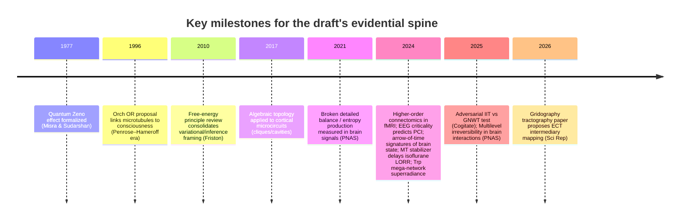
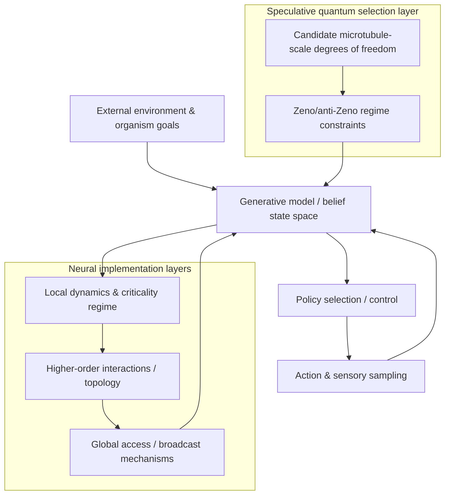

# Deep research review of the draft “Consciousness as a Navigational Faculty”

## Executive summary

The draft proposes a unification thesis: *consciousness is a navigational faculty that selects trajectories through a “possibility space”*, with **IIT** supplying structural integration, **GNWT** supplying global access/broadcast, and **Orch OR–style quantum selection** supplying a physical “choice” mechanism (often linked to microtubules and quantum Zeno/anti‑Zeno dynamics). fileciteturn0file1

Cross-checking the draft’s main empirical anchors against the allowed primary/official sources reveals a mixed picture:

A large-scale, preregistered, adversarial “theory test” does exist and supports the draft’s claim that **key canonical predictions of IIT and GNWT are challenged—while some ancillary predictions are supported**. In **Nature** (published April 30, 2025; issue date June 5, 2025), the *Cogitate Consortium* reports **n = 256** with fMRI/MEG/iEEG and concludes that **IIT is challenged by lack of sustained posterior synchronization** and **GNWT is challenged by lack of ignition at stimulus offset and limited prefrontal representation of some conscious dimensions**. citeturn1view0

Multiple 2024–2025 network/thermodynamics papers also support the draft’s broader “nonequilibrium + higher-order organization” framing:  
- **Higher-order (3+ region) interaction models** can outperform pairwise approaches for some fMRI tasks (HCP fMRI; **100 subjects**) and can support improved task decoding, individual identification, and brain–behavior association. citeturn22view0  
- Large-scale brain dynamics show measurable **irreversibility / broken detailed balance**, with stronger nonequilibrium signatures under exertion/task demands versus rest. citeturn29search0  
- Under anesthesia, measures of **criticality/edge-of-chaos** and **arrow-of-time/irreversibility** shift systematically with state, and can dissociate unresponsiveness from unconsciousness in specific protocols. citeturn25view0turn31view0  
- Higher-order irreversibility can be quantified for multivariate brain interactions (including triplets/quadruplets) in MEG task data (reporting **51 participants** in the displayed protocol figure caption). citeturn28view0

The most fragile part of the draft is the **quantum-microtubule causal chain** as currently written. Several cited “supporting” results are real and nontrivial, but the draft repeatedly **overinterprets what they establish**:
- A molecular/neuropharmacology result exists: a microtubule-stabilizer (**epothilone B**) delays isoflurane loss-of-righting reflex in rats by **~69 seconds** with **Cohen’s d ≈ 1.9**, i.e., a large standardized effect; however, the paper itself contains reviewer-discussed alternative explanations (e.g., binding-pocket interference rather than “microtubule destabilization”). citeturn33view0  
- A photophysics result exists: UV excitation of large tryptophan networks in tubulin/microtubule architectures can yield **superradiant/subradiant collective optical modes** in networks up to **>10^5** chromophores, with experimentally confirmed quantum-yield scaling and “bright” and “dark” modes spanning **hundreds of femtoseconds to tens of seconds**. This is evidence of *collective quantum optical effects* in protein architectures, but it is **not yet evidence** of long-lived, cognition-scale quantum computation in vivo. citeturn18view0  
- The long-running decoherence critique/response exchange is real and should be confronted explicitly: **Tegmark’s** calculation argues for extremely short decoherence timescales in brain-relevant degrees of freedom (order **10^-13–10^-20 s**) relative to neurophysiological times (**~10^-3–10^-1 s**), while **Hagan–Hameroff–Tuszynski** reply that alternative physical assumptions could extend coherence and that Tegmark’s modeling choices matter. citeturn32search0turn32search2

A second major weakness is *conceptual*: the draft’s central construct—“time as possibility space”—draws on relativity and philosophy of time but remains underspecified. The literature the draft points to (e.g., the block universe debate) supports that relativity motivates **eternalist/block-universe pressures**, but it does not by itself license the draft’s stronger identification of “time = possibility space” without additional formal work. citeturn6search0turn6search2turn7search0

The revision path that would most increase publishability is to (i) **separate established empirical findings from speculative metaphysics**, (ii) **formalize “possibility space” operationally** (e.g., as an agent’s generative model state space within active inference), and (iii) deliver **novel, discriminative predictions** that are not already captured by active inference / IWMT-style integrative accounts. citeturn10search0turn12search0

## Draft claim map

The draft’s argument structure can be compactly reconstructed into six “load-bearing” claims. fileciteturn0file1

The draft’s core scientific claim is that **consciousness is an active selection process**: not merely “integration” (IIT) or “broadcast/access” (GNWT), but a **control-like faculty that selects among counterfactual futures** (“possibility space navigation”). fileciteturn0file1

The draft then offers three bridging commitments:

First, it treats **IIT and GNWT as partial subsystem-level theories**. The *Cogitate* adversarial collaboration is used as evidence that each theory gets something right yet fails on a central predicted signature, suggesting the correct account may integrate multiple components rather than crown a single winner. fileciteturn0file1turn1view0

Second, it treats **brain dynamics as an irreversibly driven, nonequilibrium process** (arrow of time, broken detailed balance, criticality) and suggests that conscious state changes should correlate with shifts in nonequilibrium measures and higher-order (group) dependencies. fileciteturn0file1turn29search0turn22view0turn31view0turn25view0

Third, it posits a **quantum “selection” layer** (often via Orch OR-like narratives) to supply a physically grounded “choice” mechanism unattainable by purely classical computation, with microtubules as the candidate substrate. fileciteturn0file1turn33view0turn18view0turn32search0turn32search2

The draft also includes two philosophical “constraint claims”:

It invokes a **Gödelian/self-reference limitation**: a system cannot fully represent itself, so consciousness science faces principled self-modeling limits (and consciousness itself may exploit or instantiate such limits). fileciteturn0file1turn4search5turn5view0

It develops “**time as possibility space**,” drawing on relativity’s block-universe pressures (and the perceived tension between a static manifold and experienced temporal flow) to motivate treating conscious agency as the “missing element” that restores a lived arrow of time. fileciteturn0file1turn6search0turn7search0

## Claim-by-claim cross-check against prioritized sources

This section flags, for each major claim, whether it is **supported**, **partially supported**, **overstated**, or **currently unsupported** by the prioritized primary/official sources.

### Adversarial testing and partial failures of IIT and GNWT

The draft’s claim that a preregistered adversarial collaboration tested IIT vs GNWT at scale and found partial support but major challenges is **strongly supported**. The *Cogitate Consortium* reports a theory-neutral protocol; **human participants (n = 256)** viewed suprathreshold stimuli while neural activity was measured via **fMRI, MEG, and iEEG**; results “align with some predictions…while substantially challenging key tenets of both theories.” citeturn1view0

The draft’s specific summary of the “failed signatures” is **supported in substance**, and can be strengthened by quoting the paper’s own abstract-level framing: **IIT is challenged by lack of sustained synchronization within posterior cortex**, and **GNWT is challenged by lack of ignition at stimulus offset plus limited representation of some conscious dimensions in prefrontal cortex**. citeturn1view0

Where the draft currently overreaches is in treating this as direct support for *its* alternative theory rather than as evidence that (i) the tested operationalizations were incomplete, (ii) both theories require revision, and/or (iii) the tested paradigms may not isolate each theory’s intended mechanisms. The Nature paper itself explicitly frames the result as challenging both and calling for wider quantitative theory testing, not endorsing a replacement theory. citeturn1view0

### “Epiontic” intermediary theory via tractography

The draft cites a “gridography tractography” paper claiming an intermediary between global-workspace and integrated-information viewpoints. This paper exists and explicitly names “Epiontic Consciousness Theory (ECT)” as a bridging framework; it uses **diffusion MRI tractography** on **Human Connectome Project** diffusion data and highlights connections (notably the **superior longitudinal fasciculus**) connecting “anterior” and “posterior” regions associated with the two theories. citeturn3view0

However, the evidential weight is **modest** for a mechanistic theory of consciousness: diffusion tractography is an indirect structural inference method; the paper is largely an interpretive mapping from tractography to theory labels rather than a test that distinguishes conscious from unconscious states, or implements causal interventions. This is best presented as *a structural compatibility result* rather than confirmatory evidence for a specific hybrid consciousness mechanism. citeturn3view0

### Higher-order interactions and topology in functional data

The draft’s use of higher-order interaction work is **well supported** and aligns with a concrete 2024 Nature Communications contribution: Santoro et al. explicitly frame pairwise functional connectivity as limited, analyze higher-order interactions in fMRI, and report that higher-order approaches can enhance task decoding, individual identification, and strengthen brain–behavior associations in **100 HCP subjects**. citeturn22view0

The draft should note key nuance from the paper: **global whole-brain higher-order metrics did not clearly outperform**, whereas **local indicators** and restricted subnetworks showed consistent advantages—important for the draft’s claim that “navigation” may be localized, structured, and multi-scale rather than globally uniform. citeturn22view0

### Nonequilibrium brain dynamics, arrow of time, irreversibility

The draft’s broad picture—brain dynamics break detailed balance and show measurable irreversibility that varies with cognitive state—is **supported by primary work**.

A canonical example is Lynn et al. (PNAS) framing and measuring **broken detailed balance** and **entropy production** in macroscopic brain signals and arguing that violations increase under **physical/cognitive exertion** versus near-resting conditions. citeturn29search0

State-dependent irreversibility signatures are also supported in animal electrophysiology: Camassa et al. quantify “arrow of time / irreversibility” in LFP signals across wake, sleep, and anesthesia-related states in rats (N = 5), finding **low irreversibility** during synchronous slow-wave regimes (deep anesthesia and slow-wave sleep), and **higher irreversibility** in wake-like asynchronous dynamics. citeturn31view0

Higher-order irreversibility can also be operationalized for multivariate interactions: Nartallo‑Kaluarachchi et al. present a directed multiplex visibility-graph irreversibility framework and apply it to MEG recordings, describing a protocol with **51 participants** (as presented in the methods figure caption) and identifying interaction-level irreversibility patterns across singletons, pairs, triplets, and quadruplets. citeturn28view0

What remains **under-argued** in the draft is the step from “irreversibility correlates with state” to “irreversibility is the selection mechanism for conscious choice.” The cited sources parameterize nonequilibrium signatures but do not interpret them as *a selection operator over futures*. citeturn29search0turn31view0turn28view0

### Criticality and consciousness under anesthesia

The draft leans on criticality as a necessary condition for consciousness. A strong source exists: Maschke et al. analyze resting-state EEG under propofol, xenon, and ketamine in **15 healthy adults** (5 per anesthetic), using avalanche criticality, chaoticity, and related metrics; they emphasize that ketamine can preserve subjective experience (dreaming) despite unresponsiveness, allowing partial dissociation; “states of unconsciousness are characterized by a distancing from…avalanche criticality and the edge of chaos,” and EEG dynamics predicted PCI with “considerably high accuracy.” citeturn25view0

This supports the draft’s claim that criticality-like dynamical regimes relate to consciousness markers, but it also supplies important constraints: the study’s claim is about *resting EEG dynamical properties* predicting PCI and differentiating pharmacological states—still not a direct demonstration of a quantum selection mechanism. citeturn25view0

### Quantum Zeno / anti‑Zeno as a selection mechanism

The draft invokes quantum Zeno/anti‑Zeno effects as a way to formalize “selection via repeated observation” and to respond to the “Zeno objection” in consciousness-collapse models.

The quantum Zeno effect’s classic formulation is firmly established: repeated measurement can inhibit evolution (“an unstable particle…continuously observed…will never be found to decay”), as first formalized by Misra & Sudarshan (doi:10.1063/1.523304). citeturn14search0

Anti‑Zeno behavior is also real: measurement can accelerate transitions depending on regime and coupling; Kaulakys & Gontis provide an early formal investigation (available in arXiv form). citeturn15search3

More broadly, modern formulations emphasize that the effective decay rate depends on **overlap between environmental spectral density and a measurement-induced “filter”** (a concrete handle the draft could use to specify which physical degrees of freedom are being “measured” and at what rate). citeturn15search2

Crucially, primary sources that explicitly connect consciousness-collapse proposals to Zeno constraints exist: Chalmers & McQueen argue that “simple versions…are falsified by the quantum Zeno effect, but more complex versions remain compatible,” and propose quantum-computer experiments as potential tests. citeturn13search0

At present, the draft’s weakness is not that Zeno/anti‑Zeno are unreal; it is that the draft does not specify (i) what constitutes “measurement” in cortical/microtubule physics, (ii) what degrees of freedom are monitored, and (iii) why the model’s implied Zeno/anti‑Zeno regime matches neurophysiological timescales (rather than collapsing to trivial freezing or unphysical measurement assumptions). citeturn14search0turn15search2turn13search0

### Microtubule and quantum evidence

This is the most sensitive evidential chain in the draft.

A strong “microtubules as anesthesia-relevant target” experiment exists: in rats, epothilone B (0.75 mg/kg, s.c.) increased latency to LORR under 4% isoflurane by **~69 seconds** with **Cohen’s d ≈ 1.9**; the paper interprets this as support for microtubules as at least one relevant anesthetic target, while also documenting reviewer pushback on overclaimed mechanisms (e.g., destabilization vs binding-pocket occupancy). citeturn33view0

The draft should treat this as evidence for **microtubule involvement** in anesthetic action, but not as direct evidence that consciousness is a **quantum microtubule state**. The study’s own framing links the finding to MT-based theories, but does not establish the quantum step. citeturn33view0

A strong “collective quantum optical effects in tubulin architectures” result exists (Babcock et al.): the paper predicts and experimentally supports superradiant UV collective states in tryptophan mega-networks up to **>10^5** in microtubule architectures; it reports “brightest” and “darkest” modes spanning **hundreds of fs to tens of seconds**, and argues these effects can survive disorder at thermal equilibrium. citeturn18view0

But the proper interpretation is **photophysics in protein architectures**, not yet “cognition-scale in vivo quantum computation.” The draft’s current language sometimes slides from “collective optical modes exist” to “microtubules implement choice among futures,” which is **not warranted** by the cited result alone. citeturn18view0

The draft also needs to handle the high-profile decoherence critique. Tegmark’s analysis argues brain-relevant coherence is destroyed extremely quickly (order 10^-13–10^-20 seconds), concluding cognitive degrees of freedom behave classically; Hagan–Hameroff–Tuszynski respond that different physical assumptions could extend times and that Orch OR does not require neuron-firing superpositions. citeturn32search0turn32search2

Finally, the draft currently misattributes one key 2025 “quantum microtubule” review. The relevant open-access article is by **Michael C. Wiest** (Neuroscience of Consciousness 2025: n ia f011), not “Hameroff et al. 2025,” and should be cited accordingly. citeturn16search1

image_group{"layout":"carousel","aspect_ratio":"16:9","query":["microtubule structure electron microscopy","tryptophan fluorescence protein structure","brain network connectivity graph fMRI","simplicial complex network diagram neuroscience"],"num_per_query":1}

## Methodological and conceptual issues

### Category errors and over-joins between levels

The draft repeatedly jumps between: (i) quantum measurement theory, (ii) mesoscale neurodynamics (EEG/MEG/fMRI), and (iii) subjective report/phenomenology, often without explicit bridging assumptions. This is the core “methodological gap” because the strongest cited empirical results are at *macro/meso* scales (COGITATE, higher-order fMRI, EEG criticality, arrow-of-time), while the strongest quantum-related results are *molecular/photophysical* (tryptophan superradiance) or *pharmacological* (microtubule stabilizer effects). citeturn1view0turn22view0turn25view0turn31view0turn18view0turn33view0

To be rigorous, the draft needs an explicit “translation layer,” e.g., a model stating how a hypothesized microtubule-scale variable would manifest in canonical consciousness readouts (PCI, reportable perception, task decoding, workspace signatures). PCI is explicitly discussed as a robust cross-condition measure in the anesthesia-criticality paper; using it as a bridge target would strengthen the draft’s measurement story. citeturn25view0

### “Possibility space” remains undefined as a scientific object

As written, “possibility space” sometimes reads as:  
- an ontological space of physically real branches (Many Worlds-like),  
- a Bayesian hypothesis space (epistemic),  
- a control-theoretic state space for planning, or  
- a metaphysical dimension “added to spacetime.”

These are not equivalent, and each would demand different mathematics and empirical access.

A tractable re-specification—supported by existing literature—would interpret “possibility space” as an **agent’s generative-model state space** in active inference: perception, planning, and action framed as probabilistic inference minimizing variational free energy. This retains navigational flavor but grounds it in a widely used formalism. citeturn10search0turn11search0

As a diagnostic: the draft’s central claim becomes testable only when “navigation” implies measurable signatures in: state estimation, belief updating, policy selection, and information flow. Without this, the theory risks becoming a metaphor layered on heterogeneous results.

### The Gödel/self-reference move needs careful delimitation

The draft is right that self-representation has principled limits in many formal settings, and there is relevant contemporary work exploring Gödel-like constraints in open systems and self-models. citeturn4search5

However, importing Gödelian incompleteness into consciousness science must be explicitly framed as **analogy or constraint-hypothesis**, not as a theorem-level conclusion. Hoel’s recent arXiv work on falsifiability/triviality constraints in consciousness theories (via substitution-style dilemmas for LLMs) can be used to motivate methodological constraints, but it is distinct from Gödel’s incompleteness theorems per se. citeturn5view0

### The draft under-engages top competing integrative frameworks

The draft’s integrative aim overlaps heavily with existing integrative programs—especially active inference and IWMT—and needs a sharper differentiator.

Safron’s IWMT explicitly aims to combine IIT- and GNWT-like ideas within the free energy / active inference framework, and adds constraints about embodied control and Bayesian belief networks; the draft should engage this more directly as a near neighbor (and either adopt IWMT elements or specify what IWMT cannot explain that the navigational-quantum proposal can). citeturn12search0turn12search1

## Annotated draft with inline suggested edits and citation insertions

This annotated version focuses on high-impact edits: citation corrections, claim tightening, and “make it testable” rewrites. It is based on the draft as provided. fileciteturn0file1 A few relevant tangential sources already listed by the author are also reflected. fileciteturn0file0

### Title and abstract

**Original (title):** “Consciousness as Navigational Faculty: A Unification of IIT, GNWT, and Orch OR Through Possibility Space” fileciteturn0file1  
**Suggested edit:** Keep title, but add a clarifying subtitle indicating formal scope, e.g., “...: A multiscale proposal grounded in nonequilibrium brain dynamics and selection mechanisms.”

**Original (abstract claim, paraphrased):** COGITATE falsifies key predictions of IIT and GNWT. fileciteturn0file1  
**Suggested edit:** Replace “falsifies” with “substantially challenges preregistered operationalizations of key tenets,” and cite the Nature paper with DOI. citeturn1view0

**Citation correction insertion (abstract):**  
Add: “(Cogitate Consortium, 2025; doi:10.1038/s41586-025-08888-1)” citeturn1view0

### Use of the gridography / ECT paper

**Original draft reference:** “Nature Scientific Reports (2025). Gridography tractography…” fileciteturn0file1  
**Correction:** The Scientific Reports article is published **30 December 2025** as Sci Rep **16 (2026)**, DOI **10.1038/s41598-025-31016-y**. citeturn3view0

**Suggested wording change:**  
Replace “validated ECT” with “proposed diffusion-tractography structural connections consistent with an intermediary interpretive mapping (ECT).” citeturn3view0

### Higher-order interactions as empirical support for “navigation”

**Original draft framing (paraphrased):** higher-order connectomics proves group interactions are fundamental and reveal cognitive signatures. fileciteturn0file1  
**Suggested edit:** Tie this to specific claims and limitations:

Insert after first mention:  
“Higher-order interaction methods can outperform pairwise FC for local/topological indicators in task decoding and fingerprinting, but global higher-order metrics may not show advantages; therefore the theory should predict *where* and *when* higher-order markers track consciousness rather than assuming uniform benefit.” citeturn22view0

### Quantum/microtubule evidence and tone calibration

**Original draft citation:** “Hameroff et al. (2025) microtubule substrate experimentally supported…” fileciteturn0file1  
**Correction:** Cite **Wiest (2025)** (Neuroscience of Consciousness; open access). citeturn16search1

**Original draft claim (paraphrased):** microtubules show ms-scale coherence matching perceptual timescales. fileciteturn0file1  
**Suggested edit:** Either (a) supply a primary source that explicitly reports ms-scale coherence in the relevant degree of freedom *in situ*, or (b) reframe as a hypothesis:

Recommended replacement sentence:  
“Collective quantum optical effects in tubulin architectures (e.g., superradiant/subradiant modes and size-dependent QY scaling) motivate—but do not yet establish—cognition-scale coherent dynamics in vivo.” citeturn18view0

**Original draft claim:** microtubule-binding drugs delay anesthesia-induced unconsciousness, therefore microtubules are the consciousness substrate. fileciteturn0file1  
**Suggested edit:** Keep the strong effect size but limit inference:

Insert:  
“In rats, epothilone B delays isoflurane LORR by ~69 s (Cohen’s d ≈ 1.9), consistent with microtubules being functionally relevant targets of at least one volatile anesthetic; alternative molecular interpretations (e.g., binding-pocket interference) remain plausible and must be ruled out experimentally.” citeturn33view0

**Missing but necessary counterbalance:** Add two paragraphs acknowledging the decoherence controversy and why the draft’s mechanism is not trivially excluded.

Insert:  
“Tegmark’s decoherence analysis argues for extremely short coherence times for brain-relevant degrees of freedom, challenging quantum-computation-in-brain proposals; Hagan–Hameroff–Tuszynski respond that alternative assumptions could extend times and that Orch OR does not rely on neuron-firing superpositions.” citeturn32search0turn32search2

### Quantum Zeno / anti-Zeno mechanism specification

**Original draft (paraphrased):** repeated “observation” by conscious agent selects outcomes via Zeno/anti-Zeno. fileciteturn0file1  
**Suggested edit:** Add model commitments:

Insert a “Mechanism box” specifying:
- system: what Hilbert-space degrees of freedom (e.g., chromophore network excitations? tubulin conformers?)  
- measurement: what physical interaction implements the measurement-like operation  
- timescale: what sets sampling/measurement interval  
- regime: what spectral density/filter function overlap implies Zeno vs anti-Zeno

Support the general dependence on spectral density/filter function and cite both classic and modern formulations. citeturn14search0turn15search2turn15search3

### Philosophy of time claims

**Original draft (paraphrased):** relativity implies block universe; consciousness “restores” temporal flow as navigation. fileciteturn0file1  
**Suggested edit:** Precisify and avoid overclaim:

Insert:  
“Relativity motivates tensions between presentist ‘becoming’ and frame-dependent simultaneity arguments (Rietdijk–Putnam style), but philosophical positions remain contested; the draft’s proposal should be presented as a constructive mapping from experienced temporality to an agentive control problem instead of as a derivation from relativity.” citeturn6search0turn7search0

## Revision plan

### Rebuild the paper around falsifiable commitments

The quickest route to a “whitepaper-grade” academic contribution is to restructure the draft so that each theoretical construct produces at least one discriminative, preregisterable prediction.

Begin by adopting a “COGITATE-style discipline” for your own theory: define divergent predictions and pass/fail criteria ex ante, mirroring the explicit protocol emphasis in adversarial theory testing. citeturn1view0

### Normalize and correct the citation spine

Replace or correct the draft’s most critical citations as follows (DOIs shown for stability):

- Cogitate Consortium (Nature, 2025): doi:10.1038/s41586-025-08888-1. citeturn1view0  
- Gridography / ECT (Sci Rep 16, 2026; published Dec 30, 2025): doi:10.1038/s41598-025-31016-y. citeturn3view0  
- Higher-order connectomics (Nat Commun 15, 2024): doi:10.1038/s41467-024-54472-y. citeturn22view0  
- Arrow-of-time brain states (Sci Rep 14, 2024): doi:10.1038/s41598-024-74649-1. citeturn31view0  
- EEG criticality under anesthesia (Commun Biol 7, 2024): doi:10.1038/s42003-024-06613-8. citeturn25view0  
- Microtubule stabilizer + anesthesia (eNeuro 2024): doi:10.1523/ENEURO.0291-24.2024. citeturn33view0  
- Tryptophan mega-network superradiance (J Phys Chem B 2024): doi:10.1021/acs.jpcb.3c07936. citeturn18view0  
- Broken detailed balance / entropy production (PNAS 2021): doi:10.1073/pnas.2109889118. citeturn29search0  
- Multi-level irreversibility in brain dynamics (PNAS 2025): doi:10.1073/pnas.2408791122. citeturn28view0  
- Zeno’s paradox in quantum theory: doi:10.1063/1.523304. citeturn14search0

### Add explicit alternative interpretations and “defeaters”

A rigorous draft must state what would *falsify* the quantum-selection mechanism, and what classical alternatives explain the same observations.

For anesthesia + microtubule stabilization, list explicit discriminators:
- If epothilone B delays LORR by blocking isoflurane binding pockets rather than preserving a putative quantum state, then microtubule involvement remains but the quantum claim weakens. This alternative is directly raised in the peer review dialogue embedded in the PMC record. citeturn33view0  
- If consciousness correlates with criticality/PCI even when microtubule variables are held constant (or manipulated without changing PCI), then “navigation” likely resides at macro network dynamics, not microtubule quantum state. citeturn25view0

### Proposed experiments and analyses

A minimal set of concrete, discriminative tests—feasible with today’s methods—would connect the draft’s three domains:

One path is a **cross-scale anesthesia perturbation program**:
1) replicate and extend the epothilone B effect with antagonistic manipulations (stabilizers vs destabilizers) and multiple anesthetics; track both behavioral endpoints (LORR) and higher-order/criticality metrics (e.g., avalanche measures, edge-of-chaos proxies). citeturn33view0turn25view0  
2) quantify whether nonequilibrium/irreversibility signatures (arrow-of-time) shift in tandem with consciousness markers across the perturbed conditions, using established “irreversibility as brain state signature” pipelines. citeturn31view0turn29search0  
3) pre-register which direction each manipulation should push the measures under the draft’s model versus under an alternative “classical microtubule structural support” model.

A second path is a **higher-order interaction signature test**:
- predict that conscious access corresponds to specific local higher-order motifs (triangles/simplicial motifs) in designated subnetworks, and test whether these motifs track reportable content or PCI more strongly than pairwise FC. citeturn22view0turn25view0  

A third path is a **Zeno/anti‑Zeno mechanistic toy model**:
- formalize your “selection” operator as a filter-function overlap problem, then show which regimes produce nontrivial selection rather than freezing; this aligns with established general frameworks for Zeno/anti‑Zeno transitions and avoids hand-wavy “observation” language. citeturn15search2turn14search0

## Comparative evidence tables

### Empirical studies most relevant to the draft’s core claims

| Study (domain) | What it tests | Modality / dataset | Sample size | Key quantitative notes | What it supports in the draft | Confidence for draft use |
|---|---|---:|---:|---|---|---|
| Cogitate Consortium (Nature 2025) | Adversarial test of IIT vs GNWT predictions | fMRI + MEG + iEEG | n = 256 citeturn1view0 | Challenges IIT: lack of sustained posterior synchronization; challenges GNWT: lack of ignition at stimulus offset citeturn1view0 | “Subsystem” interpretation plausible; motivates integrative frameworks | High for “both partially challenged,” low for endorsing the draft’s replacement mechanism |
| Santoro et al. (Nat Commun 2024) | Higher-order interactions vs pairwise FC | fMRI (HCP) | 100 subjects citeturn22view0 | Higher-order improves task decoding / fingerprinting; local HO metrics outperform; global HO metrics not superior citeturn22view0 | Higher-order/topological signatures as candidate “navigation” footprints | Medium–High (supports topology framing; doesn’t entail consciousness per se) |
| Maschke et al. (Commun Biol 2024) | Criticality/edge-of-chaos vs unconsciousness; predicts PCI | Resting EEG under anesthesia | 15 healthy adults (5 per drug) citeturn25view0 | Unconsciousness = distancing from criticality/edge-of-chaos; EEG dynamics predict PCI with high accuracy citeturn25view0 | Consciousness relates to dynamical regime and perturbational complexity | High for dynamics; neutral on quantum |
| Camassa et al. (Sci Rep 2024) | Arrow-of-time irreversibility signatures of brain state | Rat LFP across sleep/anesthesia | N = 5 rats citeturn31view0 | Low irreversibility in slow-wave sleep / deep anesthesia; higher in wakefulness citeturn31view0 | Nonequilibrium/irreversibility as state tracker consistent with “navigation” metaphor | Medium (animal model, state markers not mechanism) |
| Lynn et al. (PNAS 2021) | Broken detailed balance / entropy production in brain signals | Whole-brain imaging analysis | (see paper) citeturn29search0 | Brain near detailed balance at rest but breaks it under exertion/task demands citeturn29search0 | Macroscopic nonequilibrium as cognition-relevant | High for nonequilibrium framing |
| Nartallo‑Kaluarachchi et al. (PNAS 2025) | Multilevel irreversibility of interactions | MEG memory task | 51 participants (protocol figure caption) citeturn28view0 | Identifies higher-order interaction irreversibility patterns across tuples citeturn28view0 | Higher-order irreversibility can be operationalized (candidate “navigation gradient”) | Medium–High |

### Microtubule/quantum-related evidence chain

| Evidence type | Study | Core finding | Effect size / salient quantitative | Best-supported inference | Overreach risk |
|---|---|---|---|---|---|
| Behavioral pharmacology (rats) | Khan et al. (eNeuro 2024) citeturn33view0 | MT stabilizer epothilone B delays isoflurane LORR | ~69 s delay; Cohen’s d ≈ 1.9 citeturn33view0 | MTs are functionally relevant anesthetic targets (at least in rats) | Concluding “quantum MT consciousness” without ruling out binding-pocket/structural explanations |
| Protein photophysics / collective modes | Babcock et al. (JPCB 2024) citeturn18view0 | UV-excited tryptophan mega-networks show collective superradiant/subradiant modes; QY scaling confirmed | Networks up to >10^5; “bright” ~fs and “dark” ~seconds modes citeturn18view0 | Collective quantum optical effects exist in protein architectures at thermal equilibrium | Treating this as cognition-scale quantum computation in vivo |
| Theoretical critique | Tegmark (arXiv quant-ph/9907009) citeturn32search0 | Decoherence times too short for brain quantum computing | ~10^-13–10^-20 s vs neural times ~10^-3–10^-1 s citeturn32search0 | Serious constraint; must be addressed by any MT-quantum mechanism | Ignoring decoherence critique reduces credibility |
| Theoretical response | Hagan–Hameroff–Tuszynski (arXiv quant-ph/0005025) citeturn32search2 | Argues Tegmark assumptions may be wrong; suggests conditions extending coherence | (see paper) citeturn32search2 | Debate is live; parameter choices matter | Claiming debate is resolved in favor of Orch OR is not justified |

## Figures

## Prioritized reference list

This list emphasizes sources that (i) determine the strongest “fact checks,” and (ii) would be most persuasive to an academic readership. All are from the user-specified or uploaded source set.

Cogitate Consortium, “Adversarial testing of global neuronal workspace and integrated information theories of consciousness.” **Nature** 642, 133–142 (2025). doi:10.1038/s41586-025-08888-1. citeturn1view0

Santoro A. et al. “Higher-order connectomics of human brain function reveals local topological signatures of task decoding, individual identification, and behavior.” **Nature Communications** 15, 10244 (2024). doi:10.1038/s41467-024-54472-y. citeturn22view0

Maschke C. et al. “Critical dynamics in spontaneous EEG predict anesthetic-induced loss of consciousness and perturbational complexity.” **Communications Biology** 7, 946 (2024). doi:10.1038/s42003-024-06613-8. citeturn25view0

Camassa A. et al. “The temporal asymmetry of cortical dynamics as a signature of brain states.” **Scientific Reports** 14, 24271 (2024). doi:10.1038/s41598-024-74649-1. citeturn31view0

Lynn C.W. et al. “Broken detailed balance and entropy production in the human brain.” **PNAS** 118, e2109889118 (2021). doi:10.1073/pnas.2109889118. citeturn29search0

Nartallo‑Kaluarachchi R. et al. “Multilevel irreversibility reveals higher-order organization of nonequilibrium interactions in human brain dynamics.” **PNAS** 122(10), e2408791122 (2025). doi:10.1073/pnas.2408791122. citeturn28view0

Khan S. et al. “Microtubule-Stabilizer Epothilone B Delays Anesthetic-Induced Unconsciousness in Rats.” **eNeuro** 11(8) (2024). doi:10.1523/ENEURO.0291-24.2024. citeturn33view0

Babcock N.S. et al. “Ultraviolet Superradiance from Mega-Networks of Tryptophan in Biological Architectures.” **J. Phys. Chem. B** 128, 4035–4046 (2024). doi:10.1021/acs.jpcb.3c07936. citeturn18view0

Tegmark M. “The importance of quantum decoherence in brain processes.” arXiv:quant-ph/9907009. citeturn32search0

Hagan S., Hameroff S.R., Tuszynski J.A. “Quantum Computation in Brain Microtubules: Decoherence and Biological Feasibility.” arXiv:quant-ph/0005025. citeturn32search2

Chalmers D.J., McQueen K.J. “Consciousness and the Collapse of the Wave Function.” arXiv:2105.02314. citeturn13search0

Misra B., Sudarshan E.C.G. “The Zeno’s paradox in quantum theory.” **Journal of Mathematical Physics** 18(4), 756–763 (1977). doi:10.1063/1.523304. citeturn14search0

Chaudhry A.Z. “A general framework for the Quantum Zeno and anti-Zeno effects.” (open access via PMC). citeturn15search2

Safron A. “An Integrated World Modeling Theory (IWMT)…” **Frontiers in Artificial Intelligence** (2020). doi:10.3389/frai.2020.00030. citeturn12search0

Safron A. “Integrated world modeling theory expanded…” **Frontiers in Computational Neuroscience** (2022). doi:10.3389/fncom.2022.642397. citeturn12search1

Friston K. “The free-energy principle: a unified brain theory?” **Nature Reviews Neuroscience** (2010). doi:10.1038/nrn2787. citeturn10search0

Parr T., Pezzulo G., Friston K.J. **Active Inference: The Free Energy Principle in Mind, Brain, and Behavior**. MIT Press (2022). citeturn11search0

Callender C. **What Makes Time Special?** Oxford University Press (2017). doi:10.1093/oso/9780198797302.001.0001. citeturn7search0

Babcock-related and microtubule-quantum synthesis reference in the draft (corrected): Wiest M.C. “A quantum microtubule substrate of consciousness is experimentally supported…” **Neuroscience of Consciousness** (2025). citeturn16search1