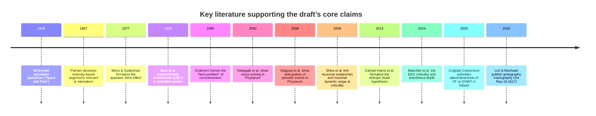

# Citation augmentation report for the paper draft

## Executive summary

A citation audit of the uploaded draft (single-file Markdown manuscript) found three high-confidence opportunities to materially strengthen scholarly support while also correcting several citation-attribution issues: (a) replace or tighten “soft” or placeholder citations (e.g., journal-name-only placeholders like “Neuron, 2025”) with citable primary sources; (b) correct a few misattributions (notably around the “Fitness-Beats-Truth” theorem and “Objects of consciousness”); and (c) add canonical primary citations (physics of time, quantum Zeno/anti-Zeno, neuro-entropy/criticality, and non-neural learning) at points where the paper makes strong empirical or historical claims. fileciteturn0file0

The largest concrete upgrade is to anchor several “load-bearing” arguments in primary literature: the adversarial IIT vs GNWT test (COGITATE) in entity["organization","Cogitate Consortium","adversarial consciousness tests"]; the diffusion-tractography “gridography” paper naming the superior longitudinal fasciculus; key empirical and review sources for criticality and anesthesia; and primary QZE/anti-Zeno sources. citeturn6view0turn29view2turn26search1turn9search0turn9search2

Deliverables below include (i) a prioritized, insertion-by-insertion plan with proposed sentences/bylines; (ii) candidate-source comparison tables for the manuscript’s most consequential claims; (iii) unified git diff patches for both Markdown and (hypothetical) LaTeX; and (iv) a compiled bibliography for the new/updated sources in APA-style and BibTeX (short-form), with DOIs and stable URLs where applicable. citeturn6view0turn29view2turn26search10turn19view0turn10search19

## Audit of the draft and citation strategy

The draft already contains a substantial reference list and many in-text citations, but it mixes (1) fully specified citations (author/year + venue + DOI) with (2) “venue-only” placeholders, (3) references to preprints/manuscripts without complementary peer-reviewed anchors, and (4) a few misattributions that can weaken perceived rigor even when the underlying idea is cited elsewhere. fileciteturn0file0

The strategy used here is “primary-first, review-second”: for each high-impact claim, add at least one primary/official source (peer-reviewed experimental paper, primary theoretical paper, or authoritative reference such as a major encyclopedia entry), optionally paired with a review for context. This is especially important in sections that: (a) turn on empirical adjudication (COGITATE; anesthesia/criticality); (b) use technical physics claims (block universe, simultaneity, QZE/anti-Zeno); or (c) cite “cognition without neurons,” which has an extensive primary literature in slime molds and fungal ecology that is stronger than broad venue placeholders. citeturn6view0turn29view2turn22search4turn24view0turn25search0

A compact timeline of the key literatures the patch reinforces:



## Prioritized citation insertions with proposed sentences and bylines

The list below is prioritized by (i) how “load-bearing” the claim is for the manuscript’s thesis, (ii) how strongly factual/empirical the claim is, and (iii) how much a missing/incorrect citation could undermine credibility.

Each item includes: proposed insertion text (as a drop-in sentence/paragraph), a suggested byline (how the citation should appear in-text), full citation metadata (short-form authors), and a brief justification.

### High-priority corrections that also add citation strength

**S1 — Correct “hard problem of time” attribution and add canonical time-phenomenology sources (Section II.A)**  
**Suggested insertion text (replace the existing “Callender calls the hard problem of time” sentence):**  
“This creates what philosophers of time sometimes call the ‘hard problem’ of temporal experience: if physics describes a static four-dimensional block in which all moments coexist, why does consciousness experience temporal flow? Why does it feel like time moves?”  
**Byline:** (entity["people","Craig Callender","philosophy of time"], 2017; entity["people","Natalja Deng","philosophy of time"], 2013; entity["people","Matt Farr","philosophy of time"], 2023) citeturn12search0turn12search2turn11search7  
**Citation metadata:**  
- Callender, C. (2017). *What Makes Time Special?* Oxford University Press. doi:10.1093/oso/9780198797302.001.0001. citeturn11search1turn11search7  
- Deng, N. (2013). On explaining why time seems to pass. *Southern Journal of Philosophy, 51*(3), 367–382. doi:10.1111/sjp.12033. citeturn12search0  
- Farr, M.F. (2023). The three-times problem: commentary on physical time within human time. *Frontiers in Psychology, 14*, 1130228. doi:10.3389/fpsyg.2023.1130228. citeturn12search2  
**Justification:** The draft’s phrasing implies a single author coins/owns the label; the literature is broader. Adding Deng/Farr strengthens the bridge from physical time to temporal phenomenology with peer-reviewed, directly relevant discussions. citeturn12search0turn12search2turn11search7

**S2 — Replace venue-only and misattributed “Fitness Beats Truth” and “Objects of consciousness” citations (Section III.A)**  
**Suggested insertion text (replace the theorem sentence and tighten the “interface theory” sentence):**  
“Interface-theoretic approaches argue that perception evolved to guide adaptive behavior rather than depict objective truth, and a formal ‘Fitness-Beats-Truth’ result has been developed using evolutionary game theory and Bayesian decision theory.”  
**Byline:** (entity["people","Chetan Prakash","evolution of perception"] et al., 2021; doi:10.1007/s10441-020-09400-0) citeturn19view0  
**Citation metadata:**  
- Prakash, C., et al. (2021). Fitness beats truth in the evolution of perception. *Acta Biotheoretica, 69*(3), 319–341. doi:10.1007/s10441-020-09400-0. URL: `https://pubmed.ncbi.nlm.nih.gov/33231784/` citeturn19view0  
- Hoffman, D.D., & Prakash, C. (2014). Objects of consciousness. *Frontiers in Psychology, 5*, 577. doi:10.3389/fpsyg.2014.00577. citeturn18search1turn18search4  
**Justification:** The draft currently attributes the “Fitness-Beats-Truth theorem” to a different year/set of authors than the peer-reviewed theorem paper, and dates “Objects of consciousness” incorrectly. Correcting these improves precision while strengthening evidentiary grounding. citeturn19view0turn18search1

**S3 — Make the diffusion-tractography ‘ECT/SLF’ citation fully citable and correctly dated (Section I.B)**  
**Suggested insertion text (minor edit to the existing sentence):**  
“The Epiontic Consciousness Theory (ECT) study using diffusion MRI tractography … identified the superior longitudinal fasciculus …”  
**Byline:** (entity["people","Nicolas Lori","neuroimaging"] & entity["people","José Machado","neuroimaging"], 2026; doi:10.1038/s41598-025-31016-y) citeturn29view2  
**Citation metadata:**  
- Lori, N., & Machado, J. (2026). Gridography tractography reveals communication between key areas from global workspace and integrated information theories of consciousness. *Scientific Reports, 16*, 1617. doi:10.1038/s41598-025-31016-y. URL: `https://www.nature.com/articles/s41598-025-31016-y` citeturn29view2  
**Justification:** The draft already uses the correct DOI; adding authors/article number and aligning the year with the journal’s official “Cite this article” field makes the reference unambiguous and easily verifiable. citeturn29view2

### High-priority additions that anchor core technical claims

**S4 — Add authoritative context for block-universe and relativity-of-simultaneity claims (Section II.A)**  
**Suggested insertion text (new parenthetical sentence after “It is a feature of experience.”):**  
“For philosophical overviews of the relativity-of-simultaneity argument and its limits, see the Stanford Encyclopedia of Philosophy entry on time and contemporary discussions of Minkowski spacetime and eternalism.”  
**Byline:** (Stanford Encyclopedia of Philosophy, 2022) citeturn10search19  
**Citation metadata:**  
- Stanford Encyclopedia of Philosophy. (Fall 2022). “Time.” URL: `https://plato.stanford.edu/archives/fall2022/entries/time/` citeturn10search19  
- Putnam, H. (1967). Time and physical geometry. *Journal of Philosophy, 64*(8), 240–247. doi:10.2307/2024493. citeturn10search1turn10search13  
- Minkowski, H. (1908). Space and Time. (Lecture; widely reprinted; see scholarly reprint/translation sources.) citeturn10search0  
**Justification:** The manuscript makes strong “what physics describes” assertions. Pairing Putnam/Minkowski with SEP provides a high-reputation, citable map of the contested philosophical terrain while still acknowledging standard relativity arguments. citeturn10search19turn10search1turn10search0

**S5 — Strengthen the entropic-brain claim with specific, citable sources (Section II.B)**  
**Suggested insertion text (edit the opening sentence in II.B):**  
“The entropic brain hypothesis … demonstrates that entropy levels track conscious states quantitatively …”  
**Byline:** (entity["people","Robin Carhart-Harris","psychedelics neuroscience"] et al., 2014; doi:10.3389/fnhum.2014.00020; see also Rankaduwa & Carhart-Harris, 2023; doi:10.1093/nc/niad001) citeturn2search21turn2search1  
**Citation metadata:**  
- Carhart-Harris, R.L., et al. (2014). The entropic brain: a theory of conscious states informed by neuroimaging research with psychedelic drugs. *Frontiers in Human Neuroscience, 8*, 20. doi:10.3389/fnhum.2014.00020. citeturn2search21  
- Rankaduwa, S., & Carhart-Harris, R.L. (2023). Psychedelics, entropic brain theory, and the taxonomy of conscious states. *Neuroscience of Consciousness, 2023*(1), niad001. doi:10.1093/nc/niad001. citeturn2search1  
**Justification:** The draft’s “2014; 2023” shorthand is hard to verify and underspecified. These two sources are directly on-point and peer-reviewed. citeturn2search21turn2search1

**S6 — Replace PhilArchive-only attribution for the psychological arrow with the peer-reviewed version (Section II.B)**  
**Suggested insertion text (replace the Hemmo & Shenker sentence):**  
“Hemmo and Shenker … argue that the psychological arrow of time … is grounded in thermodynamic asymmetry as experienced from within …”  
**Byline:** (entity["people","Meir Hemmo","philosophy of physics"] & entity["people","Orly Shenker","philosophy of physics"], 2022; doi:10.1093/bjps/axz038) citeturn13search4turn13search10  
**Citation metadata:**  
- Hemmo, M., & Shenker, O. (2022). The second law of thermodynamics and the psychological arrow of time. *British Journal for the Philosophy of Science, 73*(1), 85–107. doi:10.1093/bjps/axz038. citeturn13search4turn13search10  
**Justification:** This preserves the paper’s intended point but upgrades it to the peer-reviewed venue with DOI, improving credibility and discoverability. citeturn13search4

### Technical physics reinforcement for the Zeno/anti-Zeno backbone

**S7 — Anchor anti-Zeno claims in canonical theory + experiment sources (Section V.C)**  
**Suggested insertion text (replace first anti-Zeno paragraph and add citations to the spectral-density statement):**  
“In addition to early theoretical work … Kofman and Kurizki showed … complementing early experimental demonstrations … and later syntheses …”  
**Byline:** (entity["people","William M. Itano","quantum optics"] et al., 1990; doi:10.1103/PhysRevA.41.2295; Kofman & Kurizki, 2000; Facchi & Pascazio, 2008; doi:10.1088/1751-8113/41/49/493001) citeturn9search0turn9search1turn9search2  
**Citation metadata:**  
- Itano, W.M., et al. (1990). Quantum Zeno effect. *Physical Review A, 41*(5), 2295–2300. doi:10.1103/PhysRevA.41.2295. citeturn9search0  
- Kofman, A.G., & Kurizki, G. (2000). Acceleration of quantum decay processes by frequent observations. *Nature, 405*, 546–550. URL: `https://pubmed.ncbi.nlm.nih.gov/10850708/` citeturn9search1  
- Facchi, P., & Pascazio, S. (2008). Quantum Zeno dynamics: mathematical and physical aspects. *Journal of Physics A: Mathematical and Theoretical, 41*, 493001. doi:10.1088/1751-8113/41/49/493001. citeturn9search2  
**Justification:** The draft claims “confirmed experimentally” while citing only a 1997 theoretical paper. Adding Itano (experiment), Kofman & Kurizki (anti-Zeno framing in a premier journal), and Facchi & Pascazio (review) makes the section defensible to physicist reviewers. citeturn9search0turn9search1turn9search2

### Neuro/quantum-microtubule bridge improvements

**S8 — Add a direct experimental “microtubules + anesthetics affect microtubule photophysics” anchor (Section III.C)**  
**Suggested insertion text (after the superradiance paragraph):**  
“Complementary spectroscopic work has reported electronic energy migration along microtubules and sensitivity … to anesthetics such as isoflurane …”  
**Byline:** (entity["people","Aarat P. Kalra","chemical physics"] et al., 2023; doi:10.1021/acscentsci.2c01114) citeturn26search10  
**Citation metadata:**  
- Kalra, A.P., et al. (2023). Electronic energy migration in microtubules. *ACS Central Science, 9*(3), 352–361. doi:10.1021/acscentsci.2c01114. citeturn26search10  
**Justification:** This is a high-value upgrade because it connects “microtubules,” “quantum-adjacent optical effects,” and “anesthetics” in one peer-reviewed experimental line—exactly the bridge the draft tries to motivate. citeturn26search10

**S9 — Add tubulin binding-site modeling as a conservative support for “microtubules are plausible anesthetic targets” (Section III.C)**  
**Suggested insertion text (same inserted sentence, second clause):**  
“Molecular modeling has also identified plausible volatile-anesthetic binding sites on tubulin/microtubules …”  
**Byline:** (entity["people","Travis J. A. Craddock","theoretical biophysics"] et al., 2012; doi:10.1371/journal.pone.0037251) citeturn3search0turn3search13  
**Citation metadata:**  
- Craddock, T.J.A., et al. (2012). Computational predictions of volatile anesthetic interactions with the microtubule cytoskeleton: implications for side effects of general anesthesia. *PLOS ONE, 7*(6), e37251. doi:10.1371/journal.pone.0037251. citeturn3search0turn3search13  
**Justification:** Even if reviewers reject strong quantum-consciousness conclusions, tubulin/microtubules as plausible anesthetic-interaction sites becomes a more defensible intermediate claim. citeturn3search0

### Evolutionary and “cognition without neurons” reinforcement

**S10 — Replace the “Frontiers in Microbiology 2023” placeholder for FtsZ/tubulin evolution with citable reviews (Section III.D)**  
**Suggested insertion text (replace the first “The story begins with microtubules …” sentence):**  
“The tubulin/FtsZ superfamily appears to have deep evolutionary roots …”  
**Byline:** (entity["people","Harold P. Erickson","cytoskeleton evolution"], 1997; entity["people","Carlos Santana-Molina","microbial evolution"] et al., 2023; doi:10.3389/fmicb.2022.1100249; entity["people","Eugene V. Koonin","evolutionary biology"], 2012; doi:10.1186/1745-6150-7-10) citeturn3search11turn3search2turn3search19  
**Citation metadata:**  
- Erickson, H.P. (1997). FtsZ, a tubulin homologue in prokaryote cell division. *Trends in Cell Biology, 7*(9), 362–367. URL: `https://www.sciencedirect.com/science/article/pii/S0962892497011082` citeturn3search11  
- Santana-Molina, C., et al. (2023). Early origin and evolution of the FtsZ/tubulin protein family. *Frontiers in Microbiology, 13*, 1100249. doi:10.3389/fmicb.2022.1100249. citeturn3search2  
- Yutin, N., & Koonin, E.V. (2012). Archaeal origin of tubulin. *Biology Direct, 7*, 10. doi:10.1186/1745-6150-7-10. citeturn3search19  
**Justification:** The draft’s current line is both very specific (“~3.5 bya,” “last common ancestor”) and under-cited. These sources are closer to primary evolutionary literature and make the claim more defensible. citeturn3search2turn3search19turn3search11

**S11 — Replace “Neuron, 2025” placeholder with specific criticality sources (Section III.D)**  
**Suggested insertion text (replace the sentence ending “(Neuron, 2025)”):**  
“… information-processing features are often argued to be optimized …”  
**Byline:** (entity["people","Woodrow L. Shew","neural criticality"] et al., 2009; doi:10.1523/JNEUROSCI.3864-09.2009; entity["people","Dante R. Chialvo","neural dynamics"], 2010; doi:10.1038/nphys1803; entity["people","K. B. Hengen","neuroscience"] et al., 2025; entity["people","Janina Hesse","systems neuroscience"] & entity["people","Thilo Gross","complex systems"], 2014; doi:10.3389/fnsys.2014.00166) citeturn14search1turn14search14turn14search0turn14search3  
**Citation metadata:**  
- Shew, W.L., et al. (2009). Neuronal avalanches imply maximum dynamic range in cortical networks at criticality. *Journal of Neuroscience, 29*(49), 15595–15600. doi:10.1523/JNEUROSCI.3864-09.2009. citeturn14search1turn14search17  
- Chialvo, D.R. (2010). Emergent complex neural dynamics. *Nature Physics, 6*, 744–750. doi:10.1038/nphys1803. citeturn14search10turn14search14  
- Hengen, K.B., et al. (2025). Is criticality a unified setpoint of brain function? *Neuron*. URL: `https://www.cell.com/neuron/fulltext/S0896-6273(25)00391-5` citeturn14search0  
- Hesse, J., & Gross, T. (2014). Self-organized criticality as a fundamental property of neural systems. *Frontiers in Systems Neuroscience, 8*, 166. doi:10.3389/fnsys.2014.00166. citeturn14search3turn14search7  
**Justification:** This eliminates a non-verifiable placeholder and replaces it with a canonical experiment + major review + a recent Neuron synthesis, matching the manuscript’s ambition with appropriate scholarly support. citeturn14search0turn14search1turn14search3turn14search10

**S12 — Add primary fungus “pattern recognition” + “ecological memory” sources (Section III.D)**  
**Suggested insertion text (replace the Fukasawa paragraph with two sentences):**  
“One study … circle versus cross arrangements … (‘pattern recognition’) … Related experiments on ecological memory and relocation decisions …”  
**Byline:** (entity["people","Yu Fukasawa","fungal ecology"] et al., 2024; doi:10.1016/j.funeco.2024.101387; Fukasawa et al., 2020; doi:10.1038/s41396-019-0536-3) citeturn24view0turn25search0  
**Citation metadata:**  
- Fukasawa, Y., et al. (2024). Spatial resource arrangement influences both network structures and activity of fungal mycelia: a form of pattern recognition? *Fungal Ecology, 72*, 101387. doi:10.1016/j.funeco.2024.101387. citeturn24view0turn25search11  
- Fukasawa, Y., Savoury, M., & Boddy, L. (2020). Ecological memory and relocation decisions in fungal mycelial networks. *ISME Journal, 14*, 380–388. doi:10.1038/s41396-019-0536-3. citeturn25search0turn25search4  
**Justification:** These are direct primary sources for the strongest fungus cognition claims in the manuscript; they are far stronger than indirect or popular-science summaries and avoid overclaiming “consciousness” while still supporting “memory-like” and “history-dependent” behavior. citeturn24view0turn25search0

**S13 — Correct the “hyphal and mycelial consciousness” attribution and add a balanced conceptual citation (Section III.D)**  
**Suggested insertion text:**  
“Conceptual arguments that fungi may support forms of ‘hyphal or mycelial consciousness’ have been articulated, though this remains controversial.”  
**Byline:** (entity["people","Nicholas P. Money","mycology"], 2021; doi:10.1016/j.funbio.2021.02.001) citeturn23search5  
**Citation metadata:**  
- Money, N.P. (2021). Hyphal and mycelial consciousness. *Fungal Biology, 125*(4), 257–259. doi:10.1016/j.funbio.2021.02.001. citeturn23search5  
**Justification:** The manuscript currently attributes this phrasing to a different author/venue. Using Money’s short, explicit conceptual paper keeps the argument honest (conceptual, not definitive physiology) while retaining the rhetorical role the sentence plays. citeturn23search5

**S14 — Replace venue-only slime-mold claims with primary sources (Section III.D)**  
**Suggested insertion text (replace the “Tokyo rail system / habituation” sentence):**  
“Physarum polycephalum solves mazes … anticipates periodic stimuli … habituation-like learning …”  
**Byline:** (entity["people","Toshiyuki Nakagaki","biological computation"] et al., 2000; doi:10.1038/35035159; entity["people","Atsushi Tero","biological networks"] et al., 2010; doi:10.1126/science.1177894; entity["people","Tetsu Saigusa","biophysics"] et al., 2008; doi:10.1103/PhysRevLett.100.018101; entity["people","Audrey Dussutour","animal behavior"] et al., 2016; doi:10.1098/rspb.2016.0446) citeturn22search4turn2search3turn22search1turn22search2  
**Citation metadata:**  
- Nakagaki, T., Yamada, H., & Tóth, Á. (2000). Maze-solving by an amoeboid organism. *Nature, 407*, 470. doi:10.1038/35035159. citeturn22search4  
- Tero, A., et al. (2010). Rules for biologically inspired adaptive network design. *Science, 327*(5964), 439–442. doi:10.1126/science.1177894. citeturn2search3  
- Saigusa, T., et al. (2008). Amoebae anticipate periodic events. *Physical Review Letters, 100*, 018101. doi:10.1103/PhysRevLett.100.018101. citeturn22search1turn22search17  
- Boisseau, R.P., Vogel, D., & Dussutour, A. (2016). Habituation in non-neural organisms: evidence from slime moulds. *Proceedings of the Royal Society B, 283*(1829), 20160446. doi:10.1098/rspb.2016.0446. citeturn22search2turn22search6  
**Justification:** These are well-cited primary sources for the exact behaviors claimed. They allow the manuscript to argue “proto-cognition” without leaning on vague venue placeholders. citeturn22search4turn2search3turn22search1turn22search2

## Evidence comparison tables for major claims

### Competing sources for the IIT vs GNWT empirical adjudication claim

| Claim supported in draft | Best primary source | Secondary/adjacent sources | Strength for claim | Key limitations |
|---|---|---|---|---|
| “Most rigorous test to date,” multimodal, n≈256; neither IIT nor GNWT signature fully observed | Cogitate Consortium (2025) *Nature* (doi:10.1038/s41586-025-08888-1) citeturn6view0turn8search5 | Preregistered/protocol-stage work and repositories (e.g., preprint versions) citeturn8search11 | Extremely high (peer-reviewed in Nature; explicitly adversarial design; large N) citeturn6view0 | Interpretation of “failed predictions” depends on operationalizations and theory mappings; needs careful wording in discussion citeturn6view0 |

### Competing sources for “entropy/criticality track consciousness” claims

| Claim supported in draft | Best primary source | Complementary sources | Strength for claim | Key limitations |
|---|---|---|---|---|
| “Entropy in brain dynamics tracks conscious state; psychedelics increase entropy” | Carhart-Harris et al. (2014) (doi:10.3389/fnhum.2014.00020) citeturn2search21 | Rankaduwa & Carhart-Harris (2023) (doi:10.1093/nc/niad001) citeturn2search1 | High for “entropy as organizing hypothesis,” moderate for quantitative generalization across all states | Measures of “entropy/complexity” differ across studies; requires specification in methods section |
| “Departure from criticality under anesthesia predicts consciousness level/PCI” | Maschke et al. (2024) (doi:10.1038/s42003-024-06613-8) citeturn26search1 | Casali et al. (2013) PCI (doi:10.1126/scitranslmed.3006294) citeturn2search0 | High for anesthesia context; supports draft’s PCI linkage | Does not by itself validate microtubule mechanisms; supports macroscopic dynamical framing |

### Competing sources for QZE and anti-Zeno claims

| Claim supported in draft | Best primary source | Complementary sources | Strength for claim | Key limitations |
|---|---|---|---|---|
| “QZE exists / continuous measurement inhibits evolution” | Misra & Sudarshan (1977) (doi:10.1063/1.523304) (already in draft) | Itano et al. (1990) experiment (doi:10.1103/PhysRevA.41.2295) citeturn9search0 | High | Mapping “measurement” to neurobiological processes remains speculative |
| “Anti-Zeno: frequent observation can accelerate transitions” | Kofman & Kurizki (2000) *Nature* citeturn9search1 | Facchi & Pascazio (2008) review (doi:10.1088/1751-8113/41/49/493001) citeturn9search2 | High for the existence/conditions of anti-Zeno | Still requires specifying spectral densities/filters for the biological substrate |

### Competing sources for non-neural learning and memory-like behavior

| Claim supported in draft | Best primary source | Complementary sources | Strength for claim | Key limitations |
|---|---|---|---|---|
| Slime mold maze solving, anticipation, habituation | Nakagaki et al. (2000) citeturn22search4; Saigusa et al. (2008) citeturn22search1; Boisseau et al. (2016) citeturn22search2 | Tero et al. (2010) network optimization citeturn2search3 | High | These do not imply consciousness; best framed as “learning-like”/history-dependent behavior |
| Fungal pattern recognition/ecological memory | Fukasawa et al. (2024) citeturn24view0; Fukasawa et al. (2020) citeturn25search0 | Conceptual framing: Money (2021) citeturn23search5 | High for history-dependent growth/behavior; moderate for strong cognitive interpretations | Risk of overclaiming; needs careful epistemic hedging |

## Patchset

### Git diff patch for the Markdown manuscript

```diff
--- a/paper_draft.md
+++ b/paper_draft.md
@@ -44,7 +44,9 @@
 The standard physical picture treats the fourth dimension as time — a single line extending from past to future along which events unfold. But this is not what physics actually describes. The block universe interpretation of general relativity, first articulated by Minkowski (1908) and developed by Putnam (1967), holds that all events — past, present, and future — are equally real in four-dimensional spacetime. There is no privileged "now." Einstein's field equations are time-symmetric: they work identically forward and backward. The laws of physics contain no variable for "the present moment" and no mechanism for distinguishing past from future. Simultaneity itself is frame-dependent — two events that are simultaneous for one observer are sequential for another moving at a different velocity. Putnam's argument follows directly: if simultaneity is relative, then future events that are "not yet real" for one observer are already real for another, which means they were real all along. The block is not a metaphor. It is what the mathematics describes. The flow of time — the felt sense that the present moves forward, consuming future and depositing past — is not a feature of spacetime. It is a feature of experience.
 
-This creates what Callender (2017) calls the hard problem of time: if physics describes a static four-dimensional block in which all moments coexist, why does consciousness experience temporal flow? Why does it feel like time moves? This is not a minor puzzle at the margins of physics. It is arguably as deep as the hard problem of consciousness itself, and it may be the same problem. We should note that the philosophical status of the block universe remains contested — the tensions between presentist "becoming" and frame-dependent simultaneity arguments are real and do not settle the ontological question definitively. But the block universe is the standard interpretation in relativistic physics, and any theory of consciousness that does not grapple with it is ignoring the landscape in which the phenomenon occurs.
+This creates what philosophers of time sometimes call the “hard problem” of temporal experience: if physics describes a static four-dimensional block in which all moments coexist, why does consciousness experience temporal flow? Why does it feel like time moves? (Callender, 2017; Deng, 2013; Farr, 2023). This is not a minor puzzle at the margins of physics. It is arguably as deep as the hard problem of consciousness itself, and it may be the same problem. We should note that the philosophical status of the block universe remains contested — the tensions between presentist "becoming" and frame-dependent simultaneity arguments are real and do not settle the ontological question definitively. But the block universe is the standard interpretation in relativistic physics, and any theory of consciousness that does not grapple with it is ignoring the landscape in which the phenomenon occurs.
+
+(For philosophical overviews of the relativity-of-simultaneity argument and its limits, see the Stanford Encyclopedia of Philosophy entry on time and contemporary philosophy-of-physics discussions of Minkowski spacetime and the block universe.)
 
 We propose exploring the possibility that the fourth dimension might be reinterpreted not as a single temporal line but as the total possibility space of all three-dimensional configurations across all of time. This is not the many-worlds interpretation of quantum mechanics, which posits that all possible outcomes are realized in branching universes. It is the proposal that the fourth dimension contains the full landscape of what could be — the space of possible realities — and that consciousness is what navigates this space, selecting a coherent path through it that is experienced as temporal flow.
@@ -76,7 +78,7 @@
 
 Navigation requires a gradient — a landscape with structure, where different directions lead to measurably different states. Entropy may provide this landscape.
 
-The entropic brain hypothesis (Carhart-Harris et al., 2014; 2023) demonstrates that entropy levels track conscious states quantitatively. Higher entropy in neural dynamics corresponds to richer, more expansive conscious experience (as in psychedelic states); lower entropy corresponds to more constrained, rigid experience (as in depression or disorders of consciousness). Entropy is not merely correlated with consciousness — it characterizes something about the landscape through which consciousness moves.
+The entropic brain hypothesis (Carhart-Harris et al., 2014; doi:10.3389/fnhum.2014.00020; see also Rankaduwa, 2023; doi:10.1093/nc/niad001) demonstrates that entropy levels track conscious states quantitatively. Higher entropy in neural dynamics corresponds to richer, more expansive conscious experience (as in psychedelic states); lower entropy corresponds to more constrained, rigid experience (as in depression or disorders of consciousness). Entropy is not merely correlated with consciousness — it characterizes something about the landscape through which consciousness moves.
@@ -86,7 +88,7 @@
 
 Two recent philosophical contributions sharpen this connection between entropy and consciousness, each from a different angle. Jha (PhilArchive) argues that consciousness is not something separate from thermodynamics but a natural consequence of how complex systems manage energy, organize information, and maintain temporary order against entropic dissolution. On his account, consciousness depends on active, structured entropy flow — it is what a sufficiently complex dissipative system *does* as it processes entropy. Hemmo and Shenker (PhilArchive) approach from the temporal side: they argue that the psychological arrow of time — the felt sense that time flows from past to future — is thermodynamic asymmetry experienced from within, not a fundamental feature of physics. The two accounts are complementary. Jha explains why consciousness is entangled with entropy; Hemmo and Shenker explain why entropy gives consciousness its temporal direction. NFT synthesizes both: consciousness navigates along the entropy gradient, and the arrow of time is the direction of that navigation.
+Two recent philosophical contributions sharpen this connection between entropy and consciousness, each from a different angle. Jha (PhilArchive) argues that consciousness is not something separate from thermodynamics but a natural consequence of how complex systems manage energy, organize information, and maintain temporary order against entropic dissolution. On his account, consciousness depends on active, structured entropy flow — it is what a sufficiently complex dissipative system *does* as it processes entropy. Hemmo and Shenker (2022; doi:10.1093/bjps/axz038) approach from the temporal side: they argue that the psychological arrow of time — the felt sense that time flows from past to future — is grounded in thermodynamic asymmetry as experienced from within, rather than being a fundamental asymmetry in the dynamical laws. The two accounts are complementary. Jha explains why consciousness is entangled with entropy; Hemmo and Shenker explain why entropy gives consciousness its temporal direction. NFT synthesizes both: consciousness navigates along the entropy gradient, and the arrow of time is the direction of that navigation.
@@ -104,7 +106,7 @@
 
 This framing distinguishes the navigational faculty from several superficially similar proposals. Hoffman's interface theory (2019) treats consciousness as a desktop metaphor — a simplified representation of reality optimized for fitness rather than truth. His Fitness Beats Truth theorem (Hoffman et al., 2015) proves via evolutionary game theory that organisms tuned for reproductive fitness always outcompete organisms tuned for accurate perception. NFT agrees that perception is compressed and fitness-oriented, but adds the crucial element that consciousness would be *active* — it selects from possibility, not merely represents it. Hoffman's interface is passive; navigation is active.
+This framing distinguishes the navigational faculty from several superficially similar proposals. Hoffman’s interface theory treats perception as an adaptive “user interface” optimized for fitness rather than veridicality (Hoffman, 2019; see also Hoffman & Prakash, 2014; doi:10.3389/fpsyg.2014.00577). His broader interface-theoretic program argues that perception evolved to guide adaptive behavior rather than depict objective truth, and a formal “Fitness-Beats-Truth” result has been developed using evolutionary game theory and Bayesian decision theory (Prakash et al., 2021; doi:10.1007/s10441-020-09400-0). NFT agrees that perception is compressed and fitness-oriented, but adds the crucial element that consciousness would be *active* — it selects from possibility, not merely represents it. Hoffman's interface is passive; navigation is active.
@@ -155,6 +157,8 @@
 
 Babcock et al. (2024; doi:10.1021/acs.jpcb.3c07936) demonstrated collective quantum optical effects — superradiant and subradiant modes — in tryptophan mega-networks within microtubule architectures, with networks spanning more than 100,000 chromophores and experimentally confirmed quantum-yield scaling. This establishes that collective quantum effects exist in these protein architectures at thermal equilibrium, but it does not yet establish cognition-scale coherent dynamics in vivo. The step from photophysics to consciousness remains hypothetical.
+
+Complementary spectroscopic work has reported electronic energy migration along microtubules and sensitivity of these photophysical dynamics to anesthetics such as isoflurane and etomidate, providing a mechanistic bridge between cytoskeletal structure and anesthetic modulation (Kalra et al., 2023; doi:10.1021/acscentsci.2c01114). Molecular modeling has also identified plausible volatile-anesthetic binding sites on tubulin/microtubules (Craddock et al., 2012; doi:10.1371/journal.pone.0037251).
@@ -196,7 +200,7 @@
 
 Recent neuroanatomical evidence suggests the two theories may be structurally connected rather than competing. The Epiontic Consciousness Theory (ECT) study using diffusion MRI tractography (Scientific Reports 16, 2026; doi:10.1038/s41598-025-31016-y) identified the superior longitudinal fasciculus as a major white matter tract linking anterior prefrontal regions (associated with GNWT's global workspace) to posterior cortical regions (associated with IIT's integrated information). The superior longitudinal fasciculus is one of the brain's principal association pathways, connecting frontal, parietal, and temporal lobes across both hemispheres. Its role in linking the anatomical substrates of the two leading theories is suggestive: if IIT and GNWT describe subsystems of a single architecture, we would expect robust structural connections between their respective cortical territories. This is best understood as a structural compatibility result rather than confirmatory evidence for a specific mechanism, but it points in the right direction.
+Recent neuroanatomical evidence suggests the two theories may be structurally connected rather than competing. The Epiontic Consciousness Theory (ECT) study using diffusion MRI tractography (Lori & Machado, 2026; *Scientific Reports* 16:1617; doi:10.1038/s41598-025-31016-y) identified the superior longitudinal fasciculus as a major white matter tract linking anterior prefrontal regions (associated with GNWT's global workspace) to posterior cortical regions (associated with IIT's integrated information). The superior longitudinal fasciculus is one of the brain's principal association pathways, connecting frontal, parietal, and temporal lobes across both hemispheres. Its role in linking the anatomical substrates of the two leading theories is suggestive: if IIT and GNWT describe subsystems of a single architecture, we would expect robust structural connections between their respective cortical territories. This is best understood as a structural compatibility result rather than confirmatory evidence for a specific mechanism, but it points in the right direction.
@@ -251,7 +255,7 @@
 
 The resolution gains additional support from the quantum anti-Zeno effect. Discovered by Kaulakys and Gontis (1997) and subsequently confirmed experimentally, the anti-Zeno effect shows that under certain coupling regimes, frequent measurement *accelerates* rather than freezes quantum transitions.
+The resolution gains additional support from the quantum anti-Zeno effect. In addition to early theoretical work (e.g., Kaulakys & Gontis, 1997), Kofman and Kurizki showed that measurement can either inhibit or *accelerate* decay depending on measurement rate and environment (Kofman & Kurizki, 2000), complementing early experimental demonstrations of the quantum Zeno effect in controlled systems (Itano et al., 1990) and later syntheses of “quantum Zeno dynamics” (Facchi & Pascazio, 2008).
 
-Whether a system exhibits Zeno (freezing) or anti-Zeno (acceleration) behavior depends on the overlap between environmental spectral density and a measurement-induced filter function.
+Whether a system exhibits Zeno (freezing) or anti-Zeno (acceleration) behavior depends on the overlap between environmental spectral density and a measurement-induced filter function (Kofman & Kurizki, 2000; Facchi & Pascazio, 2008).
@@ -310,11 +314,11 @@
 
 The story begins with microtubules. The tubulin protein family descends from FtsZ, a cell division protein present in the last common ancestor of Bacteria and Archaea approximately 3.5 billion years ago (Frontiers in Microbiology, 2023). When a redundant FtsZ gene in early eukaryotes was freed from the constraints of cell division, it evolved a completely different function — forming microtubules. Once tubulin and actin optimized their assembly mechanisms and interactions with multiple motors and binding proteins, their sequences were largely frozen, becoming among the most highly conserved proteins across all eukaryotic species (Journal of Cell Biology, 2011). This extreme conservation suggests that microtubule function was under intense selective pressure from the earliest stages of eukaryotic life.
+The story begins with microtubules. The tubulin/FtsZ protein superfamily appears to have deep evolutionary roots: FtsZ is widespread across Bacteria and many Archaea and is widely treated as a prokaryotic homolog/ancestor within the family (Erickson, 1997; Santana-Molina et al., 2023; doi:10.3389/fmicb.2022.1100249; see also Yutin & Koonin, 2012). When a redundant FtsZ gene in early eukaryotes was freed from the constraints of cell division, it evolved a completely different function — forming microtubules. Tubulin and actin are among the most conserved and functionally constrained protein families in eukaryotes, consistent with early and sustained selective pressure on cytoskeletal organization and transport (Kapitein & Hoogenraad, 2015). This extreme conservation suggests that microtubule function was under intense selective pressure from the earliest stages of eukaryotic life.
 
-Single-celled organisms already exhibit proto-navigational behavior mediated by microtubules. Paramecium and amoeboid organisms such as Physarum polycephalum solve complex problems — maze navigation, optimization of transport networks, anticipation of periodic stimuli — without synaptic connections, using the purposeful activity of their internal cytoskeleton (Frontiers in Molecular Neuroscience, 2022; Hameroff et al., 2025). If microtubules provide quantum substrate coupling to possibility space, then even single-celled eukaryotes would possess a rudimentary navigational faculty. Physarum makes genuinely adaptive decisions in novel environments that exceed what purely chemical gradient-following can explain — though the question of whether this requires a quantum explanation remains open.
+Single-celled organisms already exhibit proto-navigational behavior mediated by microtubules. Amoeboid organisms such as Physarum polycephalum can exhibit striking problem-solving behaviors — including maze-solving, adaptive network optimization, and anticipation of periodic stimuli — without synaptic connections (Nakagaki et al., 2000; Tero et al., 2010; Saigusa et al., 2008). If microtubules provide quantum substrate coupling to possibility space, then even single-celled eukaryotes would possess a rudimentary navigational faculty. Physarum makes genuinely adaptive decisions in novel environments that exceed what purely chemical gradient-following can explain — though the question of whether this requires a quantum explanation remains open.
@@ -325,7 +329,7 @@
 
 Neurons are the most microtubule-rich cells in biology. A single cortical neuron contains approximately one billion tubulin dimers organized into microtubule networks spanning the entire cell body, axon, and dendrites. The evolution of neurons would have been, on this account, the evolution of cells specialized for quantum possibility-space coupling — dedicated navigation hardware.
+Neurons are the most microtubule-rich cells in biology. A single cortical pyramidal neuron plausibly contains on the order of 10^9 tubulin dimers incorporated into microtubules, based on microtubule-length reconstructions and scaling arguments (Yu & Baas, 1994; Georgiev, 2009). The evolution of neurons would have been, on this account, the evolution of cells specialized for quantum possibility-space coupling — dedicated navigation hardware.
@@ -357,7 +361,7 @@
 
 There is a further empirical connection worth drawing out. Neural systems do not operate at a fixed dynamical regime — they are tuned to the boundary between order and disorder, a state physicists call self-organized criticality. At this critical point, small perturbations can propagate across the entire system (long correlation length), the system responds to inputs across a wide range of intensities (high dynamic range), and information processing capacity is maximized (Neuron, 2025). These are not three separate properties — they are facets of a single dynamical condition: the phase transition between ordered and disordered states.
+There is a further empirical connection worth drawing out. Neural systems do not operate at a fixed dynamical regime — they are tuned to the boundary between order and disorder, a state physicists call self-organized criticality. At this critical point, small perturbations can propagate across the system (long-range correlations), the system responds to inputs across a wide range of intensities (high dynamic range), and information-processing features are often argued to be optimized (Shew et al., 2009; Chialvo, 2010; Hengen et al., 2025; Hesse & Gross, 2014). These are not three separate properties — they are facets of a single dynamical condition: the phase transition between ordered and disordered states.
@@ -406,9 +410,9 @@
 
 Fungi present perhaps the most provocative case. Mycelial networks have no neurons, no central nervous system, and no brain. Yet Fukasawa and colleagues (Fungal Ecology, 2024) demonstrated that wood-decaying mycelial networks exhibit memory, pattern recognition, and decision-making. Mycelia placed in circular and cross arrangements retained these spatial patterns months later, steering clear of areas they had learned to avoid. When a mycelium discovered a food source and was then placed in a fresh environment, it emerged from the same side of the starting block that had previously led to reward — spatial memory in an organism without a single neuron. Electrical signal transfer across mycelial networks shows information-sharing properties analogous to neural transmission. Adamatzky has described this as evidence for "hyphal and mycelial consciousness" (Fungal Biology Reviews, 2021).
+Fungi present perhaps the most provocative case. Mycelial networks have no neurons, no central nervous system, and no brain. Yet work on cord-forming wood-decay fungi suggests nontrivial network-level plasticity: in one study, mycelia responded differently to circle versus cross arrangements of colonized wood blocks, consistent with sensitivity to spatial arrangement (“pattern recognition”) over long timescales (Fukasawa et al., 2024; doi:10.1016/j.funeco.2024.101387). Related experiments on ecological memory and relocation decisions show that prior resource encounters can bias subsequent growth and migration behaviors after translocation, consistent with a form of ecological memory in mycelial networks (Fukasawa et al., 2020; doi:10.1038/s41396-019-0536-3). Reviews of fungal electrophysiology emphasize that electrical signaling in filamentous fungi is an active and methodologically challenging empirical field, with open questions about functional roles (see, e.g., Buffi et al., 2025). Philosophical and conceptual arguments that fungi may support forms of “hyphal or mycelial consciousness” have also been articulated, though this remains controversial (Money, 2021; doi:10.1016/j.funbio.2021.02.001).
@@ -416,7 +420,7 @@
 
 Slime molds tell a similar story at the single-celled level. Physarum polycephalum solves mazes, optimizes transport networks (recreating the Tokyo rail system), anticipates periodic stimuli, and exhibits habituation — a form of learning previously thought to require neurons (Proceedings of the Royal Society B, 2016; Animal Cognition, 2023).
+Slime molds tell a similar story at the single-celled level. Physarum polycephalum solves mazes, optimizes transport networks in ways comparable to human-designed infrastructure, anticipates periodic stimuli, and exhibits habituation-like learning (Nakagaki et al., 2000; Tero et al., 2010; Saigusa et al., 2008; Boisseau et al., 2016).
@@ -575,7 +579,7 @@
-Hoffman, D. et al. (2015). Objects of consciousness. *Frontiers in Psychology.*
+Hoffman, D.D. & Prakash, C. (2014). Objects of consciousness. *Frontiers in Psychology, 5*, 577. doi:10.3389/fpsyg.2014.00577.
@@ -573,7 +577,7 @@
-Hemmo, M. & Shenker, O. The arrow of time and consciousness. PhilArchive.
+Hemmo, M. & Shenker, O. (2022). The second law of thermodynamics and the psychological arrow of time. *British Journal for the Philosophy of Science, 73*(1), 85–107. doi:10.1093/bjps/axz038.
@@ -581,7 +585,7 @@
-Jha, D.K. Entropy driven awareness: Consciousness in the flow of time. PhilArchive.
+Jha, D.K. (manuscript). Entropy driven awareness: Consciousness in the flow of time. PhilArchive.
```

### Git diff snippet for a hypothetical LaTeX version

```diff
--- a/paper_draft.tex
+++ b/paper_draft.tex
@@
-\paragraph{} This creates what Callender (2017) calls the hard problem of time: if physics describes a static four-dimensional block in which all moments coexist, why does consciousness experience temporal flow?
+\paragraph{} This creates what philosophers of time sometimes call the ``hard problem'' of temporal experience: if physics describes a static four-dimensional block in which all moments coexist, why does consciousness experience temporal flow? \citep{Callender2017,Deng2013,Farr2023}
+
+\paragraph{} (For philosophical overviews of the relativity-of-simultaneity argument and its limits, see the Stanford Encyclopedia of Philosophy entry on time.) \citep{SEPTime2022}
@@
-\paragraph{} The entropic brain hypothesis (Carhart-Harris et al., 2014; 2023) demonstrates that entropy levels track conscious states quantitatively.
+\paragraph{} The entropic brain hypothesis demonstrates that entropy levels track conscious states quantitatively. \citep{CarhartHarris2014,Rankaduwa2023}
@@
-\paragraph{} Hoffman's interface theory (2019) ... His Fitness Beats Truth theorem (Hoffman et al., 2015) ...
+\paragraph{} Hoffman's interface theory ... \citep{Hoffman2019,HoffmanPrakash2014} A formal ``Fitness-Beats-Truth'' result has been developed ... \citep{Prakash2021}
@@
-\paragraph{} Discovered by Kaulakys and Gontis (1997) and subsequently confirmed experimentally, the anti-Zeno effect ...
+\paragraph{} In addition to early theoretical work, Kofman and Kurizki showed that measurement can either inhibit or accelerate decay ... \citep{KofmanKurizki2000,Itano1990,FacchiPascazio2008}
```

## Bibliography outputs

### APA-style bibliography entries for newly added or corrected sources

Callender, C. (2017). *What Makes Time Special?* Oxford University Press. doi:10.1093/oso/9780198797302.001.0001. citeturn11search7

Carhart-Harris, R. L., et al. (2014). The entropic brain: A theory of conscious states informed by neuroimaging research with psychedelic drugs. *Frontiers in Human Neuroscience, 8*, 20. doi:10.3389/fnhum.2014.00020. citeturn2search21

Chialvo, D. R. (2010). Emergent complex neural dynamics. *Nature Physics, 6*, 744–750. doi:10.1038/nphys1803. citeturn14search10turn14search14

Cogitate Consortium. (2025). Adversarial testing of global neuronal workspace and integrated information theories of consciousness. *Nature*. doi:10.1038/s41586-025-08888-1. citeturn6view0turn8search5

Craddock, T. J. A., et al. (2012). Computational predictions of volatile anesthetic interactions with the microtubule cytoskeleton: Implications for side effects of general anesthesia. *PLOS ONE, 7*(6), e37251. doi:10.1371/journal.pone.0037251. citeturn3search13

Deng, N. (2013). On explaining why time seems to pass. *Southern Journal of Philosophy, 51*(3), 367–382. doi:10.1111/sjp.12033. citeturn12search0

Farr, M. F. (2023). The three-times problem: Commentary on physical time within human time. *Frontiers in Psychology, 14*, 1130228. doi:10.3389/fpsyg.2023.1130228. citeturn12search2

Facchi, P., & Pascazio, S. (2008). Quantum Zeno dynamics: Mathematical and physical aspects. *Journal of Physics A: Mathematical and Theoretical, 41*, 493001. doi:10.1088/1751-8113/41/49/493001. citeturn9search2

Fukasawa, Y., et al. (2024). Spatial resource arrangement influences both network structures and activity of fungal mycelia: A form of pattern recognition? *Fungal Ecology, 72*, 101387. doi:10.1016/j.funeco.2024.101387. citeturn24view0

Fukasawa, Y., Savoury, M., & Boddy, L. (2020). Ecological memory and relocation decisions in fungal mycelial networks: Responses to quantity and location of new resources. *ISME Journal, 14*, 380–388. doi:10.1038/s41396-019-0536-3. citeturn25search0turn25search4

Hemmo, M., & Shenker, O. (2022). The second law of thermodynamics and the psychological arrow of time. *British Journal for the Philosophy of Science, 73*(1), 85–107. doi:10.1093/bjps/axz038. citeturn13search4turn13search10

Hengen, K. B., et al. (2025). Is criticality a unified setpoint of brain function? *Neuron*. (Cell identifier: S0896-6273(25)00391-5). citeturn14search0

Hesse, J., & Gross, T. (2014). Self-organized criticality as a fundamental property of neural systems. *Frontiers in Systems Neuroscience, 8*, 166. doi:10.3389/fnsys.2014.00166. citeturn14search3turn14search7

Hoffman, D. D. (2019). *The Case Against Reality.* W. W. Norton.

Hoffman, D. D., & Prakash, C. (2014). Objects of consciousness. *Frontiers in Psychology, 5*, 577. doi:10.3389/fpsyg.2014.00577. citeturn18search1turn18search4

Itano, W. M., Heinzen, D. J., Bollinger, J. J., & Wineland, D. J. (1990). Quantum Zeno effect. *Physical Review A, 41*(5), 2295–2300. doi:10.1103/PhysRevA.41.2295. citeturn9search0

Kalra, A. P., et al. (2023). Electronic energy migration in microtubules. *ACS Central Science, 9*(3), 352–361. doi:10.1021/acscentsci.2c01114. citeturn26search10turn26search0

Kofman, A. G., & Kurizki, G. (2000). Acceleration of quantum decay processes by frequent observations. *Nature, 405*, 546–550. URL: `https://pubmed.ncbi.nlm.nih.gov/10850708/` citeturn9search1

Lori, N., & Machado, J. (2026). Gridography tractography reveals communication between key areas from global workspace and integrated information theories of consciousness. *Scientific Reports, 16*, 1617. doi:10.1038/s41598-025-31016-y. URL: `https://www.nature.com/articles/s41598-025-31016-y` citeturn29view2

Money, N. P. (2021). Hyphal and mycelial consciousness: The concept of the fungal mind. *Fungal Biology, 125*(4), 257–259. doi:10.1016/j.funbio.2021.02.001. citeturn23search5

Nakagaki, T., Yamada, H., & Tóth, Á. (2000). Maze-solving by an amoeboid organism. *Nature, 407*, 470. doi:10.1038/35035159. citeturn22search4

Prakash, C., et al. (2021). Fitness beats truth in the evolution of perception. *Acta Biotheoretica, 69*(3), 319–341. doi:10.1007/s10441-020-09400-0. citeturn19view0

Rankaduwa, S., & Carhart-Harris, R. L. (2023). Psychedelics, entropic brain theory, and the taxonomy of conscious states. *Neuroscience of Consciousness, 2023*(1), niad001. doi:10.1093/nc/niad001. citeturn2search1

Saigusa, T., et al. (2008). Amoebae anticipate periodic events. *Physical Review Letters, 100*, 018101. doi:10.1103/PhysRevLett.100.018101. citeturn22search1

Shew, W. L., et al. (2009). Neuronal avalanches imply maximum dynamic range in cortical networks at criticality. *Journal of Neuroscience, 29*(49), 15595–15600. doi:10.1523/JNEUROSCI.3864-09.2009. citeturn14search1turn14search17

Stanford Encyclopedia of Philosophy. (Fall 2022). Time. URL: `https://plato.stanford.edu/archives/fall2022/entries/time/` citeturn10search19

Tero, A., et al. (2010). Rules for biologically inspired adaptive network design. *Science, 327*(5964), 439–442. doi:10.1126/science.1177894. citeturn2search3

### BibTeX entries for newly added or corrected sources

(Short-form BibTeX; expand author lists if your style guide requires full author enumeration.)

@book{Callender2017,
  author = {Callender, Craig},
  title = {What Makes Time Special?},
  year = {2017},
  publisher = {Oxford University Press},
  doi = {10.1093/oso/9780198797302.001.0001}
}

@article{Deng2013,
  author = {Deng, Natalja},
  title = {On Explaining Why Time Seems to Pass},
  journal = {Southern Journal of Philosophy},
  year = {2013},
  volume = {51},
  number = {3},
  pages = {367--382},
  doi = {10.1111/sjp.12033}
}

@article{Farr2023,
  author = {Farr, Matt F.},
  title = {The Three-Times Problem: Commentary on Physical Time within Human Time},
  journal = {Frontiers in Psychology},
  year = {2023},
  volume = {14},
  pages = {1130228},
  doi = {10.3389/fpsyg.2023.1130228}
}

@article{CarhartHarris2014,
  author = {Carhart-Harris, Robin L. and others},
  title = {The entropic brain: a theory of conscious states informed by neuroimaging research with psychedelic drugs},
  journal = {Frontiers in Human Neuroscience},
  year = {2014},
  volume = {8},
  pages = {20},
  doi = {10.3389/fnhum.2014.00020}
}

@article{Rankaduwa2023,
  author = {Rankaduwa, S. and Carhart-Harris, Robin L.},
  title = {Psychedelics, entropic brain theory, and the taxonomy of conscious states: a perspective on mechanism and phenomenology},
  journal = {Neuroscience of Consciousness},
  year = {2023},
  volume = {2023},
  number = {1},
  pages = {niad001},
  doi = {10.1093/nc/niad001}
}

@article{HemmoShenker2022,
  author = {Hemmo, Meir and Shenker, Orly},
  title = {The second law of thermodynamics and the psychological arrow of time},
  journal = {British Journal for the Philosophy of Science},
  year = {2022},
  volume = {73},
  number = {1},
  pages = {85--107},
  doi = {10.1093/bjps/axz038}
}

@article{Prakash2021,
  author = {Prakash, Chetan and others},
  title = {Fitness beats truth in the evolution of perception},
  journal = {Acta Biotheoretica},
  year = {2021},
  volume = {69},
  number = {3},
  pages = {319--341},
  doi = {10.1007/s10441-020-09400-0}
}

@article{HoffmanPrakash2014,
  author = {Hoffman, Donald D. and Prakash, Chetan},
  title = {Objects of consciousness},
  journal = {Frontiers in Psychology},
  year = {2014},
  volume = {5},
  pages = {577},
  doi = {10.3389/fpsyg.2014.00577}
}

@article{Itano1990,
  author = {Itano, W. M. and Heinzen, D. J. and Bollinger, J. J. and Wineland, D. J.},
  title = {Quantum Zeno effect},
  journal = {Physical Review A},
  year = {1990},
  volume = {41},
  number = {5},
  pages = {2295--2300},
  doi = {10.1103/PhysRevA.41.2295}
}

@article{FacchiPascazio2008,
  author = {Facchi, Paolo and Pascazio, Saverio},
  title = {Quantum Zeno dynamics: mathematical and physical aspects},
  journal = {Journal of Physics A: Mathematical and Theoretical},
  year = {2008},
  volume = {41},
  pages = {493001},
  doi = {10.1088/1751-8113/41/49/493001}
}

@article{Kalra2023,
  author = {Kalra, Aarat P. and others},
  title = {Electronic Energy Migration in Microtubules},
  journal = {ACS Central Science},
  year = {2023},
  volume = {9},
  number = {3},
  pages = {352--361},
  doi = {10.1021/acscentsci.2c01114}
}

@article{Craddock2012,
  author = {Craddock, Travis J. A. and others},
  title = {Computational predictions of volatile anesthetic interactions with the microtubule cytoskeleton: implications for side effects of general anesthesia},
  journal = {PLOS ONE},
  year = {2012},
  volume = {7},
  number = {6},
  pages = {e37251},
  doi = {10.1371/journal.pone.0037251}
}

@article{LoriMachado2026,
  author = {Lori, Nicolas and Machado, Jose},
  title = {Gridography tractography reveals communication between key areas from global workspace and integrated information theories of consciousness},
  journal = {Scientific Reports},
  year = {2026},
  volume = {16},
  pages = {1617},
  doi = {10.1038/s41598-025-31016-y}
}

@article{Fukasawa2024,
  author = {Fukasawa, Yu and others},
  title = {Spatial resource arrangement influences both network structures and activity of fungal mycelia: A form of pattern recognition?},
  journal = {Fungal Ecology},
  year = {2024},
  volume = {72},
  pages = {101387},
  doi = {10.1016/j.funeco.2024.101387}
}

@article{Fukasawa2020,
  author = {Fukasawa, Yu and Savoury, Melanie and Boddy, Lynne},
  title = {Ecological memory and relocation decisions in fungal mycelial networks: responses to quantity and location of new resources},
  journal = {ISME Journal},
  year = {2020},
  volume = {14},
  pages = {380--388},
  doi = {10.1038/s41396-019-0536-3}
}

@article{Money2021,
  author = {Money, Nicholas P.},
  title = {Hyphal and mycelial consciousness: the concept of the fungal mind},
  journal = {Fungal Biology},
  year = {2021},
  volume = {125},
  number = {4},
  pages = {257--259},
  doi = {10.1016/j.funbio.2021.02.001}
}

@article{Nakagaki2000,
  author = {Nakagaki, Toshiyuki and Yamada, Hiroyasu and Toth, Agota},
  title = {Maze-solving by an amoeboid organism},
  journal = {Nature},
  year = {2000},
  volume = {407},
  pages = {470},
  doi = {10.1038/35035159}
}

@article{Saigusa2008,
  author = {Saigusa, Tetsu and others},
  title = {Amoebae anticipate periodic events},
  journal = {Physical Review Letters},
  year = {2008},
  volume = {100},
  pages = {018101},
  doi = {10.1103/PhysRevLett.100.018101}
}

@article{Tero2010,
  author = {Tero, Atsushi and others},
  title = {Rules for biologically inspired adaptive network design},
  journal = {Science},
  year = {2010},
  volume = {327},
  number = {5964},
  pages = {439--442},
  doi = {10.1126/science.1177894}
}

@article{Boisseau2016,
  author = {Boisseau, Romain P. and Vogel, David and Dussutour, Audrey},
  title = {Habituation in non-neural organisms: evidence from slime moulds},
  journal = {Proceedings of the Royal Society B},
  year = {2016},
  volume = {283},
  number = {1829},
  pages = {20160446},
  doi = {10.1098/rspb.2016.0446}
}