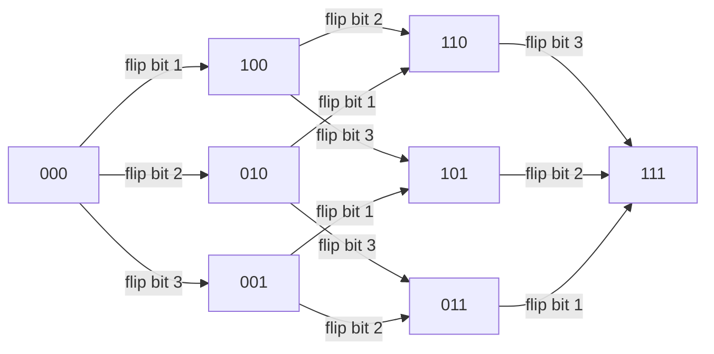

# Boolean Hypercube Models for Quantum State Spaces in Biology

## Executive summary

Boolean hypercubes (the graph/metric space of bitstrings \(\{0,1\}^N\) with Hamming distance) are already a **core mathematical substrate** in multiple “possibility-space” formalisms across biology—especially **fitness landscapes** (NK models) and **discrete regulatory dynamics** (Boolean and probabilistic Boolean networks). In these classical frameworks, “navigation” is typically a walk over hypercube vertices (single-bit mutations; single-gene flips), and **Hamming distance** is the natural notion of neighborhood and robustness. citeturn0search0turn0search5turn9search7turn9search9

On the quantum side, **quantum walks on hypercubes** provide one of the cleanest, best-understood models of unitary exploration of \(\{0,1\}^N\), with rigorous results on mixing and search; and **open-system extensions** (quantum stochastic walks; open quantum walks) supply a principled bridge from coherent dynamics to classical diffusion via **Lindblad master equations**. These are directly reusable as “quantum-biological state-space” machinery as soon as one identifies (or constructs) a meaningful vertex set, adjacency, and decoherence model. citeturn0search10turn5search0turn15search0turn24search3

For your three core questions:

**Has anyone formalized quantum biological state spaces using hypercubes/Hamming metrics?** Yes—most clearly in evolutionary and “genotype network” contexts, where genotypes are explicit bitstrings and neighboring genotypes differ by Hamming distance 1; there is at least one peer‑reviewed proposal and simulation program that puts **quantum walks** on such biological networks and explicitly discusses **decoherence times** and open-system terms. citeturn4view0

**What frameworks use hypercube topology for navigation through possibility spaces?** The most mature families are:  
(i) NK landscapes and adaptive walks on rugged landscapes (classical hypercube neighbors);  
(ii) Boolean network state spaces (global dynamics on the hypercube; Derrida/Hamming-distance damage spreading; probabilistic Boolean networks as Markov chains on \(\{0,1\}^N\));  
(iii) quantum walks on hypercubes (mixing/search) and their Lindbladian generalizations (QSW/OQW). citeturn0search0turn9search7turn9search9turn0search10turn5search0turn15search0

**Are there explicit microtubule/tubulin–hypercube connections?** In mainstream microtubule biophysics, tubulin does have identifiable **discrete conformational basins** (e.g., kinked/straight, GTP/GDP-associated ensembles) and mechanistic models sometimes emphasize **two-state contrasts**, but papers rarely frame this explicitly as “hypercube geometry.” citeturn20search12turn20search2  
In contrast, **microtubules-as-qubits** proposals (and microtubule quantum neural/“Hopfield” models) *implicitly* induce a hypercube basis—because \(N\) two-state tubulins define \(\{0,1\}^N\)—but they typically do not exploit hypercube metrics as the primary analytic tool. citeturn23view0turn14view0  
So: **direct microtubule–hypercube formalizations are uncommon**; the closest analogues live in protein conformational encoding work that explicitly uses Hamming geometry, and in Ising-style models of allosteric switching where the configuration space is exactly the Boolean hypercube. citeturn6search0turn18search0

## Core definitions and why hypercubes keep reappearing

A Boolean hypercube of dimension \(N\) is the graph whose vertices are binary strings \(x \in \{0,1\}^N\) and whose edges connect pairs at **Hamming distance 1**:  
\[
d_H(x,y)=\sum_{i=1}^N |x_i-y_i|.
\]
This is the canonical state space for any system composed of \(N\) binary “switches,” whether those switches represent genes (on/off), mutations (present/absent), conformational microstates (A/B), or abstract qubits (computational basis). citeturn0search10turn0search5turn6search0

In biological modeling, the hypercube is often a **latent** structure even when not drawn explicitly:

- In NK models, an organism/genotype is usually an \(N\)-bit string; mutation changes one locus, i.e., one bit → hypercube neighbors. citeturn0search0turn6search31  
- In Boolean networks, a whole-cell gene expression state is an \(N\)-bit vector; one perturbation flips one bit, and stability is measured by how Hamming distance evolves (Derrida plots, damage spreading). citeturn0search5turn9search7turn10view0  
- In quantum information, an \(N\)-qubit computational basis \(\{|x\rangle\}_{x\in\{0,1\}^N}\) is indexed by hypercube vertices; “local” bit-flip terms generate continuous-time quantum walks on the hypercube. citeturn0search10turn5search0

image_group{"layout":"carousel","aspect_ratio":"16:9","query":["n-dimensional hypercube graph bitstring labels","Hamming distance hypercube diagram","NK model rugged fitness landscape illustration","Boolean network state transition diagram attractor basin"] ,"num_per_query":1}

## Frameworks that use hypercube topology to model navigation through possibility spaces

This section answers question (2) while also laying the mathematical pieces you can reuse for quantum-biological state spaces.

### NK rugged fitness landscapes and adaptive walks

**Primary sources.**  
- entity["people","Stuart Kauffman","theoretical biologist"] & entity["people","Simon Levin","ecologist"], “Towards a general theory of adaptive walks on rugged landscapes.” *Journal of Theoretical Biology* (1987) 128(1): 11–45. DOI: **10.1016/S0022-5193(87)80029-2**. citeturn0search0  
- Kauffman & entity["people","Edward D. Weinberger","computer scientist"], “The NK model of rugged fitness landscapes and its application to maturation of the immune response.” *Journal of Theoretical Biology* (1989) 141: 211–245. DOI: **10.1016/S0022-5193(89)80019-0**. citeturn6search31turn0search24

**Model (minimal formalization).** A genotype \(x \in \{0,1\}^N\). Fitness is an aggregate of local contributions, each depending on one locus and \(K\) other loci:
\[
F(x)=\frac{1}{N} \sum_{i=1}^{N} f_i\big(x_i, x_{i_1}, \ldots, x_{i_K}\big),
\]
where the epistatic neighborhood \(\{i_1,\ldots,i_K\}\) defines “ruggedness.” citeturn0search0turn6search31

**Hypercube / Hamming role.** Mutations are typically single-bit flips \(x\to x\oplus e_j\), so adaptive walks are trajectories on the hypercube’s edges; “distance” and accessibility of peaks are often discussed in terms of single-step neighborhoods (Hamming spheres). citeturn0search0turn6search31

**Assumptions/limitations.** NK is a stylized, tunably rugged landscape; it abstracts away detailed chemistry/structure and often assumes bitwise loci and a fixed \(K\)-interaction scheme, so biological realism depends on how one maps genotype/phenotype to bits and chooses neighborhoods. citeturn6search31turn0search0

**Adaptation to quantum-biological state spaces.** NK is almost plug-and-play as a **potential term** \(V(x)\) on hypercube vertices in a quantum model. One common mapping is the diagonal Hamiltonian
\[
H_\mathrm{diag}=\sum_{x} V(x)\, |x\rangle\langle x|,
\]
combined with a transverse “mixing” term to allow coherent exploration (see “Hamiltonians” section below). citeturn0search10turn15search0

### Boolean networks, annealed approximation, and Hamming-distance damage spreading

**Primary sources.**  
- Kauffman, “Metabolic stability and epigenesis in randomly constructed genetic nets.” *Journal of Theoretical Biology* (1969) 22(3): 437–467. DOI: **10.1016/0022-5193(69)90015-0**. citeturn0search5  
- entity["people","Bernard Derrida","statistical physicist"] & entity["people","Yves Pomeau","physicist"], “Random networks of automata: a simple annealed approximation.” *Europhysics Letters* (1986) 1(2): 45–49. DOI: **10.1209/0295-5075/1/2/001**. citeturn9search7turn9search12  
- entity["people","Gérard Weisbuch","complex systems scientist"] & Derrida, “Evolution of overlaps between configurations in random Boolean networks.” *Journal de Physique* (1986) 47: 1297–1303. DOI: **10.1051/jphys:019860047080129700**. citeturn5search38  
- Schwab et al., “Concepts in Boolean network modeling: What do they all mean?” *Computational and Structural Biotechnology Journal* (2020) 18: 571–582. DOI: **10.1016/j.csbj.2020.03.001**. citeturn10view0  
- Kauffman, “Requirements for evolvability in complex systems: orderly dynamics and frozen components.” *Physica D* (1990) 42: 135–152. DOI: **10.1016/0167-2789(90)90071-V**. citeturn9search10

**Model.** A Boolean network has global state \(x(t)\in\{0,1\}^N\), updated synchronously by Boolean functions \(f_i\):
\[
x_i(t+1)=f_i\big(x_{j_1}(t),\ldots,x_{j_K}(t)\big).
\]
The full deterministic dynamics is a map \(f:\{0,1\}^N\to\{0,1\}^N\), yielding an attractor/basin decomposition of the hypercube. citeturn0search5turn10view0

**Hypercube / Hamming role.** The state transition system lives on vertices of the \(N\)-cube; perturbations are typically modeled as flips of a small number of bits; the annealed approximation studies the expected evolution of the overlap / Hamming distance between two nearby states under the dynamics. This is explicitly central in Derrida–Pomeau style analyses and in later “Derrida plot” analysis practice. citeturn9search7turn5search38turn10view0

**Assumptions/limitations.** Classical Boolean networks are coarse-grained, often synchronous, and usually treat “gene = binary variable.” They can reproduce qualitative motifs (attractors, criticality, robustness) but are not molecular/quantum models. citeturn10view0turn9search7

**Adaptation to quantum-biological state spaces.** Boolean networks provide a ready-made *classical* transition structure on a hypercube. A direct quantum adaptation is to treat the Boolean states as a computational basis \(\{|x\rangle\}\) and define either:  
(i) a coherent quantum walk whose adjacency reflects allowable bit flips; or  
(ii) an open-system dynamics interpolating between coherent and classical Boolean Markov behavior (QSW/OQW). citeturn15search0turn24search3

### Probabilistic Boolean networks as Markov chains on the hypercube

**Primary source.**  
- entity["people","Ilya Shmulevich","systems biologist"], entity["people","Edward R. Dougherty","engineer"], et al., “Probabilistic Boolean networks: A rule-based uncertainty model for gene regulatory networks.” *Bioinformatics* (2002) 18(2): 261–274. DOI: **10.1093/bioinformatics/18.2.261**. citeturn9search9turn9search1

**Model.** A probabilistic Boolean network chooses among multiple Boolean update functions according to a probability distribution, inducing a **Markov chain** over \(\{0,1\}^N\). Classical control questions become interventions on a Markov process over hypercube vertices. citeturn9search9

**Hypercube / Hamming role.** The state space remains the Boolean hypercube; uncertainty introduces stochastic navigation. Hamming distance appears naturally when quantifying perturbations or “distance to target phenotypes.” citeturn10view0turn9search9

**Assumptions/limitations.** Still classical, and the realism depends on the discretization of molecular concentrations to binary values; but it is one of the most direct “probabilistic navigation on the hypercube” formalisms in systems biology. citeturn9search9

**Adaptation.** PBNs are structurally close to *dissipative* quantum walk formalisms because both describe stochastic evolution over basis states; QSW’s Lindblad jump operators can be chosen to reproduce a target classical Markov chain in the decohered limit. citeturn15search0

## Quantum hypercube formalisms and the state-of-the-art in open-system “navigation”

This section addresses question (2)’s quantum branch, and supplies building blocks for (1) and your requested adaptations.

### Quantum walks on the hypercube

**Primary source (hypercube-specific).**  
- entity["people","Cristopher Moore","computer scientist"] & entity["people","Alexander Russell","computer scientist"], “Quantum Walks on the Hypercube.” In *RANDOM 2002*, LNCS 2483 (2002). DOI: **10.1007/3-540-45726-7_14**. citeturn0search10

They explicitly treat vertices as \(n\)-bit strings and edges as Hamming distance 1; they analyze both discrete-time and continuous-time walks and show faster mixing than classical random walks in this setting. citeturn0search10

**Search on the hypercube (coined walk).**  
- entity["people","Julia Kempe","quantum information scientist"], entity["people","Neil Shenvi","physicist"], and entity["people","K. Birgitta Whaley","chemist"], “Quantum random-walk search algorithm.” *Physical Review A* (2003) 67: 052307. DOI: **10.1103/PhysRevA.67.052307**. citeturn5search0

**Continuous-time quantum walk search.**  
- entity["people","Andrew M. Childs","computer scientist"] & entity["people","Jeffrey Goldstone","physicist"], “Spatial search by quantum walk.” *Physical Review A* (2004) 70: 022314. DOI: **10.1103/PhysRevA.70.022314**. citeturn5search1

**Mathematical form (continuous-time).** A standard CTQW uses
\[
i\frac{d}{dt}\,|\psi(t)\rangle = H |\psi(t)\rangle,\quad H=\gamma A,
\]
where \(A\) is the adjacency matrix of the hypercube graph and \(\gamma\) sets the hopping rate. On the hypercube, \(A\) couples states differing by one bit flip. citeturn0search10turn15search3

**Hypercube/Hamming metrics.** The hypercube’s combinatorics makes spectral analysis tractable and induces a clean concept of “local move” = small Hamming distance. This is exactly what you want if “biological possibilities” differ by small local changes (mutations, micro-switches, conformational flips). citeturn0search10turn5search0

### Quantum stochastic walks and open quantum walks

These frameworks are crucial if the goal is “quantum-biological” rather than “ideal quantum information,” because they let you encode decoherence, measurement, and environmental selection.

**Quantum stochastic walk (QSW).**  
- entity["people","James D. Whitfield","chemist"], entity["people","César A. Rodríguez-Rosario","physicist"], & entity["people","Alán Aspuru-Guzik","chemist"], “Quantum stochastic walks: A generalization of classical random walks and quantum walks.” *Physical Review A* (2010) 81: 022323. DOI: **10.1103/PhysRevA.81.022323**. citeturn15search0

QSW defines evolution of a density matrix \(\rho(t)\) on graph nodes with a Lindblad master equation that can interpolate between a coherent quantum walk and a classical random walk. citeturn15search0

**Open quantum walks (OQW) on graphs.**  
- entity["people","Stéphane Attal","mathematician"], entity["people","Francesco Petruccione","physicist"], & entity["people","Ilya Sinayskiy","physicist"], “Open quantum walks on graphs.” *Physics Letters A* (2012) 376: 1545–1548. DOI: **10.1016/j.physleta.2012.03.040**. citeturn24search3turn15search8

A closely related, more detailed formulation appears as “Open Quantum Random Walks” in *Journal of Statistical Physics*, DOI **10.1007/s10955-012-0491-0**, which formalizes the open-system/quantum-channel viewpoint. citeturn15search5turn15search34

**Why this matters for biology.** In a biological setting, it is often more realistic to treat the “state” as a basis element but allow:  
- coherent transitions (if any) among nearby states, and  
- environment-induced dephasing/jumps that implement thermalization, chemical driving, or selection.  

QSW/OQW provide standard, publication-grade machinery to do exactly that. citeturn15search0turn24search3

## Has anyone formalized quantum biological state spaces with hypercubes or Hamming metrics?

### Clear yes in evolutionary “genotype network” contexts

A concrete peer-reviewed example is:

- entity["people","Diego Santiago-Alarcon","evolutionary biologist"] et al., “Quantum aspects of evolution: a contribution towards evolutionary explorations of genotype networks via quantum walks.” *Journal of the Royal Society Interface* (2020) 17(172): 20200567. DOI: **10.1098/rsif.2020.0567**. citeturn4view0

This paper explicitly defines genotypes as **binary strings**, neighborhoods as single-step mutations, and describes genotype neighborhoods as “hyper-dimensional cubes,” then compares classical random walks and quantum walks for exploring genotype networks; it also discusses decoherence times and notes that open-system terms (Lindblad-like) are a natural next step. citeturn1view0turn4view0

This is directly responsive to (1): it is an explicit “quantum walk on biological possibility space” formalization grounded in the hypercube-style representation of genotype networks. citeturn4view0

### Hamming-metric biological state spaces are extremely common, even when not quantum

Even outside explicit quantum claims, **Hamming metrics** are foundational in “sequence space” and many evolutionary models (genotypes as strings; differences measured by Hamming distance), and this underpins why hypercubes are the default graph for binary-sequence models. citeturn0search19turn6search12

### “Quantum biology” proper: hypercubes are rarer than in evolution/GRNs

Canonical “quantum biology” areas (photosynthetic exciton transport, enzyme tunneling, magnetoreception) are usually framed on **continuous** coordinate spaces or molecular graphs—not \(\{0,1\}^N\). The hypercube shows up mainly when the biological substrate is already naturally discrete (gene on/off, mutation/no mutation, switch A/B). This is an inference supported by the fact that the most explicit “quantum + hypercube” biology example above is genotype-network based rather than protein-exciton based. citeturn4view0turn15search3

## Microtubules and tubulin: explicit hypercube links versus closest analogues

### What exists explicitly in tubulin/microtubule biophysics

The mainstream microtubule literature supports the idea that tubulin occupies **multiple conformational basins** and that transitions among basins matter for polymerization dynamics, with distinctions that are sometimes summarized in quasi-discrete terms (e.g., “kinked vs straight” free tubulin, lattice-induced fit, nucleotide-dependent ensembles). citeturn20search12turn20search6turn20search2

- Igaev & Grubmüller, “Microtubule assembly governed by tubulin allosteric gain in flexibility and lattice induced fit.” *eLife* (2018) 7:e34353. DOI: **10.7554/eLife.34353**. citeturn20search6turn20search12  
  This paper explicitly describes an equilibrium between two conformations of free tubulin (straight vs kinked) within its allosteric model narrative, making it a natural candidate for a **binary-switch coarse-graining**, even if it does not present a “hypercube” formalism. citeturn20search12  

- Kalutskii et al., “Microtubule dynamics are defined by conformations and clustering of curved tubulin oligomers.” *PNAS* (2025). DOI: **10.1073/pnas.2424263122**. citeturn20search2turn20search5  
  This supports the broader claim that microtubule dynamics depend on discrete-ish conformational motifs (curved oligomers, clustering) that could be abstracted as switches, albeit with significant biophysical complexity. citeturn20search5  

### Closest analogues: conformational hypercubes and Hamming geometry in proteins

There are explicit protein-structure approaches that encode conformations into **binary strings** and then use Hamming-distance geometry as a conformational metric:

- entity["people","Cyril Laboulais","computational biophysicist"] et al., “Hamming distance geometry of a protein conformational space: application to the clustering of a 4-ns molecular dynamics trajectory of the HIV-1 integrase catalytic core.” *Proteins* (2002) 47(2):169–179. DOI: **10.1002/prot.10081**. citeturn6search0  
  They encode conformations as binary sequences produced by partitioning conformational space; the Hamming distance between two bitstrings then becomes a distance between conformations and is compared to RMSD for clustering. citeturn6search0

A second family is lattice protein models where sequence/structure are binary strings, and explicit hypercube language appears:

- Li et al., “Fast Tree Search for A Triangular Lattice Model of Protein Folding Problem.” *Genomics, Proteomics & Bioinformatics* (2004) 2(4):245–252. DOI: **10.1016/S1672-0229(04)02031-5**. citeturn8view2turn7view0  
  The paper explicitly says “each dot in the 24D hypercube represents the sequence and structure,” and uses Hamming distance between binary strings in the HP model context. citeturn7view0turn8view2

These are not microtubule papers, but they show that **conformational or sequence hypercubes** are an established modeling move in protein science—and therefore a plausible analogue for tubulin conformational modeling if one can define meaningful binary partitions. citeturn6search0turn8view2

### Microtubules in “quantum microtubule” proposals: hypercube is implicit, not emphasized

In microtubule quantum-information proposals, tubulin is often treated as a two-state system (qubit-like), sometimes extended to multilevel units (qudits). This directly implies a Boolean hypercube basis for \(N\) tubulins, but these works usually focus on coherence claims, cavities, or network computation rather than on hypercube/Hamming geometry per se. citeturn14view0turn23view0

Examples:

- entity["people","Elizabeth C. Behrman","physicist"] et al., “Microtubules as a Quantum Hopfield Network.” In *The Emerging Physics of Consciousness* (Springer, 2006), pp. 351–370. DOI: **10.1007/3-540-36723-3_10**. citeturn23view0  
  They model tubulins as qubits in a quantum Hopfield network; stable states correspond to local minima (energy landscape view). citeturn23view0  
  Hypercube relevance: an \(N\)-qubit Hopfield model has basis states \(|x\rangle\) indexed by \(x\in\{0,1\}^N\); the energy landscape is defined over hypercube vertices.

- entity["people","Nick E. Mavromatos","physicist"] et al., “On the potential of microtubules for scalable quantum computation.” *Eur. Phys. J. Plus* (2025) 140(11):1116. DOI: **10.1140/epjp/s13360-025-07022-4**. citeturn14view0  
  This is a modern open-access proposal that treats tubulin information units as two-state or multilevel (“quDit”) degrees of freedom; the hypercube/Hamming framing is again implicit rather than explicit. citeturn12view0turn14view0

**Bottom line for (3):** if you want *explicit* hypercube geometry in tubulin, the closest rigorous bridge is to start from tubulin’s experimentally/theoretically supported discrete conformational basins (e.g., kinked/straight and clustering motifs) and then adopt the kind of binary-encoding + Hamming geometry strategies developed in other protein conformational work. citeturn6search0turn20search12

## Comparative table of frameworks and how to adapt them to quantum-biological state spaces

The table emphasizes (i) the role of hypercube/Hamming metrics, (ii) core mathematics, and (iii) applicability to tubulin/microtubule modeling.

| Reference (DOI) | Domain | Hypercube role | Mathematical form (minimal) | Applicability to microtubules | Key equations |
|---|---|---|---|---|---|
| Kauffman & Levin 1987 (10.1016/S0022-5193(87)80029-2) citeturn0search0 | Evolution / optimization | Genotypes as \(\{0,1\}^N\); adaptive walk is edge-walk (Hamming-1 moves) | Fitness landscape + greedy/biased walk | Indirect: can model conformational “fitness/energy” landscapes for tubulin patches | \(F(x)=\frac{1}{N}\sum_i f_i(\cdot)\) |
| Kauffman & Weinberger 1989 (10.1016/S0022-5193(89)80019-0) citeturn6search31turn0search24 | Immunology / rugged landscapes | Same hypercube neighbor notion; ruggedness tuned by \(K\) | NK family; landscape statistics | Indirect: map tubulin “micro-switches” to loci; \(K\) to coupling range | NK sum form above |
| Kauffman 1969 (10.1016/0022-5193(69)90015-0) citeturn0search5 | Gene regulation | Global state = hypercube vertex; basins/attractors partition cube | Deterministic map \(x(t+1)=f(x(t))\) | Indirect: could model coupled binary tubulin switches on a lattice | \(x_i(t+1)=f_i(\cdot)\) |
| Derrida & Pomeau 1986 (10.1209/0295-5075/1/2/001) citeturn9search7turn9search12 | Boolean networks theory | Hamming distance evolution (“damage spreading”) | Annealed approximation; phase transition near critical connectivity | Indirect: stability of tubulin-switch networks under perturbations | \(\rho_{t+1}=\Phi(\rho_t)\) (Derrida curve) |
| Shmulevich et al. 2002 (10.1093/bioinformatics/18.2.261) citeturn9search9 | Systems biology | Markov chain on hypercube vertices; stochastic navigation | Probabilistic update rules → transition matrix \(P\) | Medium: tubulin conformational Markov models fit well; can be voxelized to bits | \(p_{t+1}=p_t P\) |
| Moore & Russell 2002 (10.1007/3-540-45726-7_14) citeturn0search10 | Quantum algorithms | Hypercube is the underlying graph; edges = Hamming-1 | Discrete-/continuous-time quantum walks | High as mathematical substrate; biology depends on mapping | CTQW: \(i\dot{\psi}= \gamma A\psi\) |
| Shenvi–Kempe–Whaley 2003 (10.1103/PhysRevA.67.052307) citeturn5search0 | Quantum search | Hypercube topology exploited for search dynamics | Coined quantum walk + oracle | Indirect: could model “search for functional conformation” | Walk operator \(W=SC\) (coined) |
| Childs & Goldstone 2004 (10.1103/PhysRevA.70.022314) citeturn5search1 | Quantum search | Many graphs incl. hypercube; CTQW search | \(H=\gamma A + |w\rangle\langle w|\) style marked vertex | Indirect: “marked” = target conformation/phenotype | CTQW search Hamiltonian |
| Whitfield et al. 2010 (10.1103/PhysRevA.81.022323) citeturn15search0 | Open quantum dynamics | Any graph (incl. hypercube) with Lindblad interpolation QW↔RW | Master equation for \(\rho(t)\) | Very high: gives explicit decoherence models on hypercube | \(\dot\rho=-i[H,\rho]+\sum_k\mathcal{D}[L_k]\rho\) |
| Attal et al. 2012 (10.1016/j.physleta.2012.03.040) citeturn24search3turn15search8 | Open quantum walks | Graph-based quantum Markov chains | CPTP map / dissipative walk | High: natural fit if tubulin switching is strongly dissipative | Channel-based update; (graph + internal space) |
| Laboulais et al. 2002 (10.1002/prot.10081) citeturn6search0 | Protein conformations | Binary encoding → Hamming metric geometry | Clustering/geometry of conformational trajectories | High analogue: can encode tubulin conformations similarly | \(d_H(\sigma,\sigma')\) between encoded conformers |
| Li et al. 2004 (10.1016/S1672-0229(04)02031-5) citeturn8view2turn7view0 | Protein folding (lattice) | Explicit “24D hypercube” for binary sequences/structures | Hamming distance used as energy proxy | Analogue: shows explicit hypercube use in folding models | “energy = Hamming distance” (model-specific) |
| LeVine & Weinstein 2015 (10.3390/e17052895) citeturn18search0turn18search1 | Allostery / info processing | Ising spins ⇒ hypercube of configurations | Statistical mechanics on \(\{\pm1\}^N\) | Strong analogue: tubulin and MT lattices are allosteric/cooperative systems | \(U(s)=-\sum h_is_i-\sum J_{ij}s_is_j\) |
| Behrman et al. 2006 (10.1007/3-540-36723-3_10) citeturn23view0 | Microtubules + quantum neural nets | \(N\) tubulin qubits ⇒ implicit hypercube basis | Quantum Hopfield Hamiltonian (toy) | Direct but speculative; not mainstream MT biophysics | QHN energy/Hamiltonian over qubits |
| Mavromatos et al. 2025 (10.1140/epjp/s13360-025-07022-4) citeturn14view0 | Microtubules + quantum computation proposal | qubits/qudits ⇒ implicit hypercube / Hamming graphs | Cavity/QED + dipole/quDit models | Direct proposal; empirically controversial | open-system + cavity assumptions |

## Suggested mathematical adaptations for tubulin/microtubule quantum-hypercube models

This section provides the explicit Hamiltonians, Lindbladians, and mapping rules you requested.

### Mapping rules from tubulin/microtubule conformations to hypercube vertices

A workable mapping has to resolve two competing needs: (i) **faithfulness** to known tubulin conformational biology, and (ii) a **discrete** representation that yields a manageable hypercube.

A defensible starting point is to treat each chosen structural “switch” as binary, following the logic used in allosteric Ising models and protein binary encodings. citeturn18search0turn6search0

**Candidate tubulin switch variables (examples, not canonical).** Motivated by microtubule assembly papers that discuss kinked/straight ensembles and end-structure motifs, define bits such as:  
- \(x_i=0/1\): local tubulin conformation (kinked vs straight) for the \(i\)-th dimer in a modeled patch; citeturn20search12turn20search6  
- \(x_i=0/1\): nucleotide-associated local structural basin proxy (coarse-grained from ensembles); citeturn20search5turn20search12  
- \(x_i=0/1\): “curved oligomer cluster participation” indicator at MT ends (if one models end subunits). citeturn20search5  

**Minimal mapping from structures to bitstrings (data-driven).** Using MD snapshots or cryo-ET-derived conformational ensembles, choose a small set of order parameters \(\{q_k\}_{k=1}^N\) that each show a bimodal distribution; define each bit by thresholding at the midpoint between modes:
\[
x_k = \mathbf{1}\{q_k>\theta_k\},
\]
analogous in spirit to the binary partition approaches in protein conformational Hamming geometry work. citeturn6search0turn20search9

**Sanity check:** if the resulting empirical transition graph over bitstrings is dominated by single-bit transitions, the hypercube adjacency is a reasonable approximation; if transitions are mostly multi-bit jumps, the hypercube model may be the wrong topology (or you need a different coarse-graining). This check is tightly motivated by the fact that the hypercube’s modeling advantage is precisely “local moves = Hamming-1.” citeturn0search10turn6search0

### A hypercube Hamiltonian for quantum amplitudes on conformational nodes

Let \(\mathcal{H}=\mathrm{span}\{|x\rangle: x\in\{0,1\}^N\}\). Two standard building blocks:

**Coherent exploration (quantum walk term).**
\[
H_\mathrm{walk}=\gamma A,
\]
with \(A_{xy}=1\) if \(d_H(x,y)=1\) and \(0\) otherwise. On the hypercube, it is equivalent (in the computational basis) to a sum over bit-flip operators:
\[
H_\mathrm{walk}=\gamma \sum_{j=1}^N X_j,
\]
where \(X_j\) flips the \(j\)-th bit. This is the canonical “hypercube CTQW” generator. citeturn0search10turn15search3

**Energy/fitness landscape (diagonal potential).**
\[
H_\mathrm{pot}=\sum_x E(x)\,|x\rangle\langle x|.
\]
For biology, \(E(x)\) could represent free energy of a conformational microstate, an ising-like coupling energy, or an NK-style rugged “fitness” potential depending on your interpretation. citeturn0search0turn18search0

**Combined model.**
\[
H = H_\mathrm{walk}+H_\mathrm{pot}.
\]
This is a standard “walk + potential” form used throughout quantum walk/search and also parallels quantum adiabatic optimization style Hamiltonians when \(H_\mathrm{walk}\) is interpreted as a transverse field. citeturn5search1turn15search3

**Generalization beyond binary.** If tubulin has \(q>2\) relevant discrete conformations per site, the natural graph is no longer the hypercube but the **Hamming graph \(H(N,q)\)** (vertices are length-\(N\) strings over \(q\) symbols; edges differ in one position). This keeps the “Hamming metric” structure but moves from Boolean to multi-state. (This is a direct extension of the hypercube idea, and is discussed in the quantum-walk literature via “Hamming graphs/schemes.”) citeturn0search3turn0search23

### Decoherence and environment: Lindblad models tailored to tubulin switching

To represent biological irreversibility/noise, use a Lindblad master equation
\[
\dot{\rho}=-i[H,\rho] + \sum_k \left(L_k\rho L_k^\dagger-\tfrac12\{L_k^\dagger L_k,\rho\}\right),
\]
which is the standard formalism behind QSW and related open quantum walk models. citeturn15search0

Two common, interpretable choices:

**Local dephasing (destroys coherence in the \(|x\rangle\) basis).**  
Take \(L_j=\sqrt{\kappa_j}\, Z_j\). This models environmental monitoring of each switch. In the strong-dephasing limit, dynamics approaches a classical random walk/Markov chain on the hypercube. citeturn15search0

**Incoherent jumps (explicit classical transition rates).**  
For each allowed transition \(x\to y\), define \(L_{x\to y}=\sqrt{W_{xy}}\,|y\rangle\langle x|\). Then the diagonal of \(\rho\) follows a classical master equation with rates \(W_{xy}\) (when coherences are suppressed), matching the probabilistic-Boolean-network viewpoint. citeturn15search0turn9search9

**Quantum stochastic walk interpolation.** In practice, QSW formalism explicitly aims to interpolate between coherent and classical exploration by combining Hamiltonian and dissipator constructions aligned to graph connectivity. citeturn15search0

### Mermaid diagram of an end-to-end architecture

```mermaid
flowchart TD
  A[Structural / MD ensemble of tubulin or MT patch] --> B[Choose N switch coordinates q_k]
  B --> C[Binary partition thresholds θ_k]
  C --> D[Map each snapshot to bitstring x in {0,1}^N]
  D --> E[Estimate E(x): free energy or effective potential]
  D --> F[Estimate transition rates W_xy from trajectories]
  E --> G[Hamiltonian H = γ A + Σ_x E(x)|x><x|]
  F --> H[Lindblad jumps L_{x->y} = sqrt(W_xy)|y><x|]
  G --> I[Open quantum model: ρdot = -i[H,ρ] + Σ D[L]ρ]
  H --> I
  I --> J[Predictions: mixing time, hitting time, stationary distribution, coherence length]
  J --> K[Compare to experiments or higher-fidelity simulations]
```

## Concrete computational experiments and simulations

Below are three simulations that would directly test whether hypercube-based quantum/open-quantum models add explanatory or predictive value for tubulin/microtubule state spaces.

### Simulation program for a data-driven tubulin conformational hypercube

**Objective.** Test whether tubulin (or a microtubule end patch) admits a low-dimensional binary coarse-graining whose transitions are approximately Hamming-1, as required for a hypercube topology to be faithful. citeturn6search0turn20search12

**Protocol.**  
Use an ensemble from a molecular simulation or structural pipeline (e.g., tubulin conformational ensembles in microtubule assembly/allostery work) and:  
1) define \(N\) candidate switch coordinates;  
2) map snapshots to bitstrings;  
3) build the empirical transition graph;  
4) quantify the fraction of transitions with Hamming distance 1 vs >1.

**Outputs.**  
- the empirical distribution of \(\Delta d_H\) per step;  
- an estimated Markov transition matrix \(W\) on observed nodes;  
- whether a hypercube (or Hamming graph \(H(N,q)\)) is a good approximation. citeturn6search0turn9search9

**Pass/fail criterion.** If most transitions are multi-bit jumps, your hypercube model is structurally mismatched; if transitions are largely single-bit, proceed to the quantum/open-quantum experiments below. citeturn0search10turn6search0

### Quantum stochastic walk on a calibrated conformational hypercube

**Objective.** Determine whether a QSW-style open quantum model can (a) reproduce the classical transition behavior and (b) exhibit any robust, interpretable difference (e.g., faster target finding, different stationary distributions under selection-like measurements) as decoherence strength varies. citeturn15search0turn4view0

**Model.**  
- Nodes: bitstrings observed in the dataset (or full \(\{0,1\}^N\) if feasible).  
- Coherent part: \(H=\gamma A + \sum_x E(x)|x\rangle\langle x|\).  
- Incoherent part: jump Lindblads from \(W_{xy}\) plus dephasing \(L_j=\sqrt{\kappa}Z_j\). citeturn15search0turn0search10

**Experiments.** Sweep \(\kappa\) (dephasing rate) and \(\gamma\) (coherent hopping) and measure:  
- target-hitting time for a “marked” set of states (e.g., “straight-rich end configuration”);  
- mixing time to stationary distribution;  
- coherence measures (purity \(\mathrm{Tr}(\rho^2)\), off-diagonal mass). citeturn15search0turn5search1

**Interpretation.** If quantum effects vanish except at unrealistically low decoherence, the model reduces to a classical Markov model; if intermediate decoherence yields robust differences (an “environment-assisted” regime), that is a concrete, falsifiable signature of nontrivial open quantum dynamics on the hypercube. citeturn15search0turn15search3

### NK/Ising-inspired landscape + quantum annealing surrogate for microtubule patches

**Objective.** Explore whether “rugged landscape + cooperative couplings” style models (NK, Ising) can generate qualitative behaviors resembling microtubule end stability/clustering transitions, and whether a quantum mixing term changes the accessibility of low-energy states. citeturn6search31turn18search0turn20search5

**Landscape construction.** Two options:

- **Ising-style:** Define spins \(s_i\in\{\pm 1\}\) (equivalent to bits) representing local conformational switches and couplings \(J_{ij}\) for neighbors in the microtubule lattice, using the allosteric Ising “information processing” formalism as scaffolding. citeturn18search0turn18search1  
- **NK-style:** Choose \(K\) interaction neighborhoods for each site and define \(E(x)\) as an NK sum (interpretable as a rugged effective free-energy proxy). citeturn0search0turn6search31

**Quantum surrogate.** Use a time-dependent Hamiltonian \(H(t)=(1-s(t))\sum_j X_j + s(t)\sum_x E(x)|x\rangle\langle x|\) (or \(Z\)-polynomial for Ising form), and simulate small \(N\) (e.g., 10–20) exactly. This is “hypercube quantum exploration with an energy landscape” and is mathematically aligned with hypercube CTQW plus potential. citeturn0search10turn15search3

**Outputs.**  
- ground-state/low-energy occupancy vs anneal schedule;  
- entanglement proxies during evolution (e.g., bipartite entropy);  
- comparison with classical simulated annealing.  

**Biological interpretation.** You do not need to claim “real microtubules anneal quantumly” for this to be useful; the objective is to test whether hypercube quantum/open-quantum formalisms produce distinct, testable predictions relative to classical rugged landscape dynamics. citeturn6search31turn15search0

## Schematic hypercube chart with annotated transitions

The 3-bit cube below illustrates the modeling template (extend to \(N\) bits): vertices are conformations \(x\in\{0,1\}^N\), edges are single-switch flips (Hamming-1), and you can attach an energy \(E(x)\) and decoherence/jump operators along edges.



**How to interpret biologically.** If each bit corresponds to a tubulin micro-switch, then moving one edge is one local conformational flip (or one local chemical event proxy). In a QW/CTQW model, amplitudes propagate; in a QSW/OQW model, decoherence and jumps implement environmental coupling. This is exactly the “navigation through a possibility space” concept formalized in the quantum-walk and open-quantum-walk literature. citeturn0search10turn15search0turn24search3