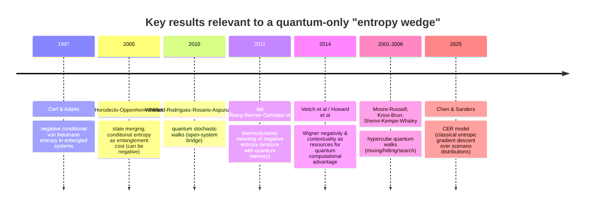

# Consciousness as Entropy Reduction Beyond Classical Limits

## Executive summary

The core objection you want to answer—“isn’t landscape‐biased selection just Boltzmann / a ball rolling downhill?”—can be reframed into a sharper, testable wedge: **classical systems can reduce *unconditional* entropy locally (e.g., relax to minima) but cannot realize *certain forms of conditional entropy reduction* that are provably quantum-only** (e.g., negative conditional von Neumann entropy), and they cannot match **quantum interference–driven search / concentration phenomena** (quantum walks, sampling hardness) without equivalent quantum resources. citeturn1search0turn1search1turn1search2turn4search0turn6search2

Empirically, the strongest consciousness–entropy measurement literature robustly shows that **loss of consciousness** (anesthesia, disorders of consciousness) tends to reduce multiple complexity/entropy proxies in EEG/fMRI, while **attentional engagement** can quench variability (more reproducible dynamics). However, these state-level findings **do not, by themselves, establish a “quantum-only” wedge**: classical dynamical systems, predictive processing, and information-thermodynamics models can often accommodate them. citeturn0search4turn8search17turn12search0turn3search1turn0search9

Formally, quantum information theory does supply a clean candidate wedge: **negative conditional von Neumann entropy** \(S(A|B)=S(AB)-S(B)<0\) is impossible classically and is a **signature of entanglement**; it has operational meanings in **state merging** and in **thermodynamics of erasure with quantum memory**, where an observer with quantum side information can lower or even reverse the work cost of erasure under appropriate conditions. The difficulty is not the math—it’s the **mapping**: to use this as your wedge, you must specify a plausible **brain-relevant quantum partition** \(A,B\), specify how \(S(A|B)\) is to be estimated or bounded, and rule out classical explanations for the measured correlates. citeturn1search0turn1search6turn1search1turn1search3

The entity["organization","arXiv","preprint server"] **CER model** (Chen & Sanders) is **explicitly classical**: it defines “subconsciousness” as a probability distribution over scenarios and “consciousness” as selection of a delta-like scenario via **entropy-gradient descent** with symmetry-breaking noise. This can be valuable to NFT as a *computational-level* description, but it does not by itself justify quantum resources (unless NFT provides an explicit physical instantiation that cannot be classically simulated under realistic constraints). citeturn13view0

Quantum-walk results on hypercubes and related graphs do show that **interference can concentrate probability amplitude** on targets or achieve particular mixing properties faster than classical random walks, but (i) the speedups depend on the task definition (mixing vs hitting) and measurement model, and (ii) unitarity means there is **no monotone “entropy decreases with time” law** unless you explicitly introduce measurement/decoherence or focus on entropy of *measurement outcomes* rather than von Neumann entropy of the underlying pure state. Still, this literature provides a rigorous route to operationalize “structured entropy reduction” as **faster reduction of uncertainty over a target/trajectory distribution** under fixed resource constraints. citeturn4search0turn4search6turn5search0turn5search2turn5search3

You framed NFT as a draft theory you are strengthening. The context below is consistent with your current draft framing fileciteturn1file3, but this report treats the present task independently and assesses the six requested threads by primary empirical/formal literatures.

## Empirical evidence that conscious processing reduces entropy vs unconscious processing

This thread divides into two importantly different empirical claims:

1) **State** claim: global consciousness level (awake vs anesthetized / DOC) correlates with entropy/complexity measures of brain signals.

2) **Processing** claim: holding stimuli and tasks constant, *conscious* processing yields lower-entropy (more structured, less variable) neural/behavioral outputs than *unconscious/automatic* processing.

The literature strongly supports (1) and supports parts of (2) via variability quenching and reproducibility, but **direct “same-task conscious vs unconscious” entropy contrasts are rarer and methodologically fragile** (criterion/report confounds; time-window/parameter dependence).

### Strongest supporting evidence

**Propofol anesthesia reduces EEG complexity measures (LZC and related coalition entropy measures).** The canonical multi-metric result is the PLOS ONE study by entity["people","Michael Schartner","eeg complexity researcher"] and colleagues, which reports a robust decrease in spontaneous EEG complexity under propofol-induced general anesthesia using multiple complexity/entropy-like metrics (including Lempel–Ziv complexity). citeturn0search4turn0search8

**Loss of consciousness reduces fMRI sample entropy and integration measures in specific hubs.** entity["people","Andrew I. Luppi","neuroscientist"] and colleagues analyze resting-state fMRI across awake, propofol anesthesia, and disorders of consciousness, using sample entropy of voxelwise BOLD time series and integration proxies; they report overlapping reductions in entropy and integration in default-mode/association regions when consciousness is lost. citeturn8search17turn9view2

**Permutation entropy distinguishes minimally conscious vs unresponsive wakefulness states (clinical populations).** entity["people","Anja Thul","biomedical researcher"] and colleagues compute permutation entropy (PeEn) and symbolic transfer entropy from EEG in MCS vs UWS and controls, reporting differences consistent with reduced cortical information dynamics in lower-consciousness clinical states. citeturn8search11

**Attentional engagement quenches neural variability (greater reproducibility) and improves behavior.** entity["people","Ayelet Arazi","neuroscientist"] and colleagues show EEG trial-by-trial variability reductions with attentional cueing and report correlations between variability quenching and behavioral benefits. This is consistent with a “conscious control produces lower variability” pattern—though it is not identical to a conscious/unconscious contrast. citeturn0search2turn12search0

**Within-task entropy/complexity tracks uncertainty reduction during learning/habituation.** entity["people","Mohammad Hossein Heidari Beni","neuroscience researcher"] and colleagues (Scientific Reports 2025) relate EEG Lempel–Ziv complexity and sample entropy to Bayesian uncertainty in an oddball sequence learning paradigm; they report that “brain complexity” correlates more strongly with posterior uncertainty and shows a decreasing trend during habituation/learning, with altered trajectories in Parkinson’s disease. This is relevant to your “future-trajectory uncertainty reduction” intuition, but it is still compatible with classical Bayesian learning. citeturn11view0

**No-report dissociation shows information-theoretic dynamics that track perception vs report.** entity["people","Agustin Canales-Johnson","neuroscientist"] and colleagues use a bistable stimulus and show that an information integration measure tracks perceptual transitions even without report (inferred via eye movements), while differentiation links more strongly to report. This is valuable because it demonstrates that some information-theoretic metrics can track perceptual content with reduced report confounds. citeturn9view0

### Strongest counterarguments and limitations

**Entropy/complexity in consciousness science is not monotone in “more conscious = lower entropy.”** Even within the state literature, some conscious states appear associated with increased entropy/complexity (e.g., psychedelic states) while unconsciousness often reduces it, implying that “consciousness reduces entropy” is at best context-dependent and must specify *which entropy of which variable* (state entropy, entropy rate, conditional entropy over futures, etc.). citeturn8search17turn8search23

**Parameter choices and time windows matter materially.** Sample entropy depends on parameters (e.g., \(m,r\)), and results can change with smoothing/analysis window choices; Luppi et al explicitly report robustness checks and also note effects of smoothing kernels on spatial clusters. citeturn9view2

**Criterion placement and report confounds can invert conclusions about “conscious vs unconscious” neural signatures.** entity["people","Jasper J. Fahrenfort","consciousness researcher"] and colleagues argue that criterion placement threatens construct validity of neural measures used to contrast conscious and unconscious processing, and that the experimental context can change the direction and magnitude of apparent effects. This is directly relevant for any entropy-based “conscious vs unconscious” comparison because subjective report thresholding and post-perceptual processes can dominate measured differences. citeturn0search9turn0search17

**Neural variability is not simply “noise to be reduced”; it can be functional.** entity["people","Leonhard Waschke","neuroscientist"] and colleagues summarize evidence that variability supports flexible behavior, and classical perspectives emphasize that much “variability” can reflect uncontrolled variables or reference-time issues rather than intrinsic stochasticity. This weakens any straightforward identification of “entropy reduction = consciousness.” citeturn12search4turn12search12

**Negative evidence: complexity may track sleep stage but not reported phenomenology within a stage.** entity["people","Andreas Aamodt","sleep researcher"] and colleagues find Lempel–Ziv complexity varies with sleep stage but does not differentiate dream vs no-dream awakenings within the same NREM stage, pushing against a simplistic mapping from complexity measures to “presence of experience.” citeturn8search6turn8search14

### Assessment of direct support for a quantum-only wedge

Empirical entropy/variability results currently provide **strong support that global state changes associated with loss of consciousness change dynamical diversity/entropy proxies**, and **moderate support** that attention/control can reduce variability (increase reproducibility). citeturn0search4turn9view2turn12search0

But **they do not directly support a quantum-only wedge** because (a) they are typically *descriptive correlates*, (b) they are compatible with classical nonequilibrium dynamics and information-processing accounts, and (c) they rarely demonstrate a bound that is **provably unattainable** by classical stochastic systems under matched constraints. Your wedge likely needs to be moved from “entropy is lower” to **“conditional entropy over future trajectories crosses a quantum-only threshold (e.g., operationally equivalent to negative quantum conditional entropy) or shows quantum-walk-like scaling advantages.”** citeturn1search1turn4search6turn3search1

## Negative conditional entropy and entanglement

Here the situation is unusually clean: the underlying quantum information result is robust, widely accepted, and has multiple operational interpretations. The open question is almost entirely in the **neuroscientific mapping**.

### Strongest supporting formal result

**Quantum conditional entropy can be negative; classically it cannot.** The core definition is the conditional von Neumann entropy
\[
S(A|B)=S(\rho_{AB})-S(\rho_{B}),
\]
which can be negative for certain entangled states. entity["people","Nicolas J. Cerf","physicist"] and entity["people","Christoph Adami","physicist"] introduced this in an explicitly information-theoretic framework and linked negativity to quantum nonseparability. citeturn1search0turn1search4

**Negativity implies entanglement (but not conversely).** A modern explicit statement: negative conditional entropy states are entangled, while not all entangled states have negative conditional entropy. This is discussed clearly in later work on witnessing negative conditional entropy. citeturn1search3

**Operational meaning via state merging: “negative information.”** entity["people","Michał Horodecki","physicist"], entity["people","Jonathan Oppenheim","physicist"], and entity["people","Andreas Winter","physicist"] show that the entanglement cost of quantum state merging equals the conditional entropy (under free classical communication), so negative conditional entropy corresponds to *gaining* entanglement rather than consuming it—one reason classical intuitions fail. citeturn1search2turn1search6

**Operational/thermodynamic meaning via erasure with quantum memory.** entity["people","Lídia del Rio","physicist"] and coauthors give a thermodynamic interpretation: the work cost of erasure depends on entropy conditioned on an observer’s information, and if the observer’s side information is quantum and entangled, the conditional entropy can be negative, changing the work/erasure accounting. citeturn1search1turn1search9

### Strongest counterarguments and limitations

**Negativity is a sufficient but not necessary entanglement witness.** Many entangled states still have \(S(A|B)\ge 0\), so “entanglement” ≠ “negative conditional entropy.” This matters if you try to infer entanglement presence/absence from conditional entropy bounds alone. citeturn1search3

**Del Rio et al.’s thermodynamic statement is subtle: it uses quantum side information and careful accounting to avoid violating the second law.** The work-extraction/erasure story is about *non-cyclic processes consuming entanglement* and does not imply a free-energy perpetual motion loophole; the formalism is consistent with thermodynamics when the resource bookkeeping is correct. citeturn1search1turn1search5

**Mapping to the brain requires extra assumptions that are not “free.”** To claim “the brain realizes negative conditional entropy,” one must specify:

- what the subsystems \(A\) and \(B\) physically are (degrees of freedom, Hilbert spaces),
- why their joint state is well approximated by a quantum density operator over relevant timescales,
- how \(S(A|B)\) (or a one-shot variant like smooth min-entropy that appears in operational thermodynamic bounds) is to be estimated or bounded from measurable statistics,
- and why classical hidden-variable / classical correlated-noise models cannot explain the same measurement outcomes. citeturn1search1turn1search6turn1search3

This is the critical vulnerability for any consciousness proposal attempting to use the negativity wedge: the wedge is real in quantum theory; the hard part is showing the brain uses it in a way that is functionally relevant.

### Assessment of direct support for a quantum-only wedge

This thread **does provide a genuine in-principle quantum-only wedge**, because negative conditional entropy is **classically forbidden** and has strong operational meanings (state merging; erasure/work with quantum memory). citeturn1search0turn1search6turn1search1

However, it supports your consciousness claim **only indirectly** until you can (i) propose a precise neural/biophysical \(A,B\) decomposition and (ii) design measurements that would bound \(S(A|B)\) (or a one-shot analog) in vivo or in controlled ex vivo preparations. Without such a mapping, the result remains a powerful *mathematical existential wedge* but not yet an empirical one for consciousness.

## CER model analysis

### Strongest supporting content for your use case

entity["people","Yifeng Chen","computer scientist"] and entity["people","J. W. Sanders","computer scientist"] define CER as follows:

- “Subconsciousness” is a **probability distribution over scenarios** (scenario = vector of feature-patterns over channels).
- “Consciousness” is a **determinate (zero-entropy) scenario distribution** (a delta distribution selecting one scenario).
- The transition from subconscious to conscious (S2C) is modeled as **entropy-gradient descent** on a “weighted general entropy,” with an explicit **infinitesimal random noise** term to break symmetry when derivatives vanish. citeturn2search0turn13view0

For NFT, the most directly reusable part is that CER cleanly operationalizes **“conscious selection = collapsing a scenario distribution”** and frames the computational role of consciousness as reducing an internal scenario-space distribution to a single high-commitment selection. citeturn13view0

### Strongest counterargument for quantum necessity

CER is **not quantum-required as written**:

- It is built in classical probability space (distributions over scenarios).
- The symmetry-breaking noise term is explicitly classical randomness, introduced to avoid derivative degeneracy and to allow gradient descent to pick a branch. citeturn13view0
- The entire process appears simulable as an algorithm (they explicitly emphasize simulation). citeturn2search0turn13view0

Therefore, CER cannot on its own establish “entropy reduction beyond classical limits.” It is, at most, a computational/information-processing model of selection.

### Relationship to NFT’s quantum stochastic walk

NFT’s “quantum stochastic walk on a Boolean hypercube” picture can subsume CER only if NFT supplies something CER intentionally leaves open:

- CER: **the brain minimizes entropy efficiently** but does not specify mechanism; the selection is produced by gradient descent in scenario probability space. citeturn13view0
- NFT/QSW-style: selection could be produced by **open quantum dynamics** that interpolate between coherent exploration and classical diffusion; the selection event would correspond to measurement/decay channels that concentrate probability on certain vertices/states. citeturn5search0turn5search3

A logically consistent integration would treat CER as a **computational-level description** (what is computed) and NFT/QSW as a **physical-level instantiation** (how the substrate realizes the computation). But for this to strengthen NFT’s quantum claims, you would need to identify a **performance regime** (scaling law or bound) where a classical CER implementation is insufficient yet a quantum-walk-like process is sufficient.

### Assessment of direct support for a quantum-only wedge

CER is **useful for sharpening the “entropy reduction over scenario space” concept**, but it offers **little direct support** for “beyond classical limits” until it is coupled to:

- a classical impossibility or computational lower bound for comparable scenario-selection tasks, and
- an explicit demonstration that quantum resources (entanglement/interference/contextuality) are required to meet biological constraints (time/energy/noise). citeturn4search1turn5search0turn1search6

## Biological Maxwell’s demons and the consciousness distinction

This thread is about distinguishing three levels: (i) local entropy reduction in life, (ii) information-thermodynamic controllers in biochemistry, and (iii) consciousness-specific “trajectory entropy” reduction.

### Strongest supporting evidence and theory

**Information thermodynamics in biology provides explicit bounds linking information and dissipation.** entity["people","Sosuke Ito","physicist"] and entity["people","Takahiro Sagawa","physicist"] explicitly model biochemical feedback control as a Maxwell-demon-like process and quantify robustness using information-theoretic quantities (e.g., transfer entropy), tying biological signal transduction to thermodynamic constraints. citeturn3search0turn3search8

**The broader framework connects Maxwell demons, feedback, and small-scale thermodynamics.** entity["people","J. M. R. Parrondo","physicist"], entity["people","Jordan M. Horowitz","physicist"], and Sagawa review thermodynamics of information using stochastic thermodynamics and fluctuation theorems, emphasizing relevance for molecular biology and small systems. citeturn3search1turn3search9

**Model-based, counterfactual evaluation can be expressed as expected future uncertainty reduction (but is not quantum-only).** Active inference formulations express action selection in terms of expected free energy, which decomposes into epistemic (information gain / uncertainty reduction) and extrinsic (preference) terms; this supplies a principled way to define “future-trajectory entropy reduction” in classical probabilistic terms. citeturn3search3turn3search24turn3search38

### Strongest counterargument: why this may not distinguish consciousness “in kind”

**Classical nonequilibrium and control theory already explain entropy reduction without invoking quantum resources.** Maxwell-demon style controllers can be built classically; biosystems can implement sophisticated prediction and control in classical stochastic thermodynamics (with dissipation costs). citeturn3search1turn3search0

**“Trajectory entropy reduction” is not unique to conscious organisms.** Many non-conscious controllers (e.g., bacterial chemotaxis, homeostatic control loops) can reduce uncertainty about future states (in a limited state space) using classical feedback and memory; defining a dividing line requires an explicit measure (e.g., planning horizon, counterfactual branching factor) and evidence that this measure correlates with plausible consciousness capacities. citeturn3search0turn3search1

**No direct evidence currently shows conscious organisms violate classical information-thermodynamic bounds.** The information-thermodynamics framework is broad enough that many “smart” behaviors can be described without requiring quantum-only resources, unless you can show a bound violation akin to the negative conditional entropy wedge. citeturn1search1turn3search1

### Assessment of direct support for a quantum-only wedge

This thread provides a **strong conceptual scaffold for precisely defining the target quantity** you care about: **entropy of future trajectory distributions** rather than entropy of current neural signals. citeturn3search3turn3search1

But it does **not yet** provide the quantum wedge by itself. The wedge would come from showing that conscious systems realize an operational scenario equivalent to **quantum side information** (negative conditional entropy) or a **quantum interference speedup** in search/planning under biological constraints.

## Quantum walks and entropy reduction

You asked whether quantum-walk speedups can be formally characterized as more efficient “entropy reduction.” The right answer depends on which entropy you mean.

### Strongest supporting formal results

**Hypercube quantum walks have distinctive mixing properties and definitional subtleties.** entity["people","Cristopher Moore","computer scientist"] and entity["people","Alexander Russell","computer scientist"] analyze discrete- and continuous-time quantum walks on the hypercube and show an \(O(n)\) *instantaneous* mixing time (continuous-time becomes exactly uniform at time \((\pi/4)n\)), contrasted with a classical hypercube mixing time \(O(n\log n)\). They also emphasize that “mixing time” depends sensitively on how you define stopping time in quantum settings. citeturn4search0turn4search4

**Quantum hitting time depends on measurement; can be faster, but can also be infinite.** entity["people","Hari Krovi","physicist"] and entity["people","Todd A. Brun","physicist"] derive a hitting-time expression using superoperators for discrete-time quantum walks on the hypercube and show dramatic dependence on coin/initial states; importantly, destructive interference can yield **infinite hitting times**—a phenomenon with no classical analogue. citeturn4search6turn4search30

**Hypercube quantum-walk search provides a quantum advantage in a marked-state finding task.** entity["people","Neil Shenvi","physicist"], entity["people","Julia Kempe","computer scientist"], and entity["people","K. Birgitta Whaley","chemist"] present a quantum random-walk search algorithm with Grover-like scaling advantages when framed as search in a large space (including hypercube-structured spaces). citeturn5search1

**Open-system bridge: quantum stochastic walks interpolate between coherent and classical regimes.** entity["people","James D. Whitfield","chemist"], entity["people","César A. Rodríguez-Rosario","physicist"], and entity["people","Alán Aspuru-Guzik","chemist"] introduce QSWs as Lindblad-type dynamics on graphs that include both quantum walks and classical random walks as special cases, allowing explicit study of decoherence, dissipation, and environment-driven transitions. citeturn5search0turn5search3

### Strongest limitations and counterarguments

**Unitary evolution does not “reduce entropy” in the thermodynamic sense.** A closed-system pure state under unitary evolution has constant von Neumann entropy. Any narrative about entropy reduction must therefore refer to:

- entropy of the **measurement outcome distribution** (Shannon entropy of position upon measurement),
- entropy of a **reduced subsystem** (entanglement entropy can change even if global entropy doesn’t),
- or entropy under **open-system dynamics** (Lindblad evolution / decoherence). citeturn5search0turn5search3turn1search6

**Mixing vs hitting time are different regimes.** Moore–Russell’s speedup is about *instantaneous uniformity* and subtleties of quantum mixing definitions, not necessarily “finding a low-entropy target state.” Hitting time requires a measurement protocol, and some protocols can produce pathologies (e.g., infinite hitting time) due to interference. citeturn4search0turn4search6turn4search30

**Decoherence can help or hurt depending on the objective.** There is literature on decoherence effects in hypercube quantum walks and more generally, and QSWs explicitly model this intermediate regime; but the existence of an “optimal decoherence” for some tasks cuts both ways: it supports a computational advantage story, but also shows that the advantage is not simply “more coherence = better.” citeturn5search2turn5search0turn5search6

### A defensible “entropy reduction” re-interpretation

If you define the task as: “start with high uncertainty over a target vertex; end with high probability mass on a labeled target,” then time-to-solution corresponds to time-to-reduce **surprisal** or **min-entropy** of the target indicator variable. Quantum walks can reduce this uncertainty faster (under some graph and oracle conditions) because interference concentrates amplitude. citeturn4search6turn5search1turn4search1

This is far more defensible than claiming that quantum walks reduce thermodynamic entropy.

### Assessment of direct support for a quantum-only wedge

This thread supplies a plausible *mechanistic analog* for “structured entropy reduction”: **interference-mediated concentration in large possibility spaces** can outperform classical diffusion. citeturn4search1turn4search6turn5search1

But the wedge becomes compelling only when you (i) specify a biologically plausible mapping from “planning over futures” to a walk/search problem with known classical lower bounds under biological constraints, and (ii) show the brain operates in a regime approximating QSW-like dynamics rather than classical stochastic dynamics alone.

### Minimal comparison table for your argument

| Result | Setting | Classical baseline | Quantum result | What “entropy” could mean here | Key caveat for NFT |
|---|---|---|---|---|---|
| Moore–Russell hypercube mixing | Closed quantum walk | \(O(n\log n)\) mixing | instantaneous uniformity at \((\pi/4)n\) (definitional caveats) citeturn4search0 | Shannon entropy of measured position at a chosen time | does not define monotone entropy decay; mixing notion subtle |
| Krovi–Brun hypercube hitting | Measured discrete-time walk | exponential hitting in \(n\) for some targets (classical diffusion intuition) | potentially dramatic changes; can be infinite due to interference citeturn4search6turn4search30 | entropy of “target found / not found” variable | measurement protocol/coin matters; can impede rather than help |
| SKW quantum-walk search | Oracle/marked-state search | \(O(N)\) brute-force | \(O(\sqrt{N})\) style speedup citeturn5search1 | faster reduction in uncertainty about target | requires algorithmic structure/oracle; not generic “nature does this” |
| QSW framework | Open-system walk | classical random walk limit | interpolates coherent/incoherent in Lindblad form citeturn5search0 | entropy production / mixing under dissipation | must justify biological parameters/regime |

## Creativity and novelty as structured quantum outputs

You want to distinguish “novel and adaptive” (consciousness) from “random noise” and “predetermined computation,” and you specifically asked for formal work distinguishing quantum-generated output structure from classical outputs.

### Strongest supporting formal results

**Quantum advantage is tied to specific nonclassical resources, not generic randomness.** Two major resource-theoretic lines show that what enables quantum computational advantage is *structured nonclassicality*:

- **Contextuality** as enabling resource for universal quantum computation via magic state distillation (Howard et al.). citeturn6search0turn6search12  
- **Wigner-like negativity** (quasi-probability negativity) as a resource correlated with speedup and with boundaries of efficient classical simulation (Veitch et al.). citeturn6search5

A key bridge: entity["people","Robert W. Spekkens","physicist"] argued that refined notions of negativity and contextuality can be seen as equivalent notions of nonclassicality (in an operationally motivated sense), reinforcing the idea that “nonclassical output structure” can be captured by resource monotones rather than “more randomness.” citeturn7search3

**There are explicit tasks where quantum devices generate output distributions believed to be classically hard to sample.**

- **Boson sampling / linear optics**: entity["people","Scott Aaronson","computer scientist"] and entity["people","Alex Arkhipov","computer scientist"] relate sampling hardness to permanents and complexity-theoretic assumptions. citeturn6search2turn6search6  
- **Random circuit sampling**: entity["people","Frank Arute","physicist"] and collaborators (Google’s Sycamore) present a prominent realization and benchmark claims, grounded in cross-entropy methods and complexity-theoretic framing. citeturn6search3turn6search19  

These results distinguish quantum-generated outputs from classical outputs by **computational complexity** and by **resource monotones** (contextuality/negativity), not by Shannon entropy alone.

**Classical simulation boundary clarifies what’s “not enough.”** Stabilizer/Clifford subtheories can be efficiently classically simulated (Gottesman–Knill–type results), while adding “magic states” yields universality. entity["people","Sergey Bravyi","physicist"] and entity["people","Alexei Kitaev","physicist"] formalize this by showing Clifford gates plus appropriate noisy ancillas (magic states) suffice for universal quantum computation beyond classically simulable regimes. citeturn7search0turn7search4

### Strongest counterarguments and limitations

**Sampling hardness and resource monotones do not automatically imply “creativity” or “adaptive novelty.”** They imply that certain distributions are hard to reproduce classically, not that they are semantically meaningful or goal-directed. citeturn6search2turn6search0turn7search0

**Classical systems can produce outputs with high algorithmic complexity and novelty given sufficient internal state and stochasticity; the key is constraints and scaling.** The proper question is not “can classical systems produce novel outputs?” but “under what constraints (time/energy/noise/model class) is classical generation/sampling fundamentally limited compared to quantum generation?” That is exactly why complexity-theoretic and resource-theoretic framings matter more than raw Shannon entropy. citeturn6search2turn7search0turn6search5

### Assessment of direct support for a quantum-only wedge

This thread yields a **credible “structure beyond classical” framework** (contextuality/negativity, sampling hardness) that you can use as an analogy for “novel structured outputs” from a high-dimensional possibility space. citeturn6search0turn6search5turn6search2turn6search3

But it remains an analogy unless you can specify what the brain’s “output distribution” is (behavioral policies? internal trajectory samples?) and why that output distribution plausibly inhabits a complexity/resource regime where classical sampling is inadequate under biological constraints.

## Prioritized experimental program with falsifiable predictions

Below are five experiments designed to directly test a **quantum-wedge** claim (not merely correlate entropy with conscious state). Each is framed to yield *failure modes* that would weaken NFT’s quantum commitments.

### Experiment measuring conscious vs automatic entropy reduction under matched input uncertainty

**Design.** Within-subject longitudinal training on a sequential decision task whose stimulus statistics are held constant, transitioning from deliberative control to automaticity/habit. Use (i) a no-report or low-report variant, and (ii) explicit criterion placement manipulation called out in advance. Record EEG/MEG and behavior.

**Measures.** Entropy/variability measures across matched windows (CSER/entropy rate–type estimators, LZC, sample entropy; trial-to-trial RT variance; Fano-factor-like proxies if spiking accessible). Use the methodological cautions highlighted by Fahrenfort et al. citeturn0search9turn12search0turn11view0turn12search18

**Falsifiable predictions.**
- *If “conscious selection reduces trajectory entropy,”* deliberative phases should show larger reductions in future action uncertainty (policy entropy conditioned on state) than the automated phase, even when performance is matched.
- *Quantum-wedge–relevant prediction:* if you can define a planning problem with known classical bounds, the entropy reduction (or success probability increase) should scale more favorably with branching factor during deliberative conscious planning than during automaticity.

**Failure mode.** If entropy/variability differences disappear under no-report + controlled criterion placement, then many prior “conscious vs unconscious entropy” contrasts were confounded. citeturn9view0turn0search9

### No-report consciousness tracking using information-theoretic measures plus entropy proxies

**Design.** Extend the Canales-Johnson bistable stimulus paradigm by adding entropy/complexity measures (LZC/entropy rate) and explicitly comparing report vs no-report conditions.

**Falsifiable predictions.**
- Replicate: integration measures track percept transitions without report; differentiation may track report. citeturn9view0  
- *NFT-relevant:* if “conscious selection” is the mechanism, then the entropy proxy linked to selection should track perceptual transitions in both conditions and remain robust to report suppression.

**Failure mode.** If entropy proxies track report rather than perceptual transitions, then “entropy reduction” is post-perceptual/executive rather than constitutive of conscious selection.

### Entanglement witness / negative conditional entropy program in a candidate biological substrate

**Design.** Choose a concrete candidate quantum subsystem (you will need to specify this at the biophysical level) and attempt to detect entanglement or bound conditional entropy via entanglement witnesses in controlled preparations (ex vivo first). The key point is not “quantum coherence exists” but **entanglement between identifiable subsystems** \(A,B\) such that a negative conditional entropy claim becomes meaningful.

**Operational target.**
- Demonstrate statistics incompatible with separable models, consistent with the idea that \(S(A|B)\) could be negative in principle. citeturn1search3turn1search0

**Falsifiable predictions.**
- If you obtain a validated entanglement witness under physiological temperatures and timescales, that supports the plausibility of a negative conditional entropy wedge (though it does not prove the brain uses it for cognition).
- If no entanglement is measurable even in stabilized ex vivo settings under realistic conditions, NFT’s “quantum-only” wedge is substantially weakened.

### Thermodynamic erasure with quantum memory in a biomolecular context

**Design.** Create a setup analogous to del Rio et al.’s “erasure with quantum side information,” but with a controllable biomolecular/biophysical system (again, likely ex vivo). The goal is to test whether *quantum side information changes the work cost of erasure* relative to classical side information, under properly controlled resource accounting. citeturn1search1turn1search5

**Falsifiable predictions.**
- If work cost bounds depend on quantum correlations in the predicted direction, this is direct evidence of the operational wedge.
- If all observed effects reduce to classical correlations/noise and no quantum-memory advantage can be established, the wedge cannot be imported into the consciousness case without additional mechanisms.

### Quantum-walk scaling analog test for “trajectory entropy reduction efficiency”

**Design.** Implement a QSW-like planner/search process in hardware where you can dial coherence/decoherence (the QSW interpolation parameter). Compare classical diffusion vs QSW in a hypercube-structured decision space, measuring hitting time and uncertainty reduction over a marked solution distribution.

**Grounding.** This is anchored in quantum walk, hitting/search, and QSW literatures. citeturn4search6turn5search0turn5search1turn5search2

**Falsifiable predictions.**
- If intermediate coherence provides scaling or constant-factor advantages in time-to-target uncertainty reduction under matched energy/time constraints, that supports an existence proof for the mechanism NFT posits.
- If no advantage is found under realistic decoherence rates (or if all apparent advantages can be matched by classical heuristics under the same constraints), the quantum-walk navigation premise is weakened.

---

**Bottom line across threads:** the most defensible “quantum-only wedge” currently available is **negative conditional entropy / quantum side information**, because it is provably classically forbidden and has operational meaning. citeturn1search0turn1search1turn1search6 The biggest scientific risk is not the wedge’s validity—it is whether you can construct a plausible, testable mapping to brain-relevant variables without slipping into unverifiable assumptions.