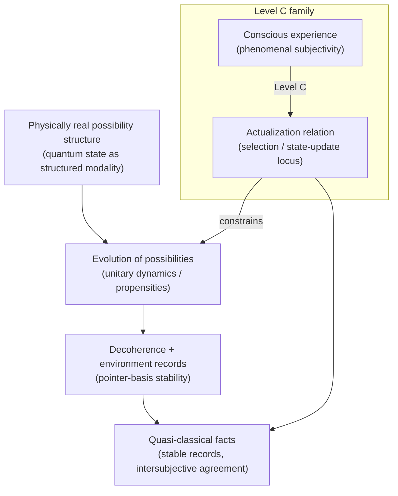
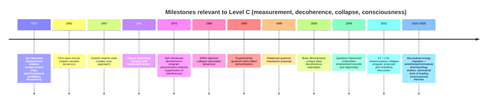

# Consciousness as a Physical Participant in Quantum State Actualization

## Executive summary

This report develops a rigorous, academically credible case for the author’s “Level C” ontological claim: **consciousness physically participates in the manifestation (actualization) of our current quantum state**—not merely as an observer in the everyday sense, but as a constituent in the ontology that selects (or *helps select*) a definite outcome from a structured field of physical possibilities. The goal is persuasion of an academic audience: clarity, conceptual discipline, and explicit engagement with the strongest objections.

The central strategy is to **treat Level C as a scientifically constrained ontological proposal** that (i) addresses a real open problem in quantum foundations (the measurement problem), (ii) connects to a live research program on consciousness and collapse dynamics (including explicit falsifiability proposals), and (iii) can be embedded in well-known metaphysical frameworks (modal realism/possibility-space realism, Russellian/dual-aspect traditions, and carefully delimited panpsychist options) without violating established empirical constraints. citeturn5search4turn2search0turn21search13turn9search0

A key persuasive advantage is to **avoid “quantum mysticism” tropes** by (a) separating interpretive/ontological claims from empirical claims, (b) presenting multiple precise formulations of Level C with different empirical commitments, and (c) explicitly using the standards of quantum foundations: no-superluminal signaling, Born-rule recovery, decoherence constraints, and compatibility with precision tests relevant to collapse models. citeturn2search0turn22search9turn5search3

The report provides (i) a precise statement of Level C, (ii) a disciplined “levels” distinction (Levels A and B are treated as *unspecified in the prompt* but acknowledged as part of the author’s broader framework), (iii) a philosophy background linking modality/possibility-spaces to quantum possibility structures, (iv) a physics background mapping Level C onto major interpretations, (v) empirical constraints and concrete experiment pathways (especially consciousness-weighted objective collapse and quantum-computational tests), and (vi) the principal objections with targeted rebuttals. fileciteturn0file1 citeturn21search13turn2search0turn5search4

## Thesis and definitional framework

**Thesis (Level C, ontological):** There exists a physically real **possibility structure** (a “space of physically admissible alternatives”) associated with the quantum state of the world, and **consciousness is not merely correlated with** which alternative becomes actual but is **a real participant in the actualization relation**—i.e., in the transition from *mere physical possibility* (amplitudes/probabilities/propensities) to *one concrete, experienced-and-recorded actuality* (“our current quantum state” in the sense of a definite outcome history). citeturn5search4turn2search0turn21search13turn9search0

To persuade academic audiences, “physically participates” must be cashed out with **formal options** rather than rhetoric. The most defensible approach is to present **a family of sharpenings**:

1. **Minimal (interpretive) Level C:** consciousness is a primitive *actualization index* in the ontology—facts are only defined *relative to* (or *for*) experiential subjects. This aligns most naturally with relational/agent-centered readings, but tends to be empirically equivalent to standard quantum mechanics (and thus risks non-testability unless supplemented). citeturn2search2turn18search1turn5search4  
2. **Moderate (psychophysical-law) Level C:** there exist **fundamental psychophysical laws** linking certain physical structures to conscious experience, and those laws also constrain *when/where* a measurement update (collapse/actualization) is physically realized. This makes consciousness part of the lawful closure of nature rather than an external “ghostly” cause. citeturn10search3turn10search13turn9search0  
3. **Strong (consciousness-weighted collapse dynamics) Level C:** collapse is objective (a real dynamical process) and its parameters are partly a function of a quantifiable consciousness-relevant variable (e.g., **integrated information** or an operational proxy). This is the most directly testable formulation and has been developed explicitly as a research program in contemporary analytic philosophy of mind and quantum foundations. citeturn21search13turn2search0turn17search3

**Level distinctions from A and B (as requested):** The prompt states Levels A and B are unspecified here. This report therefore does not assume their details, but notes that the author’s broader framework explicitly distinguishes a functional and a mechanistic level from the ontological level; Level C is presented as **not logically required** for the lower levels to be meaningful in the author’s full system. fileciteturn0file1

**Terminological discipline:** “Our current quantum state” is ambiguous across interpretations (ontic universal state vs effective state vs agent-relative state). A persuasive scholarly presentation should (i) specify which “state” is meant (universal wavefunction, effective reduced density matrix, conditional state relative to records, etc.), and (ii) specify which physical transition is at issue (unitary evolution + decoherence vs literal collapse vs relational state update). citeturn22search9turn5search4turn2search0

(Conceptual map: Level C claims that the “actualization relation” is not exhausted by decoherence + record formation; consciousness is part of the ontology that underwrites why *one* course of events is actual-for-us.) citeturn22search9turn5search2turn5search4

## Philosophical foundations for an ontological possibility space

A Level C ontology presupposes a metaphysics where **possibilities are not mere linguistic or epistemic constructs**. Philosophers treat this under the umbrella of *modality*: what is possible, necessary, or actual—often modeled via *possible worlds* or structured possibility spaces. citeturn8search0turn8search1turn8search8

A persuasive approach is to explicitly locate Level C relative to major modal positions:

- **Actualism vs possibilism:** Actualists deny “mere possibilia”; possibilists allow non-actual but real possibilities. The claim that quantum possibilities are physically real (not just calculational) resonates with at least some possibilist-friendly frameworks, though Level C can also be developed as a structured dispositional/propensity view without full Lewis-style modal realism. citeturn8search0turn8search1  
- **Branching formalisms and indeterminism:** Work on branching space-times provides a mature formal idiom for “real alternative futures” compatible with relativistic constraints, useful as an analogy for quantum possibility structures (while not itself quantum theory). citeturn8search6turn8search2  
- **Modal interpretations of quantum mechanics:** These interpret the quantum state as fixing a set of *physical possibilities* and rules for which properties become definite. This is philosophically adjacent to the author’s possibility-space realism and provides vocabulary that academic philosophers of physics already recognize. citeturn8search3turn8search7

The mind–matter side benefits from frameworks that avoid naïve “interactionist dualism” while still allowing consciousness to be ontologically serious:

- **Russellian monism / neutral monism:** Physics is often construed as giving structural/dynamical relations while being silent on intrinsic categorical properties; Russellian monism proposes that a single underlying property-base can underwrite both physical structure and consciousness. This is a powerful bridge because it reframes “consciousness participating” as **participation by intrinsic properties already present in nature**, not as an external add-on. citeturn9search0turn9search8  
- **Panpsychism / panprotopsychism as an evolutionary/early-universe pressure valve:** A classic objection to consciousness-collapse views is: “What collapsed the wavefunction before conscious life existed?” Panpsychist or proto-phenomenal options provide one principled family of replies, though they introduce their own combination problems and explanatory burdens. citeturn9search3turn9search4turn17search2  
- **Psychophysical laws:** A scientifically “naturalistic dualist” style view treats consciousness–physical correlations as governed by basic laws (not reducible to current physics). Level C can be formulated in that idiom: the lawful bridge is not only correlational but *dynamically participates* in actualization. citeturn10search3turn10search13turn10search10

A historically important point for persuasion: the consciousness–measurement link is *not* merely a fringe modern association; it has serious historical lineage, but also a complex reception in physics. Recent scholarship emphasizes that attributions to early figures can be caricatured, so a careful presentation should explicitly separate what was claimed, what was later rejected, and what remains as a structured research program today. citeturn0search6turn22search3turn22search8turn21search13

## Physics foundations and interpretive landscape

### Measurement problem and the “actualization gap”

Quantum theory’s standard formalism combines (i) continuous unitary evolution and (ii) a probabilistic “update” associated with measurement outcomes. The **measurement problem** is the tension between universal unitary dynamics and the empirical reality of definite outcomes (pointer readings, stable records). Decoherence explains the suppression of interference between branches in open systems and helps account for classical appearance, but on most analyses it does **not by itself select** a unique outcome; it explains effective classicality and robustness, not “one actual result” without further interpretive or dynamical input. citeturn5search4turn22search9turn5search3turn5search2

Level C is best pitched as addressing this “actualization gap” explicitly: it proposes that **consciousness is part of what closes the gap** (in one of the precise ways defined earlier), rather than being a late-stage spectator reading off an already-made classical world. citeturn21search13turn5search4

image_group{"layout":"carousel","aspect_ratio":"16:9","query":["quantum measurement problem diagram wavefunction collapse","decoherence pointer states diagram environment-induced superselection","Wigner's friend thought experiment illustration","microtubule structure neurons illustration"] ,"num_per_query":1}

### Comparison of core interpretations and compatibility with Level C

The table below treats the interpretations requested in the prompt—Copenhagen, Many-Worlds, pilot-wave (often called “Bohmian mechanics”), objective collapse, QBism, and relational quantum mechanics—and assesses how naturally each can host a Level C claim. The guiding idea is: **Level C needs either a real collapse/actualization process or a relational ontology where “actual facts” are indexed to experience/agency**. citeturn18search2turn2search3turn3search0turn4search0turn0search7turn2search2

| Interpretation family | Dynamics (unitary only? collapse?) | What is “the quantum state”? | Role of observer/agent | Default stance on consciousness | Fit for Level C without major surgery |
|---|---|---|---|---|---|
| Copenhagen-style | Unitary + operational “collapse/update” at measurement; cut is interpretive | Often treated as tool for predicting outcomes under experimental conditions | Measurement context is primitive in description | Typically **no special role** for consciousness; observer is not metaphysically privileged | **Moderate**: can be extended by locating the cut at/near consciousness, but risks arbitrariness citeturn18search2turn5search4 |
| Many-Worlds / Everettian | Unitary only; no physical collapse; branching/decoherence supplies apparent outcomes | Universal wavefunction is ontic (in most realist versions) | Observers are physical subsystems inside the wavefunction | Consciousness is emergent on branches; not causal for branching | **Low** (as stated): Level C needs reinterpretation as indexical “experienced actuality” rather than physical selection citeturn2search3turn5search2 |
| Pilot-wave / Bohmian | Unitary wave + additional definite variables; no collapse; determinism | Wave guides actual configuration; extra ontology carries definiteness | Observers are just physical systems reading definite configurations | No privileged role | **Low**: Level C would require new dynamics linking experiences to configuration evolution citeturn3search0turn18search0 |
| Objective collapse (GRW/CSL family) | Modified dynamics: stochastic nonlinear collapse; empirically testable deviations at scale | Quantum state is physical, with real collapse events | Observer not fundamental; collapse is objective | Consciousness not required, but could be coupled to collapse rate/locus | **High**: Level C is naturally formulated as *consciousness-weighted collapse* citeturn4search0turn4search9turn2search0 |
| QBism | State is an agent’s degrees of belief; Born rule as normative constraint | Quantum state is epistemic (personalist Bayesian) | Agent’s actions and experiences are central | Consciousness not a physical collapse trigger; but “experience” is primitive in interpretation | **Moderate**: supports participatory language, but tends to be non-ontic about wavefunction citeturn0search7turn18search1turn0search3 |
| Relational QM | States and facts are relative to physical interactions; no global observer-independent state | Quantum state is relational/informational between systems | No privileged observer; all systems can be “observers” | Consciousness not required, but “observer-relative facts” is congenial | **Moderate**: can host a disciplined “facts-for-experiencers” version of Level C citeturn2search2turn2search6 |

### Why Level C is not obviously “anti-physics”

A major persuasive point—especially for physicists—is that Level C aims to be **interpretation- or dynamics-level**, not an attempt to override quantum predictions. The most credible implementations either:

- remain empirically equivalent to standard QM but propose a different ontology (relational/agent-indexed actualization), or  
- introduce constrained and testable modifications in the well-studied landscape of collapse models (GRW/CSL), which already constitute a mainstream-targeted experimental program in quantum foundations. citeturn2search0turn5search1turn21search13

In particular, explicit contemporary work has argued that “consciousness-collapse” is not automatically pseudoscience: versions can be mathematically specified, confronted with known constraints such as the quantum Zeno effect, and potentially tested using quantum computational platforms. citeturn21search13turn17search3turn2search0

(Each line corresponds to peer-reviewed or widely cited scholarly milestones discussed in this report.) citeturn0search6turn3search0turn2search3turn5search3turn4search0turn17search3turn2search2turn1search4turn5search2turn21search13turn1search11turn11search0

## Empirical constraints and testability

A Level C claim that persuades academics must take **constraints** first and “cool ideas” second.

### Constraints that any Level C model must satisfy

1. **Born-rule recovery:** Any level of consciousness involvement cannot arbitrarily skew probabilities without conflicting with the empirical success of quantum theory; collapse models must recover the Born rule (or explain deviations within current bounds). citeturn2search0turn21search13  
2. **No-superluminal signaling:** Consciousness-linked collapse cannot enable controllable faster-than-light communication; this is a central constraint in collapse-model design and in interpretive consistency arguments. citeturn2search0turn3search3  
3. **Decoherence reality check:** In warm, wet neural systems, naïve long-lived coherence claims face strong challenges; influential estimates argue decoherence times are extremely short for many candidate neural degrees of freedom, forcing either (i) different physical substrates, (ii) error-protected mechanisms, or (iii) a model where consciousness couples to collapse without requiring long-lived macroscopic coherence. citeturn1search4turn1search1turn22search9  
4. **Empirical collapse bounds:** Objective collapse is constrained by interferometry, optomechanics, and other precision experiments; any consciousness-weighted collapse must live within (or predict controlled deviations from) the extensive parameter bounds reviewed in the collapse literature. citeturn2search0turn5search1

### The most testable path: consciousness-weighted objective collapse

The strongest “academic persuasion” move is to adopt a clear stance:

> Level C becomes scientifically serious when formalized as **a collapse model whose collapse dynamics depend on an independently motivated measure of consciousness** (or a proxy), rather than vague claims that “observation collapses the wavefunction.”

A prominent contemporary version explicitly combines a theory of consciousness (integrated information) with a collapse dynamics framework (CSL), argues that some simple variants are already ruled out (via quantum Zeno constraints), and proposes that more sophisticated versions could be testable—potentially using quantum computers. citeturn21search13turn17search3turn2search0

This is not merely rhetorical: the proposal shows what it means to be **wrong in a controlled way**, which is exactly what skeptical physicists expect. citeturn21search13turn2search0

### Supporting empirical “hooks” from neuroscience and quantum biology

Even when not decisive, cross-domain empirical hooks can make Level C feel less arbitrary by motivating *candidate consciousness variables* and *candidate physical substrates*.

**Neurophysiological correlates and state markers.** Operational measures of consciousness capacity such as the perturbational complexity index (PCI) explicitly quantify integration and complexity of brain responses, and have been validated across conscious/unconscious conditions and disorders of consciousness. citeturn11search2turn11search17

Independent literatures connect conscious state changes to thermodynamic/nonequilibrium signatures:

- Large-scale brain dynamics can be analyzed for entropy production and detailed-balance violation, with systematic differences between rest and demanding cognitive/physical conditions. citeturn12search0  
- Measures of temporal irreversibility (“arrow of time” in neural signals) vary across brain states including wakefulness, sleep, and anesthesia. citeturn12search1  
- EEG dynamics near criticality correlate with anesthesia-induced loss of consciousness and with complexity measures. citeturn12search2  

These are not “quantum proofs,” but they help motivate that consciousness correlates with **integration, complexity, irreversibility, and nonequilibrium structure**—features that can, in principle, be mathematically linked to collapse-parameter candidates in an objective-collapse framework. citeturn11search2turn12search0turn12search2

**Microtubules and anesthesia as a mechanistic testing ground.** The claim “microtubules host consciousness-relevant quantum processes” remains controversial, but the empirical situation is no longer purely speculative:  

- Experimental and modeling work reports **electronic energy migration** in microtubules and reports modulation by anesthetics such as isoflurane and etomidate. citeturn1search11  
- Separate work reports UV superradiance behavior in large tryptophan networks within biological architectures including microtubule-related structures. citeturn1search2turn1search14  
- Computational and theoretical studies model anesthetic binding to tubulin/microtubules and explore how anesthetics could alter collective dipole oscillations correlated with anesthetic potency. citeturn17search0turn16search6  
- Pharmacological studies report that microtubule-modulating interventions alter anesthesia sensitivity in rodent models. citeturn16search3turn16search4  

A persuasive Level C presentation should treat these as **candidate empirical pivots**:
- If microtubule physics is irrelevant to consciousness, anesthesia effects should be fully explainable (in principle) without invoking microtubule-specific quantum-sensitive channels.  
- If microtubule quantum-sensitive processes are relevant, *specific, reproducible signatures* should emerge (e.g., anesthetic-specific suppression of particular transport/oscillation phenomena, coupled to consciousness markers). citeturn1search11turn16search3turn12search2

### Proposed experiments and discriminating predictions

The table below focuses on experiments that (a) are conceptually aligned with Level C, (b) can be cleanly specified, and (c) have plausible pathways to interpretation without conflating “observer” with “human awareness.”

| Experimental direction | What is varied? | What is measured? | Level C prediction (model-dependent) | Key confounds |
|---|---|---|---|---|
| Consciousness-weighted collapse on quantum devices | Degree of causal integration / informational structure of a measuring/control system | Deviations from standard coherence scaling; effective collapse/noise signatures | Collapse rate depends on a consciousness proxy; some parameter regimes ruled out by Zeno constraints; others testable | Defining/measuring proxy; separating engineering noise from fundamental collapse citeturn21search13turn17search3turn2search0 |
| Interference vs “integration-rich” detectors | Detector architecture (feedforward vs recurrent/integrated; same energy & environment) | Fringe visibility / decoherence rates | If collapse depends on integration, interference breaks earlier with integration-rich detectors | Ordinary decoherence typically dominates; must carefully match environments citeturn22search9turn2search0 |
| Microtubule excitonics under anesthesia manipulations | Specific anesthetics; microtubule modulating drugs | Energy migration length, spectral signatures, temperature dependence; correlate with consciousness markers | Consciousness-relevant substrate shows systematic suppression aligned with loss of consciousness and microtubule pharmacology | Many-body biophysics; anesthesia has multiple targets; correlational ambiguity citeturn1search11turn16search3turn16search4turn11search2 |
| Neural nonequilibrium/irreversibility mapping | Wake/sleep/anesthesia/psychedelic states | Entropy production, temporal irreversibility, criticality; compare with PCI | Level C + collapse-law approach predicts a mapping from consciousness proxies to collapse parameters; helps pick candidate variables | Inferring thermodynamic quantities from neural signals is model-dependent citeturn12search0turn12search1turn12search2turn11search2 |
| Measurement back-action pedagogy bridging “manifestation” | Strength/type of measurement interaction | Quantified quantum back-action; trajectories | Not a unique Level C signature, but provides rigorous way to talk about “measurement as physical intervention” without mysticism | Does not by itself isolate consciousness as variable citeturn7search4turn7search1 |

A key rhetorical constraint: **do not claim standard delayed-choice or “observer effect” experiments support consciousness-collapse**; they are already accounted for in orthodox quantum theory and are notorious sites of popular misinterpretation. Instead, Level C must earn credibility by proposing **new discriminators** (or by explicitly positioning itself as an ontology without new empirical predictions). citeturn5search4turn22search9turn21search13

## Objections and scholarly rebuttals

This section treats the main objections in their strongest forms and sketches rebuttals that remain faithful to scientific constraints.

### Category error: “you are confusing epistemology with ontology”

**Objection:** In many interpretations, the quantum state is not a literal physical entity but an informational/epistemic tool; claiming consciousness “manifests the quantum state” is therefore a category mistake. citeturn18search1turn19search5

**Rebuttal strategy:**  
1. Concede the ambiguity: “quantum state” is interpretation-relative. Level C should therefore be stated at the level of **actualization of definite outcomes** (facts/records) rather than at the level of “collapsing a wavefunction” per se. citeturn5search4turn2search2turn18search1  
2. Note that there are strong arguments pressuring purely epistemic readings under common assumptions (e.g., ψ-ontology debates); whether one accepts these arguments, they show that ontology is not an avoidable topic in quantum foundations. citeturn19search0turn19search5  
3. Offer a bifurcated Level C:  
   - A **QBist/relational-friendly Level C**: consciousness participates by being part of the primitive “fact-for-agent” structure.  
   - A **collapse-friendly Level C**: consciousness participates via a lawful collapse dynamics.  
   This flexibility prevents the category-error objection from being a knockdown across all versions. citeturn2search2turn18search1turn21search13

### Causal closure: “physics is causally closed; mind can’t push matter”

**Objection:** If the physical domain is causally closed, conscious experience cannot add causes without either overdetermination or violation of conservation/closure. citeturn10search10turn10search20

**Rebuttal strategy:** Level C should not be presented as “mind intervenes in physics from outside.” Instead:
- Adopt **Russellian/dual-aspect framing**: “consciousness” is part of the intrinsic nature of the physical, not an extra substance competing with physical causes. Then causation remains physical, but “physical” is understood more deeply than bare structure. citeturn9search0turn9search8  
- Or adopt **psychophysical laws** framing: closure is preserved by expanding the basic-law base—analogous in form (not content) to historical expansions of physics when new regularities required new primitives. citeturn10search3turn10search13  
- Or adopt **objective-collapse** framing: collapse already modifies dynamics; consciousness-weighted collapse makes the modification principled by tying it to an independently motivated feature (consciousness) rather than arbitrary mass thresholds—while remaining constrained by collapse-model experiment. citeturn2search0turn21search13

### Epiphenomenalism: “if consciousness doesn’t change outcomes, it’s explanatorily idle”

**Objection:** If Level C yields no new empirical predictions, it collapses into epiphenomenal metaphysics; if it does yield predictions, it likely conflicts with established experiments. citeturn10search10turn2search0

**Rebuttal strategy:** Treat this as a design constraint that forces clarity:
- If you want Level C to be *scientific*, commit to a testable model class (e.g., consciousness-weighted CSL) and openly accept that parts of the parameter space may already be ruled out. citeturn21search13turn17search3turn2search0  
- If you want Level C to be *interpretive/metaphysical*, be explicit about empirical equivalence and argue its value as an explanatory unifier (e.g., explaining why experienced actuality is single-threaded, why measurement has experiential content, etc.). This is still legitimate scholarship—many interpretations are empirically equivalent. citeturn5search4turn5search9

### Occam’s razor: “this is unnecessary ontology”

**Objection:** Adding consciousness to fundamental physics violates parsimony; we already have interpretations without consciousness. citeturn5search9turn2search0

**Rebuttal strategy:** Occam’s razor is not “minimize entities,” but “minimize *unnecessary* entities while preserving explanatory adequacy.” The key is to argue that Level C earns its cost by addressing *two* hard problems simultaneously:
- the quantum measurement/actualization problem, and  
- the mind–matter relation (in particular, the causal/explanatory role of conscious experience).  
Contemporary defenders of consciousness-collapse research programs explicitly frame this as a cost–benefit trade, not a free lunch. citeturn21search13turn10search10turn9search0

### The early-universe/evolution objection: “who collapsed the wavefunction before minds existed?”

**Objection:** Consciousness-collapse seems to entail that the early universe had indefinite outcomes until minds evolved, which is implausible and risks circularity in evolutionary explanations. citeturn17search2turn21search0

**Rebuttal strategy:** Present three academically recognizable replies, each with costs:
1. **Panpsychist/protophenomenal reply:** proto-conscious properties are ubiquitous, so collapse triggers exist prior to biological minds. citeturn9search3turn9search4  
2. **Objective-collapse-first reply:** collapse is objective and consciousness does not *cause* collapse, but participates by being systematically aligned with collapse events (so Level C becomes “consciousness is where actualization is registered/realized,” not the sole trigger). citeturn2search0turn5search1  
3. **Relational reply:** “definiteness” is always relative to interactions; no global “cosmic definiteness” is required prior to observers, only local records relative to systems. citeturn2search2turn5search4

A persuasive presentation will **choose one reply** and treat the others as alternatives, rather than sliding between them.

## Audience-specific rhetoric and research agenda

This section provides concrete guidance on how to present Level C persuasively to different academic communities, and it closes with a prioritized research program (as requested).

### Rhetorical strategies by audience

**For philosophers (metaphysics of modality, mind, and ontology):**  
Anchor Level C in (i) the metaphysics of modality (actualization among structured possibilities), (ii) a defensible mind–matter framework (Russellian/dual-aspect options), and (iii) the legitimacy of interpretation-level debates in quantum theory. Emphasize conceptual clarity: distinguish *possibility space realism* from full possible-world modal realism; distinguish “consciousness-weighted collapse” from vague “observation creates reality.” citeturn8search0turn9search0turn10search10turn5search9

**For physicists (foundations, measurement, testability):**  
Lead with the measurement problem and with the fact that objective collapse models are a live, experimentally constrained research program. Then present Level C as a *specific subfamily* within collapse-model space (or as a disciplined relational ontology), with explicit constraints (Born rule, no signaling) and with realistic experimental discriminators (quantum-device tests; parameter bounds). Avoid neuroscience until after the formal part—otherwise it will be read as “motivational color” rather than foundations. citeturn2search0turn22search9turn21search13turn5search1

**For neuroscientists (mechanisms, correlates, interventions):**  
Treat Level C as a hypothesis generator: it predicts that consciousness correlates should map onto variables relevant to “actualization-like” transitions (irreversibility, integration, complexity) and that anesthesia should disrupt the relevant substrate in specific ways. Use operational measures (PCI; state transitions) and intervention studies (microtubule-modulating drugs affecting anesthesia sensitivity) as footholds. Be candid: these do not establish Level C, but they prioritize measurable variables and candidate mechanisms. citeturn11search2turn12search2turn16search4turn1search11

### Recommended next research steps and experiments

The strongest “next steps” are those that *force precision*—mathematically and experimentally.

**Formal theory steps (high priority):**

- **Define Level C as an explicit model class** with clear “degrees of commitment”:  
  (i) interpretive Level C (empirically equivalent),  
  (ii) lawful psychophysical Level C,  
  (iii) consciousness-weighted collapse Level C.  
  Each should specify: what counts as consciousness (or proxy), what physical variables it couples to, and what empirical signatures follow. citeturn21search13turn2search0turn10search13  
- **Compatibility proofs / constraint checks**: show (at least at the toy-model level) how Born-rule statistics are preserved, how no-signaling is maintained, and how known constraints (quantum Zeno regimes) carve out the parameter space. citeturn2search0turn17search3turn21search5  
- **Bridge concept work:** align “possibility space realism” with a recognized modality framework (e.g., compare to modal interpretations and branching formalisms), so critics cannot dismiss it as merely metaphorical. citeturn8search3turn8search6turn5search9

**Experimental program (high priority):**

- **Quantum-platform discriminator experiments** motivated by consciousness-weighted collapse proposals:  
  design experiments where the only manipulated variable is the *integration architecture* of a control/measurement system, while environmental decoherence is held fixed within tight bounds. The experimental readout should be interference visibility or collapse-like noise consistent with the collapse-model test literature. citeturn21search13turn2search0turn22search9  
- **Microtubule photophysics replication + consciousness-state correlation:**  
  replicate microtubule energy-migration and anesthetic-modulation findings while simultaneously collecting a consciousness proxy (behavioral responsiveness; EEG complexity metrics) to test coupling predictions. citeturn1search11turn12search2turn16search3  
- **Pharmacological triangulation:**  
  extend rodent anesthesia-sensitivity studies with microtubule modulators to include mechanistic endpoints (microtubule stability markers; synaptic function controls) to separate microtubule-specific effects from generalized physiological changes. citeturn16search3turn16search4  

**Interdisciplinary synthesis steps (medium priority):**

- **Agency and evolution framing:** integrate action-perception optimization frameworks (free-energy principle / active inference) with Level C’s “selection among futures” language, but keep the claim strictly at the level of formal analogy unless a concrete mechanistic bridge is provided. citeturn13search2turn13search15  
- **Time-consciousness integration:** connect the “manifest time” literature (experienced flow, specious present) to Level C’s actualization concept carefully: argue that consciousness is a system that continuously constructs a single-threaded present from a structured space of possibilities, while being explicit that this is a philosophical alignment, not a direct physical derivation. citeturn14search15turn14search17turn14search3  

**From the author’s current manuscript:** the draft and appendices already develop a possibility-space framing and a research-oriented structure; the most persuasive revision for an academic audience will be to (i) explicitly separate interpretive and dynamical (testable) versions of Level C, (ii) adopt collapse-model or relational-QM vocabulary where appropriate, and (iii) treat microtubule evidence as a constrained mechanistic hypothesis rather than a rhetorical centerpiece. fileciteturn0file1 fileciteturn0file0